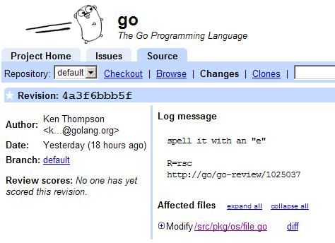

2009年11月11日，光棍节，[Google发布了Go语言](https://coolshell.cn/articles/1751.html)，马上，就有网友在<http://code.google.com/p/go/>上找到了一个Go语言包文件操作源码/src/pkg/os/file.go文件的一个最新改动。这个改动的作者就是那个大名鼎鼎的Unix之父[Ken Thompson](http://en.wikiquote.org/wiki/Kenneth_Thompson)（看看人家，都这么老了，还在写程序，佩服佩服，真是顶级程序员啊——《[程序员的八个级别](https://coolshell.cn/articles/343.html)》），而这个改动的[Log Message](http://code.google.com/p/go/source/detail?r=4a3f6bbb5f0c6021279ccb3c23558b3c480d995f)如下所示（把屏抓下来，以免以后某日被放到墙外或是google.com数据丢失或是Google公司倒闭）

Spell it with an “e”  

  

 

这是一个很著名的典故，要知道这个典故，你需要知道两件事，一个是Ken Thompson的经典语录，一个是Unix的系统调用。

关于Ken Thompson的经典语录，你可以在wikipdia上的[Ken Thompson](http://en.wikiquote.org/wiki/Kenneth_Thompson)词条中找到，这个事情是这样的。

> Ken Thompson was once asked what he would do differently if he were redesigning the UNIX system. His reply: “**I’d spell creat with an e.**” （Ken Thompson有一次在被问到——如果他可以重新设计Unix系统，他会做些什么不同的事？而他回答到：“我会把“creat”多拼一个e”）
> 
> 

“I’d spell creat with an e”，也就是说，他会把creat这个单词拼成**creat****e**，而不是creat。为什么是creat呢，这需要我们来看一下creat这个系统调用，你可以在Unix或Linux下简单地[man creat](http://linux.die.net/man/2/creat)你就可以知道，这个系统调用连带其某些参数，如：**O\_CREAT**，都是一个少了“e”的create。（Unix下的有很多东西都是简写，如：usr，gp，ls，mv，ps，满大街的都是缩写）

看看这个改动的[diff](http://code.google.com/p/go/source/diff?spec=svn1f0a01c93d305f1ab636c68b67346659c5b957f7&r=4a3f6bbb5f0c6021279ccb3c23558b3c480d995f&format=side&path=/src/pkg/os/file.go&old_path=/src/pkg/os/file.go&old=50a1ee94151635c25ad76816044252af417a45b8)——这个diff只有一行，第65行，抓屏如下（理由同上）

40年后的今天，Ken Thompson参与Go语言设计，于是，他提交了这个改动，也算是圆了他的愿望，从这点看来，Ken Thompson把Go语言看得和Unix一样重啊。难道Go语言也会像Unix一样成为另一个传奇？（Unix传奇 [上篇](http://blog.csdn.net/haoel/archive/2007/03/27/1542340.aspx)，[下篇](http://blog.csdn.net/haoel/archive/2007/03/27/1542353.aspx)）

（全文完）

**（转载本站文章请注明作者和出处 [酷 壳 – CoolShell](https://coolshell.cn/) ，请勿用于任何商业用途）**

### 相关文章

* [Unix 50 年：Ken Thompson 的密码](https://coolshell.cn/articles/19996.html)
* [Unix考古记：一个“遗失”的shell](https://coolshell.cn/articles/9410.html)
* [少即是极多](https://coolshell.cn/articles/7771.html)
* [https://coolshell.cn/wp-content/plugins/wordpress-23-related-posts-plugin/static/thumbs/2.jpg](https://coolshell.cn/articles/3156.html)[Go语言的”Issue 9″ Closed!](https://coolshell.cn/articles/3156.html)
* [Unix传奇(上篇)](https://coolshell.cn/articles/2322.html)
* [https://coolshell.cn/wp-content/plugins/wordpress-23-related-posts-plugin/static/thumbs/25.jpg](https://coolshell.cn/articles/1781.html)[Go语言更名Issue 9？](https://coolshell.cn/articles/1781.html)
The post [Go语言源码的一个改动](https://coolshell.cn/articles/1761.html) first appeared on [酷 壳 - CoolShell](https://coolshell.cn).