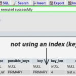

某DBA在查看自己的数库日志的时候，看到了数据库服务器上出现了很多很怪异的SQL的Where条件语句，是下面这个样子：（所有的where语句前都有了一个叫“1=1”的子条件）呵呵。


要理解这个事情的原因其实并不难。只要你是一个编写数据库的程序员，你就会知道——动态生成where后的条件的“麻烦”，那就是条件的“分隔”-and或or。下面听我慢慢说来。


我们知道，大多数的查询表单都需要用户输出一堆查询条件，然后我们的程序在后台要把这些子条件用and组合起来。于是，把and加在各个条件的中间就成为了一件“难事”，因为你的程序需要判断：


* 如果没有条件的话，则不需要where
* 如果只有一个条件的话，不需要and.
* 如果有多个条件的话，
	+ 如果and是持续加在每个条件后面的话，那么就要判断是否是最后一个条件，因为最后一个不能加and.
	+ 同样，如果and是要加在每个条件前面的话，你就需要判断是否是第一个，如果是，那就不加。


真是TMD太烦了，所以，编程“大拿”引入了“1=1”条件语句。于是，编程的难度大幅度下降，你可以用单一的方式来处理这若干的查询子条件了。而1=1应该会被数据库引擎优化时给去掉了。


```

<pre><code>$query = "SELECT name FROM table WHERE 1=1 ";

foreach($clauses as $key => $value){
    $query .= " AND ".escape($key)."=".escape($value)." ";
}
</code></pre>

```

呵呵，**DBA怎么能够理解我们疯狂程序员的用心良苦啊**。


另外，在这里说一下，这样的做法看似很愚蠢，但很有效，在PHP的世界中，也有人使用下面这样的做法——使用了PHP的implode函数。


```

<pre><code>/**
 * @param string $base base of query, e.g. UPDATE table SET
 * @param string $logic logic for concatenating $assoc, e.g. AND
 * @param array $assoc associative array of `field`=>'value' pairs to concatenate and append to $base
 * @param string $suffix additional clauses, e.g. LIMIT 0,30
 * @return string
 */
function construct_sql($base, $logic, $clauses, $suffix='')
{
    // initialise array to avoid warnings/notices on some PHP installations
    $queries = array();

    // create array of strings to be glued together by logic
    foreach($clauses as $key => $value)
        $queries[] = "`" . escape($key) . "`='" . escape($value) . "'";

    // add a space in case $base doesn't have a space at the end and glue clauses together
    $query .= " " . implode(" $logic ",$queries) . " " . $suffix . ";";

    return $query;
}

/**
 * @param string $str string to escape for intended use
 * @return string
 */
function escape($str)
{
    return mysql_real_escape_string($str);
}
</code></pre>

```

于是，我们可以这样使用：（`为什么我们要在update语句后加上“Limit 1”呢？这个关系到性能问题，关于这方面的话题，你可以查看本站的《[MySQL性能优化的最佳20+条经验](https://coolshell.cn/articles/1846.html "MySQL性能优化的最佳20+条经验")》`）


```

<pre><code>$updates = array(
    'field1'=>'val1'
    'field2'=>'val2'
);
$wheres = array(
    'field1'=>'cond1',
    'field2'=>'cond2'
);
echo construct_sql(construct_sql("UPDATE table SET", ", ", $updates) . " WHERE ", " AND ", $wheres),"LIMIT 1");
</code></pre>
<pre></pre>

```

`下面是输出结果：`


`UPDATE table SET `field1`='val1', `field2`='val2' WHERE `field1`='cond1' AND `field2`='cond2' LIMIT 1;`


 


`（全文完）`


**（转载本站文章请注明作者和出处 [酷 壳 – CoolShell](https://coolshell.cn/) ，请勿用于任何商业用途）**


### 相关文章

* [](https://coolshell.cn/articles/7270.html)[NoSQL 数据建模技术](https://coolshell.cn/articles/7270.html)
* [https://coolshell.cn/wp-content/plugins/wordpress-23-related-posts-plugin/static/thumbs/7.jpg](https://coolshell.cn/articles/4795.html)[开源中最好的Web开发的资源](https://coolshell.cn/articles/4795.html)
* [](https://coolshell.cn/articles/1846.html)[MySQL性能优化的最佳20+条经验](https://coolshell.cn/articles/1846.html)
* [](https://coolshell.cn/articles/8711.html)[程序员疫苗：代码注入](https://coolshell.cn/articles/8711.html)
* [](https://coolshell.cn/articles/7886.html)[代码执行的效率](https://coolshell.cn/articles/7886.html)
* [](https://coolshell.cn/articles/7490.html)[性能调优攻略](https://coolshell.cn/articles/7490.html)
The post [SQL的Where语句](https://coolshell.cn/articles/1889.html) first appeared on [酷 壳 - CoolShell](https://coolshell.cn).