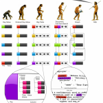

MyISAM 是MySQL中默认的存储引擎，一般来说不是有太多人关心这个东西。决定使用什么样的存储引擎是一个很tricky的事情，但是还是值我们去研究一下，这里的文章只考虑 MyISAM 和InnoDB这两个，因为这两个是最常见的。

下面先让我们回答一些问题：

* 你的数据库有外键吗？
* 你需要事务支持吗？
* 你需要全文索引吗？
* 你经常使用什么样的查询模式？
* 你的数据有多大？

思考上面这些问题可以让你找到合适的方向，但那并不是绝对的。如果你需要事务处理或是外键，那么InnoDB 可能是比较好的方式。如果你需要全文索引，那么通常来说 MyISAM是好的选择，因为这是系统内建的，然而，我们其实并不会经常地去测试两百万行记录。所以，就算是慢一点，我们可以通过使用Sphinx从InnoDB中获得全文索引。

数据的大小，是一个影响你选择什么样存储引擎的重要因素，大尺寸的数据集趋向于选择InnoDB方式，因为其支持事务处理和故障恢复。数据库的在小决定了故障恢复的时间长短，InnoDB可以利用事务日志进行数据恢复，这会比较快。而MyISAM可能会需要几个小时甚至几天来干这些事，InnoDB只需要几分钟。

您操作数据库表的习惯可能也会是一个对性能影响很大的因素。比如： COUNT() 在 MyISAM 表中会非常快，而在InnoDB 表下可能会很痛苦。而主键查询则在InnoDB下会相当相当的快，但需要小心的是如果我们的主键太长了也会导致性能问题。大批的inserts 语句在MyISAM下会快一些，但是updates 在InnoDB 下会更快一些——尤其在并发量大的时候。

所以，到底你检使用哪一个呢？根据经验来看，如果是一些小型的应用或项目，那么MyISAM 也许会更适合。当然，在大型的环境下使用MyISAM 也会有很大成功的时候，但却不总是这样的。如果你正在计划使用一个超大数据量的项目，而且需要事务处理或外键支持，那么你真的应该直接使用InnoDB方式。但需要记住InnoDB 的表需要更多的内存和存储，转换100GB 的MyISAM 表到InnoDB 表可能会让你有非常坏的体验。

http://blog.inetu.net/wp-content/plugins/wp-spamfree/img/wpsf-img.php

文章：[来源](http://blog.inetu.net/2009/04/mysql-innodb-or-myisam/)

**（转载本站文章请注明作者和出处 [酷 壳 – CoolShell](https://coolshell.cn/) ，请勿用于任何商业用途）**

### 相关文章

* [MySQL性能优化的最佳20+条经验](https://coolshell.cn/articles/1846.html)
* [性能调优攻略](https://coolshell.cn/articles/7490.html)
* [NoSQL 数据建模技术](https://coolshell.cn/articles/7270.html)
* [https://coolshell.cn/wp-content/plugins/wordpress-23-related-posts-plugin/static/thumbs/26.jpg](https://coolshell.cn/articles/5826.html)[千万别用MongoDB？真的吗？！](https://coolshell.cn/articles/5826.html)
* [https://coolshell.cn/wp-content/plugins/wordpress-23-related-posts-plugin/static/thumbs/29.jpg](https://coolshell.cn/articles/4939.html)[Quora使用到的技术](https://coolshell.cn/articles/4939.html)
* [https://coolshell.cn/wp-content/plugins/wordpress-23-related-posts-plugin/static/thumbs/7.jpg](https://coolshell.cn/articles/4795.html)[开源中最好的Web开发的资源](https://coolshell.cn/articles/4795.html)
The post [MySQL: InnoDB 还是 MyISAM?](https://coolshell.cn/articles/652.html) first appeared on [酷 壳 - CoolShell](https://coolshell.cn).