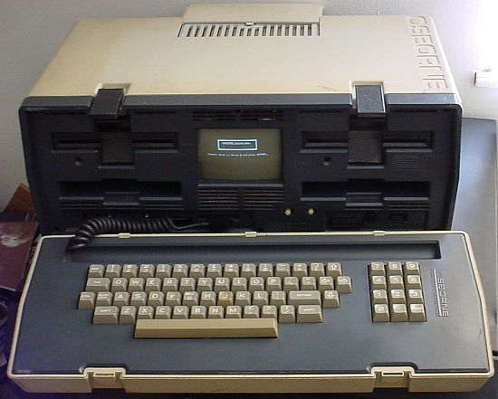
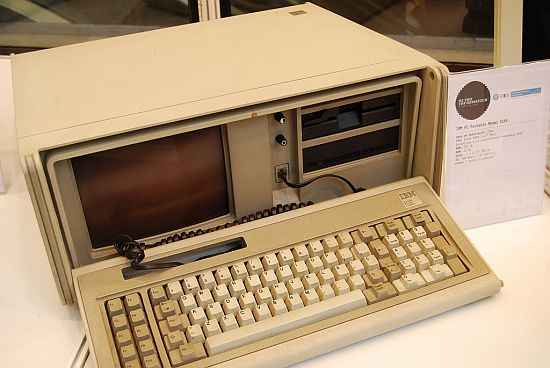
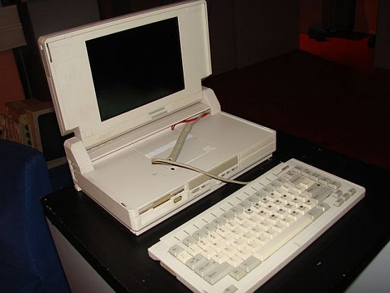
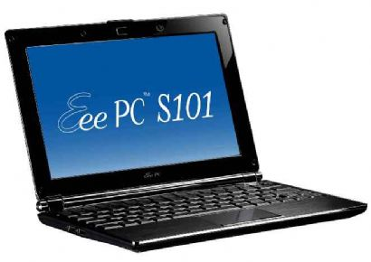
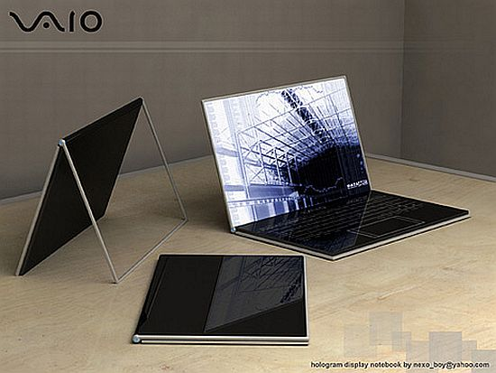

这是一段比较有趣的历史，让我们回顾一下笔记本电脑的整个历史吧。可能叫便携式电脑比较好一点。

**1970 – 1981 第一个便携式的电脑概念**

上世纪70年代，Alan Kay 在 Xerox PARC开始有了便携式个人电脑的想法。到了1981年， Osborne 1问世，其由Adam Osborne创造。如下图。Osborne 1 有一个5英寸的屏幕，还有一个可选的电池，两个5 ¼” 软驱，一个 modem 接口，还有一个键盘。当时的价格是$1,800（包括一块电池）。

 

### 1981 – 1984 : Gavilan 和 IBM

没有多久Gavilan Mobile Computer公司也进入了这个行业。其第一个便携式电脑的原型和今天的笔记本电脑非常相似，而且只有4公斤重并且配备了一个可以运行9个小时的镍镉电池。无论是从性能还是设计上来说，在1983年，这已经是非常超前的。而且这是 Galvin 第一次向市场引入了“移动PC”的术语。

Osborne 1的出现后， 微软公司的Kazuhiko Nishi 开始了一个便携式电脑的原型，其采用了LCD显示屏，重量2 kilos，叫做“Radio Shack TRS-80 Model 100 Mobile Computer”，有一个 modem，还有一个无线电通讯的程序，以及一个文本编辑器和一个由微软开发的小程序。总的来说，这更像是一个无线装置。（如下图）

随着我们的“Radio Shack”让我们的便携式电脑看起来更像是笔记本电脑，IBM也开发进入这个市场，其于1984年开发了Portable PC 5155。但是，这个便携式电脑犯了一个可怕的错误，那就是其“便携”的重量有13.6公斤，而且有一个9英寸的显示器，价格在$ 4000。而且，你还得随时插在电脑插座上，因为它根本没有电池。所以，5155 充其量只不过是一个“可以容易搬动的台式电脑”。不过非常感谢IBM的是，他们只用了1年的时间就终止了这个畸形的产物。

 

### 1984 – 1988: Compaq

在接下来的几年，笔记本电脑几乎没有什么发展。不过Compaq 公司在1988 的时候开发了一台便携式电脑Compaq SLT 286，有一个VGA的显示器，1.44英寸的软戏和一颗286的CPU，只是重量有6公斤。

### 

### 1989 – 1993:  NEC，Zenith的MinisPORT 以及 第一代的Macintosh

NEC 公司改变了便携式电脑重量太重的局面，他的 NEC UltraLite model— 第一个有完整功能的基于MS-DOS的便携式PC机只有4.4 磅（2公斤左右）。而其接下来具有革命性的发展是在90年代，但其开始1989年，由 Zenith Data Systems 公司生产的 Minisport，其带 640K的RAM，1.44英寸的软驱，一个2400波特率的Modem以及一个20MB ESDI 硬盘。虽然其只有一个彩色的LCD显示器，但是，也足够不错了。从此开始了便携电脑的新纪元。

接下来，我们来看一下，苹果公司的第一代Macintosh 便携机，重达8公斤，但是其有 9.8英寸的最大分辨率有 640 x 400像素的显示器。

到了1993年，我们开始有了 256色的显示器，其代表产品是PowerBook 165c。然后，我们开始进入今天，百万像素的真彩色显示器，更好和更轻的的笔记本电脑，更为灵活的设计，更好的性期，并开始有了多媒体包括CD-ROM。然后，真正没有让笔记本电脑流行的是，笔记本电脑的性价比，价格太贵了，像ThinkPad和MacBook也是在那时出现的，但是没有多少人能真正地买得起。

 

**1996 – 2003 : Panasonic 的ToughBooks 和Intel 处理器**

1996年Panasonic 公司引入了新一代的笔记本电脑——Toughbook (CF-25)，70 cm高，可以抵抗灰尘和水气，非常明显，松下公司想改变便携式电脑的观念，感觉上这个电脑更像是一个军用的。就算是使用枪击过的电脑，电脑也能正常工作。

 

以后，直到2003年，直到Intel开发出了不可思异地低能耗的 Pentium M 处理器，其在整个笔记本电脑的发展上写下了重重的一笔，而且价格上开始了巨大的松动，于是笔记本电脑也开始进了一平常百姓家里。

 **今天和未来**

让我们来看看今天的电脑吧。今天，无线连接，蓝牙，Wi-Fi,  DVD 光驱, 高级显卡，宽屏，超薄，口袋电脑，……

Apple Macbook Air

Asus EEE PC S101

 

我们再来看看未来的电脑，下图是Sony VAIO Zoom，一台使用全息技术的笔记本电脑。可能未来还不止如此，让我们一起期望……

文章：[来源](http://www.geekwithlaptop.com/laptop-revolution-where-size-does-mater-a-whole-lot/)

**（转载本站文章请注明作者和出处 [酷 壳 – CoolShell](https://coolshell.cn/) ，请勿用于任何商业用途）**

### 相关文章

* [我有一个Hello World的C++程序编译不过](https://coolshell.cn/articles/4170.html)
* [https://coolshell.cn/wp-content/plugins/wordpress-23-related-posts-plugin/static/thumbs/1.jpg](https://coolshell.cn/articles/2036.html)[2010 = 1+2-(3-4-5)\*6\*7\*8-9](https://coolshell.cn/articles/2036.html)
* [80个优秀的AJAX方案](https://coolshell.cn/articles/57.html)
* [https://coolshell.cn/wp-content/plugins/wordpress-23-related-posts-plugin/static/thumbs/11.jpg](https://coolshell.cn/articles/4561.html)[对程序员职业的一些建议](https://coolshell.cn/articles/4561.html)
* [https://coolshell.cn/wp-content/plugins/wordpress-23-related-posts-plugin/static/thumbs/21.jpg](https://coolshell.cn/articles/1142.html)[BT雷人的程序语言](https://coolshell.cn/articles/1142.html)
* [https://coolshell.cn/wp-content/plugins/wordpress-23-related-posts-plugin/static/thumbs/24.jpg](https://coolshell.cn/articles/1532.html)[到处都是Unix的胎记](https://coolshell.cn/articles/1532.html)
The post [笔记本电脑的发展史](https://coolshell.cn/articles/378.html) first appeared on [酷 壳 - CoolShell](https://coolshell.cn).