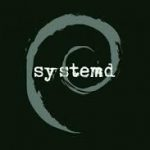

**经历了四个十年，操作系统的未来充满了变数，但传奇将会是永久的**

 **原文**：[链接](http://www.computerworld.com/action/article.do?command=viewArticleBasic&taxonomyName=Operating+Systems&articleId=9133570&taxonomyId=89&pageNumber=1)—[Computerworld](http://www.computerworld.com/)

　

#### 译者前言

 今年是Unix40岁的生日。很早就看到这篇文章了，一直想转到中文社区。但一直没有时间，今天看到了CSDN首页的一篇《[昨天,今天,明天! Unix系统的40年](http://news.csdn.net/a/20090610/211863.html)》号称是转载于[cnBeta](http://www.cnbeta.com/articles/86179.htm)。这篇文章翻译的要有多烂有多烂，简直就是对Unix 40的历史和原文作者的一种不敬。所以，在这里给出全部译文。

 

**关于更为详细的历史，可以参考我的《Unix****传奇》[上篇](http://blog.csdn.net/haoel/archive/2007/03/27/1542340.aspx)****，[下篇](http://blog.csdn.net/haoel/archive/2007/03/27/1542353.aspx)**

**以及一篇CSDN****对我的采访《[Unix的现状与未来](http://blog.csdn.net/haoel/archive/2007/07/13/1688006.aspx)****》**

　

#### 正文

40年前的一个夏天，一个程序员只用了一个月的时间就创造出了这个世界上迄今为止最重要一个软件的原型。

在1969年8月，Ken Thompson，AT&T公司Bell实验室的一个程序员，因为妻儿不在身边，所以有机会把他的一些关于新的操作系统的想法付诸实现。他用汇编语言在DEC（Digital Equipment Corp.）的PDP-7微机上写了第一个版本Unix，他只用了一周的时间就完成了一个简单的操作系统，包括一个shell，一个编译器还有一个汇编编译器。

Thompson和他的一个同事Dennis Ritchie当时在开发一个叫“[Multics](http://www.multicians.org/multics.html)（Multiplexed Information and Computing Service复杂指令和计算服务）”的分时(Time-Sharing)操作系统)，因为这个项目当时遇上了很多麻烦，所以Thompson和Dennis当时感到很没劲，他们即不想去做当时主流的“批处理（Batch）操作系统”，也不想去做那个看上去怪异和笨拙的Multics。

所以，在他们来来回回讨论经了一些关于新系统的想法后，Thompson写下了第一个版本的Unix，然后，这两位老搭档在以后的几年里继续开发着这个操作系统，当然，后面有更多的同事（Doug McIlroy, Joe Ossanna 和 Rudd Canaday）加入了进来。一些当时Multics的理念也被带入到这个新的操作系统中来，不过，更为漂亮的Unix则带来了–“更少则为更多（less-is-more）”的哲学。

（**陈皓注：**在我们所认识的历史中，这两位程序员当时是在Multics下开发一个叫”太空旅行”的游戏，后来Multics项目解体了，这两位哥们觉得自己的游戏白弄了，所以就为了这个游戏开发了一个新的操作系统Unix，Unix的取名和Multics是相反的，Multics有”复杂的”的意思，而Unix则是”小巧的”意思。后来他们觉得这个操作系统非常不错，所以在后来发表了一篇论文向全世界宣布了这一操作系统，从此开启了计算机世界崭新的文化，详情可参看我的《**Unix****传奇**》[上篇](http://blog.csdn.net/haoel/archive/2007/03/27/1542340.aspx)，[下篇](http://blog.csdn.net/haoel/archive/2007/03/27/1542353.aspx)）

“一个强大的用于交互式的操作系统不应该在价格成本和人力成本上都是昂贵的” Ritchie 和 Thompson在开发这个操作系统5年后，他们在”计算机协会（ACM- Association for Computing Machinery）杂志”上发表了一篇文章《*Communications of the ACM* (CACM)》，文中说，”我们希望Unix的用户会找到那些非常重要的系统特性就是它是’简单的’，’一流的’和’易用的'”。

显然，他们做到了，Unix的确成为了IT领域中的一块基石，被广泛地部署到了大学，政府和企业的服务器和工作站上。并且，Unix的影响力开发迅速地传播开来，这恐怕超出了所有人的估计，正如ACM在1983年给Thompson 和 Ritchie颁发最具价值的图灵奖（计算机领域的诺贝尔奖）所记录的那样–“Unix系统的模式已经在以一种全新的编程思想领导着新一代的软件开发”。

Unix早期
------

 http://www.computerworld.com/common/images/site/features/2009/062009/unix_kendennis.jpg

Thompson 和 Ritchie.

当然，Unix的成功不是一蹴而就的。 在1971年，它首先被移植到了PDP-11微机（一个比PDP-7更强的微机）。文本格式和文本编译程序在这时被加入进了Unix。并且，当时的实验室专利部门已经开始用这些文本编译器，这也是Unix系统除开发团队之外的第一个用户。

在1972年，Ritchie引入了一个更高级的语言–C语言（基于Thompson的B语言），此后，Thompson用C语言重写了Unix，这极大地增加了Unix的可移植跨平台性。然后，他们为这个操作系统命名Unics(Uniplexed Information and Computing Service)，这是和Multics玩的一个文字游戏。但最后，Unix成了最终的名字。（**陈皓注**：Unix下的经常出现缩写，如usr 是 user, ed是edit，gp是group，这也是Unix的文化。Unix的更名可能也是因为这个吧）

是时候向全世界宣布这个系统系统了。Ritchie 和 Thompson于1974年7月在 *CACM* 上发表了一篇论文– “[The UNIX Time-Sharing System](http://cm.bell-labs.com/cm/cs/who/dmr/cacm.html)“《Unix分时操作系统》，这篇论文就像一个风暴一样席卷了都个IT界。直到有一天，Unix被限制在了只能由Bell实验室中的少数人使用。但是，因为有计算机协会的支持，当时的Unix处于一个引爆点。

” *CACM* 的那篇论文产生了一个戏剧化的影响”， IT 历史学家 Peter Salus 在他的书《*The Daemon, the Gnu and the Penguin*》中写到， “很快，Ken 被铺天盖地的Unix的请求所淹没”

 

黑客的天堂
-----

 Thompson 和 Ritchie 算得上是史上最名副其实的”黑客”，当时”黑客hacker”一词指的是那些把非同寻常的创意组合起来， 以一种超常智力，并以废寝忘食的态度解决了某个鲜为人知的软件问题的人。

Thompson 和 Ritchie他们的所使用的开发方法，他们所写下的代码，极大地吸引了大学里的程序员，并在以后，这些大学中其中的一些程序员因为Unix开创了自己的公司，他们都是在Unix发展过程中的黑客，就像，加利福尼亚州大学的Bill Joy，卡内基梅隆大学的[Rick Rashid](http://www.computerworld.com/action/article.do?command=viewArticleBasic&articleId=9133574#rashid) ，以及Bell实验室[David Korn](http://www.computerworld.com/action/article.do?command=viewArticleBasic&articleId=9133574#korn)。当然，他们开创的这些公司都没有IBM，HP和Microsoft的资助。

“几乎从一开始，Unix就能够，也确实是开始了自我进化”，Thompson和Ritchie在*CACM* 论文中说到，”因为所有的源代码总可以容易被人在线地更改，所以，当有一个新的想法被发明，发现或是被建议出来的时候，大家都非常自愿地修订或重写Unix系统和上面的软件”。

Korn，一个今天还在AT&T工作的员工，上世纪70年代曾是Bell 实验室的一个程序员。”Unix的一个特点是，一个小工具刚被完成，就被另一个更好的工具所代替”，他回忆起来说，”如果你觉得不好的话，你完全可以开完一个更好的版本”。Korn当时为Unix开发了一个很具影响力的[Korn shell](http://www.computerworld.com/action/article.do?command=viewArticleBasic&articleId=9133574#korn)，本质上来说，当年的Unix就像今天的开源软件。

Salus，作为一个作家和技术历史家，回忆起，他上世纪70年代在多伦多大学时当教授时，在IBM System/360大机上使用APL编程语言工作时的情景–那并不很好用，但是自从1978年圣诞节以后，一个哥伦比亚大学的朋友给我演示了一下在微机上运行的Unix，”我说，’我的上帝啊’，我彻底被你征服了”。

他说，Unix最关键的优势是他有一个”管道”特性（1973年引入），这么我们可以把上一个程序的输出轻松地传给下一个程序。”管道”的概念，由Bell实验室的McIlroy发明，随后”管道”这个东西被其它几乎所有的操作系统复制，包括所有的Unix， Linux，DOS和Windows。

http://www.computerworld.com/common/images/site/features/2009/062009/unix_murrayhill_230.jpg

位于新泽西Murray Hill 的Bell 实验室总部

*Credit: Alcatel-Lucent/Bell Labs*

 

Unix还有一个不错的地方。 “哇”，正如Salus所惊叹的，这个操作系统并不需要一个需要一百万美金的大型机才能运行的操作系统。它在极其原始的小型的DEC PDP-7微机上开发出来，因为这是当是Thompson 和 Ritchie可以找到用来写这个操作系统最好的机器（**陈皓注：**当时这个机器像垃圾一样被扔在实验室角落里）

很多很多的大学研究者们使用Unix就是因为这是一个简单和容易修改的操作系统，而且对硬件资源要求的很少，代码也是开源和免费的。就像Sun Microsystems公司，或是一些用于特定的科学计算的主机公司，例如Multiflow Computer，他们在选择Unix作为操作系统时都和那些大学研究者们有相同的原因。

Unix家谱
------

Unix成长为一个非私有的操作系统，是因为1956年的AT&T公司受命于联邦去经营电报电话服务。当然也可以开发软件，甚至那个软件可以有”合理”收费的许可证，但是这个公司却被禁止从事任何和计算机有并的商业活动。

Unix，在开发的过程中，没有任何的奖励制度和管理，从一开始在AT&T公司出现时，其是一种近似于好奇或兴趣的东西。

然而，20世纪70年代，AT&T公司开始意到Unix所带来的商业价值。公司的律师开始寻找一些手段来保护Unix，并让其成为一种商业机秘。从1979年Unix的版本V7开始，Unix的许可证开始禁止大学使用Unix的源码，包括在授课中学习。

没问题！一个荷兰阿姆斯特朗Vrije大学使用版本V6的计算机科学系的教授Andrew Tanenbaum说。在1987年，他为教学目的克隆了一个Unix，创建一个叫Minix的开源的操作系统，并可以在80286的Intel芯片上运行。

“Minix使用了所有和Unix一样的想法，并且这是一个非常灿烂的事物”，Salus说，”只有一个专门是程序员的并且非常了解操作系统内部的人才成干出这件事来”。Minix从此变成了另一个起点–Linus Torvalids 在1991年使用Minix创造了Linux –这并不是一个简单的Unix克隆版本，只不过它长得像Unix。

让我们再回到Linux出现的十年以前，Bill Joy，毕业于加利福尼亚州大学伯克利分校，当年，他在学校的时候拷贝了Bell 实验室的Unix版本，并且所到了这是一个很不错的可以使用Pascal编译器和文本编译器的操作系统平台。

于是，他更改变扩展了Unix，形成了Unix的第二个最主要的分枝–BSD（Berkeley Software Distribution）Unix。在1978年3月，Joy卖出了第一个BSD的拷贝：50美金。

到了1980年，有两个最主要的Unix的版本线，一个是Berkeley的BSD，另一个是AT&T的Unix，在这个时候，很显然，竞争最终引发了Unix的战争。在这场战争中，好的是，软件开发人员还是能够得到Unix的源码并对其按照自己的需要和兴致进行裁剪。而不好的是，Unix开始一发不可收拾地开发不停地出现各种各样的变种。

1982年，Joy创建了Sun Microsystems公司并提供了工作站–Sun-1，运行在当一个BSD的版本，叫SunOS（Solaris以之后的十年出现）。而AT&T则在随后的几年中发布了Unix System V的第一版，一个具有强大影响力的操作系统，最终造就了IBM的AIX和HP的HP-UX。

 

http://www.computerworld.com/common/images/site/features/2009/062009/unix_chart_420.jpg

Unix 家谱. *Credit: Eraserhead1 ([cc-by-sa-3.0](http://creativecommons.org/licenses/by-sa/3.0/), [GFDL](http://en.wikipedia.org/wiki/GNU_Free_Documentation_License))*  

[点击这里下载大图](http://www.computerworld.com/action/article.do?command=viewArticleBasic&articleId=9133696)

 

Unix战争
------

 在上世纪80年代中期，大量的用户包括联邦政府，开始抱怨”Unix是一个理论上单一的可移植的操作系统”，但事实上应该如此却并不是这样。Unix软件供应商们，一方面为这些抱怨而为 其买单（”空头人情”），而另一方面，他们却在没日没夜地给用户们定制Unix的各种功能和APIs，旨在为了留下用户。 

 而其它的Unix产商害怕At&T和Sun的联盟，所以，有各种各样的派别组织开始在”标准”上竞争，这些组织大多在X或Open命名，开放软件基金会（Open Software Foundation），Unix开放系统国际和公司（Unix International and Corporation for Open Systems）等等，在这些组织中形成的各种各样的争论，辩论，抗辩和观点可以写一本厚厚的书，但他们无一例外地以肆意相互评击来主张一个统一的Unix局面。

 刚形成的[开放软件基金会](http://en.wikipedia.org/wiki/Open_Software_Foundation)，其包括了IBM，HP，DEC和其它公司共同来反抗AT&T和Sun的联盟。在一个1988年未出版的文件中，DAPRA（Defense Advanced Research Projects Agency）一个著名的小型机先驱[Gordon Bell](http://www.computerworld.com/action/article.do?command=viewArticleBasic&articleId=9133574&pageNumber=2#bell)说， “开放软件基金会OSF是一条’Unix穷人’进入正在发展的市场的一条路，他们以此来供养那个的高利润代码博物馆”。

 Unix战争在解决差异和设定一个操作系统标准中以失败告终。但在1993年，Unix社区听到了一个”警钟”–Microsoft发布了Windows NT，一个企业级的，32位的，支持多处理的操作系统。而Windows NT的所有者瞄准了Unix领域，并企图扩展Microsoft的桌面系统霸权到各种数据中心以及被Sun服务器所占领的地方。

 Microsoft的用户欢呼雀跃，Unix的产商开始惊慌。所有的主流的Unix竞争者们开始主动地联合起来形成了一个[通用开放式软件环境（Common Open Software Environment）](http://en.wikipedia.org/wiki/COSE)，并在随后的几年中放下了他们的武器并开始着手把AT&T和Sun联盟为背景的”Unix International Group”并入开放软件基金会OSF。这个合并在今天叫做–[The Open Group](http://www.opengroup.org/)，而证明Unix系统和所有者的是[Single Unix Specification](http://www.unix.org/what_is_unix/single_unix_specification.html)，现在官方叫法是–“Unix”。

 

但在实践过程中，所有关于Unix的开发的确需要一个尽可能”标准化的”Unix，但是由于这些产商热衷于竞争的习惯，在Unix下并没有做到，但这一”标准化”被随后如潮水一样涌来的一个叫Linux的操作系统给完成了，这是一个开源的系统系统，则我们的Tanenbaum教授开发的Minix发展而来。

### 什么是”Unix”?

Unix，许多人会说，是一个几十年前在Bell实验室写的操作系统，Unix包括其所有的派生版本。今天，最主要的Unix版本是从两个主干上分出来的：一个当然是从AT&T出来的，另一个则是通过加利福尼亚伯克利分校产生的。今天，最顽强的分枝是IBM的AIX和HP的HP-UX以及Sun的Solaris。

然而，只有”The Open Group”拥有Unix的注册商标，[定义一个Unix](http://www.unix.org/what_is_unix.html)需要遵从[Single Unix Specification](http://www.unix.org/what_is_unix/single_unix_specification.html) (SUS)。这包含了那些从来没有Unix思想的操作系统，比如Mac OS X Leopard（这是从BSD和Mach那边发展来）以及IBM的z/OS（这是从大型机操作系统MVS发展来的），因为它们遵从了SUS的API规范。基本上来说，只要那看起来像是一个Unix，那他就是一个Unix，而不管它是由什么代码写的。

当然，一个比较宽松的Unix定包含了Unix-Like的操作系统，有些时候，也叫做Unix-Clones或Look-Alikes，这些都是复制了Unix的东西但他们却并不直接使用Unix的代码。在这堆操作系统中，领头羊是Linux。

最后，我们可以把Unix叫做一种”操作系统”因为这是已成了实际习惯。另外，对于一个操作系统的内核，Unix实现了很多典型的工具比如命令行编辑器，应用程序接口，开发环境，开发库和文档–*Gary Anthes*

Unix的未来
-------

由于这些长期竞争的各种版本的Unix缺乏可移值性，以及在价格方面没有优势，在x86芯片上占据主导地位的Linux和Windows将会快速地让所有的IT机构把Unix替换掉。调查机构[Gartner Group](http://www.gartner.com/DisplayDocument?ref=g_search&id=878016)最近公布了这项调查结果。

“在主机服务器方面，调查结果继续显示公众对Linux的热情，而Windows也有相应的增长，而Unix系统还会长期存在，但是其逐渐地下滑”，这个调查报告由2009年2月发布。

“Unix还会像以前那样长期存在，但它已不如从前，而这种局面只会愈演愈烈” Gartner分析师George Weiss说，”Linux将会是Unix的另一选择”，虽然Linux并没有像Unix那样经过了这么长的开发、性能调整和压力测试的过程，但很明显他很快就要达到像Unix那样的性能，可靠和扩展性”。

但是，最近一个由Computerworld发起一个[民意调查](http://www.computerworld.com/action/article.do?command=viewArticleBasic&articleId=9133777)，暗示了所有一切把Unix踢开的举动不会很快地发生。在一个由130个Unix用户和211个IT经理的问卷调查中显示，其90%的人说他们的公司”非常极端地信任Unix”。不到半数的被访者说，”Unix是一个非常基本的平台，但我们并不确定其未来是否会被保留”，而只有12%的受访者说，”我们期望在未来把Unix迁走”。节省成本，是诸多原因中最主要是一个原因。

Weiss说，移值到x86处理器上会越来越快，因为这些硬件的价值实在是太便宜了。”水平扩展架构，集群技术，云计算，虚拟化技术，你只需要把这些技术合并一下，通过这些技术应用的趋势，我们可以看到操作系统的选择基本上就是Linux和Windows”，他说。

“例如”，Weiss说，”在最近Cisco宣布的[Unified Computing 架构](http://newsroom.cisco.com/dlls/2009/prod_031609.html)，你可以拥有网络，存储，计算，内存，光纤连接，但你不需要Unix。你可以安装Linux或Windows并使用x86平台。所以Intel赢得了Linux取代Unix的那半壁江山”。

The Open Group，目前Single Unix Specification和Unix系统认证的所有者，开始有点退步并有点承认Linux也是一个Unix系统的选择，因为Unix是”高端性能，可扩展性和性能可以用于很多相当重要的应用”，而Linux则是一个更为小的，注重于并不太注重的应用。

AT&T的Korn是其中一个对Unix仍然看到的人。Korn说，Unix的长处是它的历史，自从1973年来引入”管道”技术，它就可以被分成几个部分来部署。这会把Unix带向前方，他说，”这个哲学体系可以运用在云计算中，在那里，你只需要创建一些小的可重用的碎片而不是一个巨大的应用”。

Unix传奇
------

 

无论最后的Unix命运会怎么样，这个从Bell实验室出生的40岁的家伙，已经书写了一段传奇，而且这个传奇可能还会继续几十年。它影响并产生了一个相当相当长的流行软件列表，包括给IBM，HP和Sun提供的Unix，以及Apple的Mac OS X和Linux。它同样影响了Microsoft的Windows NT以及IBM和Microsoft弄出来的DOS。

请你来说
----

### [分享你的Unix记忆！](http://www.computerworld.com/comments/node/9133570)

 

因为Unix，产生了许多公司，并走向了成功，因为当时Unix给了一个低成本的平台。在Internet上的服务器，Unix是核心的建筑区，今天它也是所有通讯系统的心脏。由它孕育了许多架构上的创意，比如管道，并且，Unix引出的Mach为科学作出了巨大的贡献，同时也为多处理器计算作出了贡献。

ACM在1983年因为Unix授予Thompson和Ritchie图灵奖时说过：”Unix系统最天才的部分是它的framework，它激发了程序员们沿着这一方向工作”。

 

**作者**：Gary Anthes  

**时间**：2009年6月4日美国东部时间凌晨12:01

 

**译者**：陈皓（haoel(at)hotmail.com）  

**时间**：2009年6月11日北京时间晚上10:22

**关于更为详细的历史，可以参考我的《Unix****传奇》[上篇](http://blog.csdn.net/haoel/archive/2007/03/27/1542340.aspx)****，[下篇](http://blog.csdn.net/haoel/archive/2007/03/27/1542353.aspx)**

**以及一篇CSDN****对我的采访《[Unix的现状与未来](http://blog.csdn.net/haoel/archive/2007/07/13/1688006.aspx)****》**

**（本文由陈皓翻译，在转载时请注明作者和出处）**

**（转载本站文章请注明作者和出处 [酷 壳 – CoolShell](https://coolshell.cn/) ，请勿用于任何商业用途）**

### 相关文章

* [程序员练级攻略（2018) 与我的专栏](https://coolshell.cn/articles/18360.html)
* [Linux PID 1 和 Systemd](https://coolshell.cn/articles/17998.html)
* [vfork 挂掉的一个问题](https://coolshell.cn/articles/12103.html)
* [谜题的答案和活动的心得体会](https://coolshell.cn/articles/11847.html)
* [sed 简明教程](https://coolshell.cn/articles/9104.html)
* [AWK 简明教程](https://coolshell.cn/articles/9070.html)
The post [Unix 40年：昨天，今天和明天](https://coolshell.cn/articles/1023.html) first appeared on [酷 壳 - CoolShell](https://coolshell.cn).