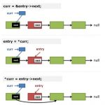

前几天Neo写过《[编程中的命名设计那点事](https://coolshell.cn/articles/990.html "编程中的命名设计那点事")》，这里也有另外一篇和程序命名的文章，可以从另一个角度看看。


**1.- 变量应该是尽可能的望文知意。千万不要使用教材中的命名方式。**


* **好的变量**：daysDateRange, flightNumber, carColor.
* **坏的变量**： days, dRange, temp, data, aux…


在我们的日常工作中，有很大数量的开发人员喜欢使用短的变量名，而不是有含义的变量名。这主要是因为我们大学教科书的那些示例所造成的，人都是先入为主，所以，教科书中的那些很抽象，带着演示的变量命名影响了我们一代又一代的程序员，并影响了他们很多年。虽然那些短的，教材式的变量名，可能会让你少打一些字，但其实，这是非常非常不好的。因为软件的维护成本远远大于了软件的开发成本，如果你不取一个好的一点的变量名，那么当进行代码评审时，当进行bug fixing时，当进行代码重构时，当进行代码维护时，你的某个变量名可能会让你一头雾水，不知道所措，还可以会让你走入陷阱，造成更大的时间成本。所以，一个可阅读的代码必然和那些不错的变量名分不开，而这也能让你的软件间接上有更好的质量。


**2.- 变量名不要太长，尽可能地简短**


只有简单和简短的变量名才是容易阅读的。因为你的变量名一定会用于程序语句中，所以，为了让你的程序语句看起来的简短，你的变量名也应该短一点，不然写出来的一个表达式就会显得很复杂。


当然，在有些时候，一个有含义的变量名和一个简短的变量名可能存在一些冲突。这相当锻炼我们的语言能力——如果有最精炼的词语来表达最丰富的含义。如果实在做不到，那么，取一个有含义的变量名要比取一个简短的变量名更好一些。不管怎么样，我们希望即简短又有丰富的含义，但如果不能两全，那有含义优先级更高一些。


* **坏的变量**：howLonDoesItTakeToOpenTheDoor， howBigIsTheMaterial…
* **好的变量**：timeToOpenTheDoor， MaterialSize.


**3.- 可以使用缩写，但需要有一些注释**


有一些时候，我们需要使用一些缩写来命名变量，比如：用usr来表示user，用gp来表示group，用conf来表示configuration，用cwd来表示current working directory，用ptr来代码point to reference，等等，等等。缩写一般要用在大家可以看得懂的，而不是为了缩写而缩短一个单词，当然，如果你把缩写后的变量名加上注释，那就更加稳妥了。关于一些约定俗成的缩写，可参看本文的**附录一**。


**4.- 使用合适的匈牙利命名规则**


这里有一篇非常不错的英文文章告诉你 《[什么是合适的匈牙利命名](http://www.joelonsoftware.com/articles/Wrong.html) 》，这篇文章同时还告诉你如何去用他。基本上来说，匈牙利命名法主要是为变量加上某种前缀以标识这个变量的类型，或是一种方法的功能。其基本原则是：变量名＝属性＋类型＋对象描述。


比如：在描述类型方面：指针p，函数fn，长整型 l，布尔b，浮点型（有时也指文件）f，双字 dw，字符串 sz，短整型 n，双精度浮点 d，无符号 u……等等。关于更多的命名规范，请参见**附录二**。


注意，匈牙利命名也是有不好的地方的，比如你要把一个整形改成一个浮点型，你除了要改变这个变量的类型，你还要改变这个变量的名字。这是相当麻烦的。而且，在某些时候，这种前缀式的命名可以反而让你不知所措。另外，在C++中，有了类以后，这种命名方法就显得不容易去实施了。所以，合适地使用匈牙利命名方式背后的思想是很关键的。


**5.- 不要使用反逻辑来命名**


* **好的命名**：  IsEnabled.
* **坏的命名：** IsNotEnabled.


在阅读的时候，我们更喜欢正向的逻辑，而不是反向逻辑。这一规则不单单的命名，在条件语句中，我们也是要尽量不要使用这种反面的逻辑。如：if (! (isAdmin || isUser))，这样的语句很不符合人读代码的习惯，写成这样会更好一些——if (!isAdmin && !isUser)。


**6.- 保持一致性**


保持所有代码的一致性。使用相同的命名规则。这外世界上没有最好的命名规范。但有一点是可以确认的，那就是在一个代码库中，应该使用一致的命名规则，即使这个规则不那么好，但整个团队使用一致的就是好的。


**7.- 附和应用程序的领域术语**


在不同的领域中，不同的观念会有非常特别和不同的意思。例如：单词“order”并不总是意味着“次顺”，有些时候，其意味着“订单”，有些时候，意味着“命令”，有些时候，意为着“规则”。所以，在某个领域中，某些单词会有不同的含义，所以，这需要我们的命令去附和这些领域。


 


**黄金法则- 花一些时间去思考去权衡一下你的变量名**


当你设计好一个的变量名一个函数名的时候，别着急去使用他，停下来，想一想，这个变量名是否合适，是否还有更好的？也许你正在使用的是一个很不好的变量名。有些时候，需要我们权衡利弊一下，可能还要去和同事讨论一下。


总之，变量名是编程的第一步，第一步走好了，后面才走得好。试想，无论是你或你的同事在使用一些好的变量名编程是一件多么轻松的事啊。


 


#### 附录：部分的缩写规范


|  |  |
| --- | --- |
| 完整单词 | 缩写 |
| A |  |
| average | avg |
| B |  |
| back | bk |
| background | bg |
| break | brk |
| buffer | buf |
| C |  |
| color | cr,clr |
| control | ctrl |
| D |  |
| data | dat |
| delete | del |
| document | doc |
| E |  |
| edit | edt |
| error | err |
| escape | esc |
| F |  |
| flag | flg |
| form | frm |
| G |  |
| grid | grd |
| I |  |
| increment | inc |
| information | info |
| initial | init |
| insert | ins |
| image | img |
| L |  |
| lable | lab |
| length | len |
| list | lst |
| library | lib |
| M |  |
| manager | mgr,mngr |
| message | msg |
| O |  |
| Oracle | Ora |
| P |  |
| panorama | pano |
| password | pwd |
| picture | pic |
| point | pt |
| position | pos |
| print | prn |
| program | prg |
| S |  |
| server | srv |
| source | src |
| statistic | stat |
| string | str |
| Sybase | Syb |
| T |  |
| temp | tmp |
| text | txt |
| U |  |
| user | usr |
| W |  |
| window | win,wnd |


 


#### 附录二、匈牙利命名法


```
  a       Array                       数组
  b       BOOL (int)                  布尔(整数)
  by      Unsigned Char (Byte)        无符号字符(字节)
  c       Char                        字符(字节)
  cb      Count of bytes              字节数
  cr      Color reference value       颜色(参考)值
  cx      Count of x (Short)          x的集合(短整数)
  dw      DWORD   (unsigned long)     双字(无符号长整数)
  f       Flags                       标志(一般是有多位的数值)
  fn      Function                    函数
  g_      global                      全局的
  h       Handle                      句柄
  i       Integer                     整数
  l       Long                        长整数
  lp      Long pointer                长指针
  m_      Data member of a class      一个类的数据成员
  n       Short int                   短整数
  p       Pointer                     指针
  s       String                      字符串
  sz      Zero terminated String      以0结尾的字符串
  tm      Text metric                 文本规则
  u       Unsigned int                无符号整数
  ul      Unsigned long (ULONG)       无符号长整数
  w       WORD (unsigned short)       无符号短整数
  x,y     x, y coordinates (short)    坐标值/短整数
  v       void                        空
```

有关项目的全局变量用g\_开始，类成员变量用m\_，局部变量若函数较大则可考虑用l\_用以显示说明其是局部变量。


```
前缀       类型        例子
g_      全局变量       g_Servers
C       类或者结构体   CDocument，CPrintInfo
m_      成员变量       m_pDoc，m_nCustomers
```

**VC常用前缀列表：**


```
前缀   类型   描述                      例子
ch     char    8位字符                   chGrade
ch     TCHAR   16位UNICODE类型字符       chName
b      BOOL    布尔变量                  bEnabled
n      int     整型                      nLength
n      UINT    无符号整型                nLength
w      WORD    16位无符号整型            wPos
l      LONG    32位有符号整型            lOffset
dw     DWORD   32位无符号整型            dwRange
p      *       内存模块指针，指针变量   pDoc
lp     FAR*    长指针                    lpDoc
lpsz   LPSTR   32位字符串指针           lpszName
lpsz   LPCSTR  32位常量字符串指针       lpszName
lpsz   LPCTSTR 32位UNICODE类型常量指针  lpszName
h      handle  Windows对象句柄           hWnd
lpfn   (*fn)() 回调函数指针              lpfnAbort
```

**Windows对象名称缩写：**


```
Windows对象 例子变量  MFC类       例子对象
HWND        hWnd;      CWnd*       pWnd;
HDLG        hDlg;      CDialog*    pDlg;
HDC         hDC;       CDC*        pDC;
HGDIOBJ     hGdiObj;   CGdiObject* pGdiObj;
HPEN        hPen;      CPen*       pPen;
HBRUSH      hBrush;    CBrush*     pBrush;
HFONT       hFont;     CFont*      pFont;
HBITMAP     hBitmap;   CBitmap*    pBitmap;
HPALETTE    hPalette;  CPalette*   pPalette;
HRGN        hRgn;      CRgn*       pRgn;
HMENU       hMenu;     CMenu*      pMenu;
HWND        hCtl;      CStatic*    pStatic;
HWND        hCtl;      CButton*    pBtn;
HWND        hCtl;      CEdit*      pEdit;
HWND        hCtl;      CListBox*   pListBox;
HWND        hCtl;      CComboBox*  pComboBox;

（全文完）
```


**（转载本站文章请注明作者和出处 [酷 壳 – CoolShell](https://coolshell.cn/) ，请勿用于任何商业用途）**


### 相关文章

* [](https://coolshell.cn/articles/18024.html)[API设计原则 – Qt官网的设计实践总结](https://coolshell.cn/articles/18024.html)
* [](https://coolshell.cn/articles/8990.html)[Linus：利用二级指针删除单向链表](https://coolshell.cn/articles/8990.html)
* [https://coolshell.cn/wp-content/plugins/wordpress-23-related-posts-plugin/static/thumbs/8.jpg](https://coolshell.cn/articles/8745.html)[如此理解面向对象编程](https://coolshell.cn/articles/8745.html)
* [](https://coolshell.cn/articles/7886.html)[代码执行的效率](https://coolshell.cn/articles/7886.html)
* [https://coolshell.cn/wp-content/plugins/wordpress-23-related-posts-plugin/static/thumbs/14.jpg](https://coolshell.cn/articles/5444.html)[千万不要把 bool 设计成函数参数](https://coolshell.cn/articles/5444.html)
* [](https://coolshell.cn/articles/5201.html)[重构代码的7个阶段](https://coolshell.cn/articles/5201.html)
The post [编程命名中的7+1个提示](https://coolshell.cn/articles/1038.html) first appeared on [酷 壳 - CoolShell](https://coolshell.cn).