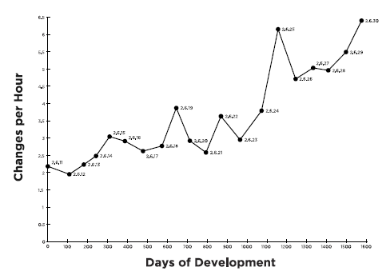
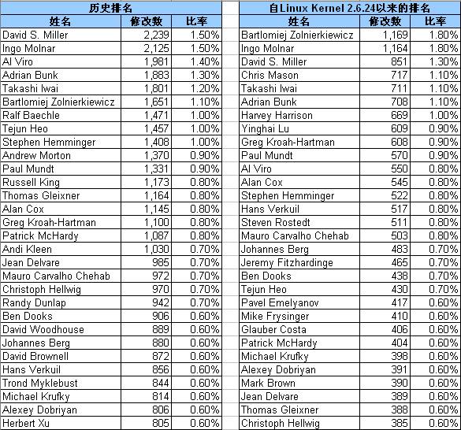

[http://www.linuxfoundation.org/sites/www.linuxfoundation.org/themes/opensourcery/images/linux-foundation.png](http://www.linuxfoundation.org/sites/www.linuxfoundation.org/themes/opensourcery/images/linux-foundation.png)2009年8月，[Linux软件基金会](http://www.linuxfoundation.org/)发布了一份叫《[Who Writes Linux and Who Supports It](http://www.linuxfoundation.org/publications/whowriteslinux.pdf)》(PDF)的报告。这份报告主要对Linux 2.6.x的开发进行了全方位的统计。看了以后才知道，原来Linux的开发的生产率竟是这样的惊人，而且相当的的令人振奋，所以，在第一时间转过来给大家看看。让人不得不惊叹，这不可思议的具有非凡活力的社区。（注意，我们这里说的是Linux，不是GNU的那些东西，所谓Linux就是Linux的Kernel）

下面是一个导读，希望每一个看到这篇文章的朋友都能看看原文的报告：《[Who Writes Linux and Who Supports It](http://www.linuxfoundation.org/publications/whowriteslinux.pdf)》(PDF)

这份报告的一开始就对Linux的开发进行了总结：

* 每2-3个月一个release
* 最近的每一次release都超过10000个补丁
* 有超过1000个开发人员进行开发，他们来自200个公司或组织。
* 自2005年以来，超过5000个来自500个不同公司的开发人员为Linux内核做过贡献。
* 自2008年以来，每次release，都大约增加了10%左右的开发人员，而且，代码码达到了2.7百万行。

是的，这样的生产率真是太疯狂了。下面是这份文档中所涉及的一些介绍和一些具体的统计数据。

#### Linux开发模式

Linux的开发采用的是一种宽松的，基于时间的开发模式。每一个新的主要版本的release基本上会发生在2-3个月之内。这个开发模式是在2005年形成的，因为任何人都可以修改其内核的代码，所以，很多补丁进入内核的时间非常的快。

其中一个有意义的事是，他们有一个叫Linux-Next的服务器，这个服务器一般来说会是下一个版本的staging，比如，如果目前的稳定版本是2.6.31，那么Linux-Next上就会运行2.6.32。这样，所有的developer都能看到下一个版本总体的样子，而且，这更容易发现一些集成性的问题。

在2.6的mainline代码库上（mailline是代码库的主线），有一个叫做“stable team”的团队，他们会做短期的维护工作，他们确保所有的重要的补丁或更改都会被放入mailline中，这样就能滚入下一个release。

然后，这份文档中给出了大量的开发编译数据。

#### 统计数据

下面的统计数据是从版本2.6.11开始的，我把源文件中的表格合并成一个大表，如下所示。

从上图我们可以看到下面这些东西：

* Linux Kernel开发的速度越来越快，看看每个release的补丁数，每天文件增、删、改就可以知道。
* Linux Kernel开发的团队是越来越大，包括人员和参与的公司。

下面是几个统计图表：

  

平均每天的修改

  

代码修改统计

  

开发人员

#### 谁写了Linux

最后我们进入主题——谁写了Linux，首先，我们先来看一下进入代码修改的Top 30的开发人员列表：

我们可以看到，Linus Torvalds （729 总修改，自2.6.24版来254 修改）无法进入前30名。当然，对Linux的贡献绝对不能通过代码行来表示，Linus对Linux就算是在今天也是至关紧要的。

好，让我们再来看看那些公司对Linux的贡献。根据这份报告所说，知道每个developer所在的公司，主要是通过了下面的几种方法：

* 使用的邮件地址有公司的名字。
* 由赞助者提交的代码。
* 直接询问得到的。

所以，这些数据只能算得上的近似，不过也能看到一个总体的样子了。下图中“None”代表没有职业无业游民，“Unknown”代表无名氏或是英雄不知出处。

我们可以看到，Top 10公司，为Linux贡献了近70%的代码。包括了None和Unknown，而且，那些是拿着公司报酬给Linux作开发的程序员。

那么，为什么这些公司要支持Linux的内核开发呢？

* 我们可以看到像IBM, Intel, SGI, MIPS, Freescale, HP, Fujitsu这样的大公司，他们的目的当然是为了确保Linux能够在他们的硬件上工作得更好。
* 我们也可以看到像Red Hat, Novell, 和MontaVista这些Linux的Distribution公司，他们是Linux的主力，主要是为了提供给他们的客户更好的服务。
* 同样，我们还能看到像Sony, Nokia, 和Samsung这样的公司，这些公司主要是用Linux来开发数码产品，如摄像机、手机或是电视，他们使用Linux做一些嵌入式开发，以保证他们的产品工作得更好。
* 还有一些和IT都没有关系的，例如：Volkswagen公司在v21.6.25中为Linux加入了PF\_CAN网络实现的协议。Quantum Controls BV公司在2.6.30时加入了一个航海导航的补丁，这些公司都会使用Linux来完善他们的产品。

看来，Linux的势头是越来越无法阻挡了，你也想加入这个阵营吗？点下面的链接吧：<http://ldn.linuxfoundation.org/book/how-participate-linux-community>

（全文完）

**（转载本站文章请注明作者和出处 [酷 壳 – CoolShell](https://coolshell.cn/) ，请勿用于任何商业用途）**

### 相关文章

* [eBPF 介绍](https://coolshell.cn/articles/22320.html)
* [打造高效的工作环境 – Shell 篇](https://coolshell.cn/articles/19219.html)
* [记一次Kubernetes/Docker网络排障](https://coolshell.cn/articles/18654.html)
* [程序员练级攻略（2018) 与我的专栏](https://coolshell.cn/articles/18360.html)
* [Linux PID 1 和 Systemd](https://coolshell.cn/articles/17998.html)
* [缓存更新的套路](https://coolshell.cn/articles/17416.html)
The post [谁写了Linux](https://coolshell.cn/articles/1360.html) first appeared on [酷 壳 - CoolShell](https://coolshell.cn).