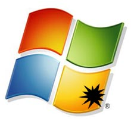
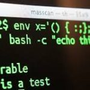
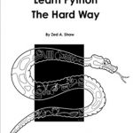

截止至2009年底，大约有90%的微软安全补丁是把管理员权限给disable了。根据 [BeyondTrust](http://www.beyondtrust.com/)的报告，到今年3月分，Windows 7 有57%的安全补丁是以移除管理员权限作为解决方法的，相比较而言，Windows 2000 是 53%，Windows XP 是 62%，Windows Server 2003 是 55%，Windows Vista 是 54% 以及 Windows Server 2008 是 53%，而最牛的要算是 —— 100% 的 Microsoft Office 和 94%  Internet Explorer （其中100% 的 IE8 ）的安全补丁是移除管理员权限。

这对于某些公司的IT部门来说是个好消息，因为这些公司的IT部门通常是不会让公司的员工有本机的管理员权限的，根据微软大量的安全补丁是移除某些管理员权限的这一特性，这意味着对于本机只有一般用户权限IT管理，将会防住很大一部份的恶意攻击。

Paul Cooke, Windows Client Enterprise Security主管说：“我们相信，如果你只是用一般用户来操作Windows的话，这会是一种很好的方式”。而这一提法，相对于Unix的尽可能的不用root用户操作系统这一观点，整整落后了几十年，Windows的用户很习惯于在Administrator下操作系统，这样，一旦中招，任何程序都以系统管理员的权限运行，所以结果也是毁灭性的。这样操作电脑的方式对于Unix的用户来说简直是不可想像的，因为在Unix下，99%的情况下，操作者都不会使用管理员的账号。

还记得以前和朋友的一段对话：

朋友：“为什么Windows下很容易中病毒，Unix/Linux下却不常见？杀毒软件在Windows下是必备的，但还是很容易中招，而Unix/Linux却可以祼奔。”

陈皓：“那是因为大家都用Windows的Administrator用户操作电脑，而且文件系统都没有权限设置。不像Unix/Linux，没人总是用root操作电脑，而且，所有的文件和目限都有权限。所以，Windows下，一中病毒，病毒就会以管理员的权限运行，不但破坏你的系统甚至干掉你的杀毒软件。而Unix/Linux下，就算中毒，干掉的也是当前用户下的文件，对于系统文件和系统进程来说，不会有任何问题。”

朋友：“那么在Windows下，如何和Unix/Liunx一样使用？”

陈皓：“首先，尽量不要使用Adminstrator用户，使用User用户操作电脑。并且把文件系统格式化成NTFS，这样才能设置上权限。把C盘的根目录，%Windows%以及%System%目录，注册表的关键位置（服务、启动等），都设置上只有Administrator可写，User只读。这样一来，就算是中毒，病毒最多改写当关用户文件，其根本无法操作C盘根目录和Windows%以及%System%目录以及注册表的关键位置，还有IE的插件等（这些地方都是病毒最爱去的地方），中毒后不会对系统造成伤害。在这种情况下，你就算没有杀毒软件祼奔也没有问题”

朋友：“嗯，听起来不错。不过这样整是不是太麻烦了，特别是要装一些软件什么的。”

陈皓：“是的，没错。按道理来说，各个用户的软件应该是装在其用户的目录和环境下，而不应该装在系统的目录下，Unix/Liunx就是这么做的，但是Windows并没有提供这样的方式，很多软件都要去Adminstrator下安装，所以，在系统上装上一些恶意插件，流氓软件也就很正常了。没办法，这就是Windows和Unix/Liunx的差别了，Windows出生的时候就是单用户的，Unix/Liunx则是多用户的，这是Windows先天设计的缺陷，所以，今天这样的局面也是理所当然的。”

上面的这段对话，也许有助于你了解Windows，安全等方面的东西。下面，让我们再来用一组数据结束本文。

总体来说，去年一年中64%的所有的微软安全补丁把管理员权限给移除了。如果你只考虑Critical级别的安全补丁，那么有点到80%补丁是移除管理员权限，如果只考虑远程攻击方面的，那么这个比率是84% 。相关的报道请查看如下文章：

- [90% of Critical Microsoft Windows 7 Vulnerabilities are Mitigated by Eliminating Admin Rights](http://www.beyondtrust.com/downloads/whitepapers/documents/wp039_BeyondTrust_2009_Microsoft_Vulnerability_Analysis.pdf) (beyondtrust.com)

- [Report: Windows 7 holes eased by axing admin rights](http://news.cnet.com/8301-27080_3-20001359-245.html) (news.cnet.com)

（全文完）

**（转载本站文章请注明作者和出处 [酷 壳 – CoolShell](https://coolshell.cn/) ，请勿用于任何商业用途）**

### 相关文章

* [bash代码注入的安全漏洞](https://coolshell.cn/articles/11973.html)
* [性能调优攻略](https://coolshell.cn/articles/7490.html)
* [https://coolshell.cn/wp-content/plugins/wordpress-23-related-posts-plugin/static/thumbs/5.jpg](https://coolshell.cn/articles/5107.html)[10大经典错误](https://coolshell.cn/articles/5107.html)
* [https://coolshell.cn/wp-content/plugins/wordpress-23-related-posts-plugin/static/thumbs/25.jpg](https://coolshell.cn/articles/4102.html)[如何学好C语言](https://coolshell.cn/articles/4102.html)
* [https://coolshell.cn/wp-content/plugins/wordpress-23-related-posts-plugin/static/thumbs/7.jpg](https://coolshell.cn/articles/4077.html)[纯文本配置还是注册表](https://coolshell.cn/articles/4077.html)
* [两本电子书](https://coolshell.cn/articles/3270.html)
The post [微软的安全补丁分析](https://coolshell.cn/articles/2305.html) first appeared on [酷 壳 - CoolShell](https://coolshell.cn).