**出处**：[A Useful Selection of Android Developer Tools and Resources](http://speckyboy.com/2010/08/04/a-useful-selection-of-android-developer-tools-and-resources/)

在google、开源平台，和来自移动电话制造商HTC,Samsung和Sony Ericsson的支持下，Android平台在市场占有率上相比去年取得的886%增长！如果我只看增长率，IPhone据统计才有61%的增长。这些数据可以给你关于两个平台流行度的印像，但是事实上，这些数据告诉了智能机开发员的谁才是真正的赢家。在时下，智能机越来越流行，因此成为一个快速增长的Android平台的智能机开发人员将会是一个不错的选择。

相比较其他的平台，Android不依赖于任何约束第三方应用程序的私有的操作系统（题外话：美国最近[宣布](http://www.bbc.co.uk/news/technology-10836692)对于IPhone的破解和越狱是合法行为），Android本身就是开源的。由于开源，Android有巨大的开发社区支持。各种个样的例子和教程，GUI素材，和开发工具下载。几乎所有的都是免费提供的。我们选出接近20个可以免费或开源的，工具，资源，开发指南。希望这些资源能给你的Android应用带来帮助。  

 **相关文章参看:**

* [Android App Developers GUI Kits, Icons, Fonts and Tools →](http://speckyboy.com/2010/05/10/android-app-developers-gui-kits-icons-fonts-and-tools/)
* [iPhone and iPad Development GUI Kits, Stencils and Icons →](http://speckyboy.com/2010/04/30/iphone-and-ipad-development-gui-kits-stencils-and-icons/)
* [Mobile Web and App Development Testing and Emulation Tools →](http://speckyboy.com/2010/04/12/mobile-web-and-app-development-testing-and-emulation-tools/)
* [14 Free Mobile Application Development Icon Sets →](http://speckyboy.com/2010/03/08/14-free-mobile-app-development-icon-sets/)

### [免费的Android开发人员电子书:andbook](http://andbook.anddev.org/)

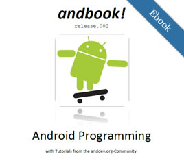

如果你刚步入Android的开发，那么对于第一次开发Android应用程序的你来说，这本书是非常适合的。这本只有62页的PDF电子书里，有简单易懂的入门教程，帮助你在没有任何Android开发知识的背景下，教你开发Android应用程序。  

[Free Android Developer Ebook: andbook! →](http://andbook.anddev.org/)

### [免费的Android开发人员电子书:专业Android应用程序开发](http://kronox.org/documentacion/Professional_Android_Application_Development.pdf)

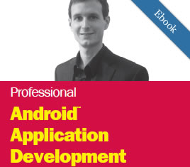

专业Android应用程序开发PDF电子书，是一本创建移动手机应用程序的上手指南，这本书特点简洁，还有着能帮助你快速构建真实Android移动电话应用程序的典型的例子。本书覆盖了Android手机所有本质特性，并同时展示了Android手机的高级特性。  

[Free Android Developer Ebook: Professional Android Application Development →](http://kronox.org/documentacion/Professional_Android_Application_Development.pdf)

### 免费和开源的应用程序

* [apps-for-android (Open Source Applications) →](http://code.google.com/p/apps-for-android/)这个链接中包含了许多实用的开源的Android应用程序。这些应用程序展示了Android的许多特性。

* [List of Sample Android Apps →](http://developer.android.com/resources/samples/index.html)（**译者注：**我勒个擦！墙掉了，中国Android开发人员杯具了，看来官方不给力啊，这次元还真是不毛之地啊）  

这个Web页面是一个Android开发包中的实例程序列表。使用这个页面上的链接，你可以通过你的浏览器来阅读这些例子程序的源代码。你也可以把这些实例程序下载下来，当你需要的时候，你可以修改并使用他们。

* [Android Cookbook (Examples in Cookbook Form) →](http://code.google.com/p/android-cookbook/)这个站点有很多实用的Android示例程序，你完全可以重用这些例子。

* [OpenIntents →](http://www.openintents.org/en/)OpenIntends 设计和实现了开放式 intents和接口，其使得Android移动应用程序能更紧密的结合在一起。同时OpenIntends免费的提供了更专业和复杂的实例应用程序来演示他们的用法。

* [Android Snippets (Share Useful Snippets of Source Code) →](http://www.androidsnippets.org/)Android Snippets 是一个Android的实用代码段库，这个库是用来分享实用和优秀的Android应用程序代码；如果没有特别的需求，我们可以大量的重用这些代码库。

### [Windows上的Android](http://www.addictivetips.com/windows-tips/download-google-android-emulator/)

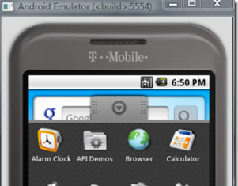

对于那些想测试驱动Android的开发者，可以使用这个Android模拟器，这个模拟器以单独的应用程序的形式独立运行在Windows PC之上，使用这个模拟器不用下载和完全安装复杂的Android开发包。你甚至可以在这个模拟器上安装和测试Android系统兼容的应用程序。  

[Android Emulator on Windows →](http://developer.android.com/guide/developing/tools/emulator.html)

### [来自应用程序开发入门的Android模拟器](http://developer.android.com/guide/developing/tools/emulator.html)

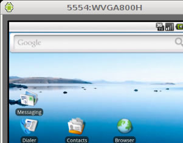

Android的开发包中包含了一个移动设备模拟器。这个模拟器模仿了典型移动设备的硬件和软件特性(当然，不包含打电话)。这个模拟器提供各种个样的导航和控制按键，可以使用你的鼠标和键盘来“按”下这些按键为你的应用程序生成事件。这个模拟器也提供一个屏幕为你显示应用程序。同时，SDK中提供了很多能在模拟器上运行的应用程序。  

[Android Emulator from The Developer’s Guide →](http://developer.android.com/guide/developing/tools/emulator.html)

### [感应模拟器](http://www.openintents.org/en/node/23)

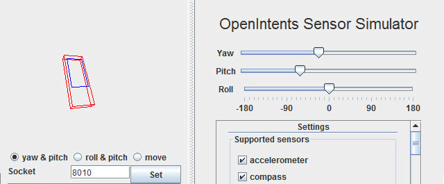

感应模拟器是一个JAVA独立应用程序，感应模拟器模拟感应数据并把数据传给Android模拟器。这个感应模拟器可以让你模拟加速度仪器，指南针，和方向感应，这些数据可以用于Android应用程序，并通过感应器进行控制。  

[SensorSimulator →](http://www.openintents.org/en/node/23)

### [DroidEx:大（巨）屏上的Android项目](http://github.com/commonsguy/droidex)

DroidEx 可以让你附加的Android设备的显示屏内容复制一份到你的开发机屏幕。使用DroidEx来做演示是非常有用的。因为你可以把你的Android设备连接到你的笔记本电脑上或投影仪上，你的客户就可以通过这些设备来看你Android设备上的内容。DroidEx还可以用来演示那些用模拟器不方便演示的内容，比如说GPS或加速度仪器等内容。  

[DroidEx: Projecting Android on the Big(ger) Screen →](http://github.com/commonsguy/droidex)

### [Android的App Inventor](http://appinventor.googlelabs.com/about/)

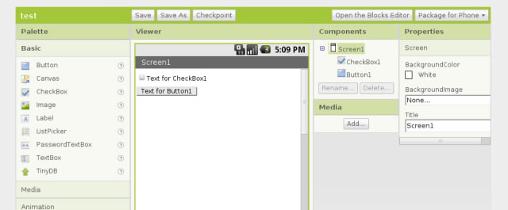  

Android 的App Inventor是来自Google为非开发人员准备的新工具，通过这个工具，非开发人员可以非常容易地在里面创建应用程序。可以通过网站的视屏来预览这个工具的功能特性。(你可以参看酷壳的[这篇文章](https://coolshell.cn/articles/2608.html))

(**译者注：**这里还有一个youtube视屏，可惜也墙掉了）  

### [如何开发Android中的常用任务](http://developer.android.com/guide/appendix/faq/commontasks.html)

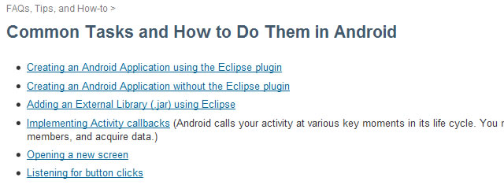

这是一个关于Android开发可能遇到的常用任务列表集合，并提供了一个快速、 how-to方式的帮助，来帮助你完成这些任务。

[Common Tasks and How to Do Them in Android→](http://developer.android.com/guide/appendix/faq/commontasks.html)

### [快速启动小抄](http://andblogs.net/fastboot/)

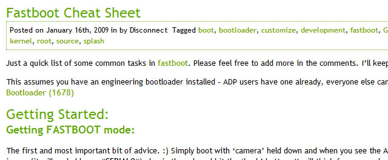

快速启动小抄是一个非常实用和快速的列表，这个列表中罗列一些关于快速启动的相关任务。  

[Fastboot Cheat Sheet →](http://andblogs.net/fastboot/)

### [UI指导原则](http://developer.android.com/guide/practices/ui_guidelines/index.html)

在这里你可以找一些到官方文章的连接，这些连接来自于“The Developer’s Guide”。这些文章的内容描述了关于Android可视交互应用程序的UI设计开发的指导原则。

* [Icon Design Guidelines →](http://developer.android.com/guide/practices/ui_guidelines/icon_design.html)
* 图标指导原则描述每类图标的细节，并做关于尺寸，颜色，阴影其他的细节的规范，根据这些规范你的设计的图标可以适用于Android系统。你也可以下载Android图标模板包，这个包里面是一些Photoshop和Illustrator模板和滤镜文件，通过这个模板包你可以更简单的创建满足规范的图标。
* [Download the Android Icon Templates Pack](http://developer.android.com/guide/practices/ui_guidelines/icon_design.html#templatespack)
* 控件设计指导描述了如何设计适合其他主页屏的控件。这个连接会连接到一些图形文件和模板，通过这些模板和文件可以使你设计更简单。
* [Widget Design Guidelines →](http://developer.android.com/guide/practices/ui_guidelines/widget_design.html)
* Activity和Task设计指导描述了活动的工作方式，并用图解示例演示了Activity，并描述了其重要的底层机制和原理，如多任务系统，Activity重用，intents，Activity栈，和Task。以设计层面的角度覆盖了活动的所有内容。
* [Activity and Task Design Guidelines →](http://developer.android.com/guide/practices/ui_guidelines/activity_task_design.html)
* 菜单设计指导描述了上下文菜单和选项菜单的不同。如何放置菜单项，何时放置屏幕命令，和其他的一些菜单细节。
* [Menu Design Guidelines →](http://developer.android.com/guide/practices/ui_guidelines/widget_design.html)

**[理解Android中的用户接口 来自于](http://mobiforge.com/designing/story/understanding-user-interface-android-part-1-layouts)[mobiforge.com](http://mobiforge.com/)**

这4部分的文档来自于[mobiforge.com](http://mobiforge.com/),文档中包含了组成Android UI的各种要素。文档的第一部分讨论Android中各种各样的有效的的布局。

1. 1. [Understanding User Interface in Android – Part 1 →](http://mobiforge.com/designing/story/understanding-user-interface-android-part-1-layouts)
	2. [Understanding User Interface in Android – Part 2 →](http://mobiforge.com/designing/story/understanding-user-interface-android-part-2-views)
	3. [Understanding User Interface in Android – Part 3 →](http://mobiforge.com/designing/story/understanding-user-interface-android-part-3-more-views)
	4. [Understanding User Interface in Android – Part 4 →](http://mobiforge.com/designing/story/understanding-user-interface-android-part-4-even-more-views)

### [Android UI模式](http://www.androidpatterns.com/)

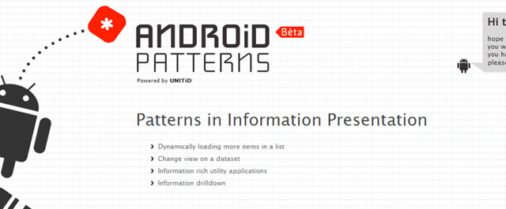

[Android UI Patterns →](http://www.androidpatterns.com/)

### [DroidDraw:Android用户接口图形编辑器](http://www.droiddraw.org/)

[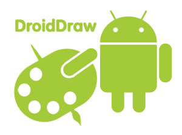](https://coolshell.cn/wp-content/uploads/2010/08/android_dev_19.jpg)

DroidDraw是一个为Android创建图形用户界面的UI设计器。它是一个独立的可执行程序，可以运行在Mac OS X，Windows和Linux上。

[DroidDraw : Graphical User Interface Editor for Android →](http://www.droiddraw.org/)

### [Android GUI PSD 向量包](http://www.smashingmagazine.com/2009/08/18/android-gui-psd-vector-kit/)

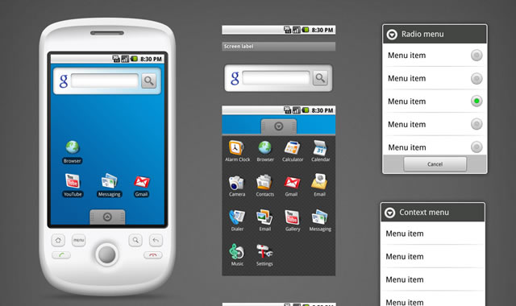

Android GUI Starter Kit包里面包含了多个按钮元素和不同接口选项的AndroidGUI内容。这些元素是基于Android1.5 GUI的，并且这些包里面的被提供给开源社区的Android应用程序模型。大部分的GUI元素和手机图例都是使用向量路径制成，所以他们非常地容易被缩放。对于文本AndroidSans包被使用。  

[Android GUI PSD Vector Kit →](http://www.smashingmagazine.com/2009/08/18/android-gui-psd-vector-kit/)

### [Android的Firworks Template](http://unitid.nl/2009/11/fireworks-template-for-android/)

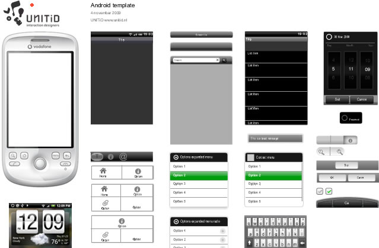

在Fireworks模板中，Android的各种元素被以向量图形的方式被重绘。在目录中，这些元素的名称大多根据Android词汇表被命名。  

[Fireworks Template for Android →](http://unitid.nl/2009/11/fireworks-template-for-android/)

### [Android线框模板](http://www.tomhume.org/2010/01/android-wireframe-templates.html)

线框PDF是信纸大小（8.5英寸 \* 11英寸）并且各部件都被拉伸。因此你可以非常容易的以纸张原型或拉伸为真实尺寸的方式来使用。如果你没有信纸，你可以用A4纸来打印。  

[Android Wireframe Templates →](http://www.tomhume.org/2010/01/android-wireframe-templates.html)  

你也可以参考：

* [Android App Developers GUI Kits, Icons, Fonts and Tools →](http://speckyboy.com/2010/05/10/android-app-developers-gui-kits-icons-fonts-and-tools/)
* [iPhone and iPad Development GUI Kits, Stencils and Icons →](http://speckyboy.com/2010/04/30/iphone-and-ipad-development-gui-kits-stencils-and-icons/)
* [Mobile Web and App Development Testing and Emulation Tools →](http://speckyboy.com/2010/04/12/mobile-web-and-app-development-testing-and-emulation-tools/)
* [14 Free Mobile Application Development Icon Sets →](http://speckyboy.com/2010/03/08/14-free-mobile-app-development-icon-sets/)
* [45+ Cool Google Android Apps – The Perfect iPhone Replacement →](http://speckyboy.com/2009/09/15/45-cool-google-android-apps-the-perfect-iphone-replacement/)

**（全文完）**

**（转载本站文章请注明作者和出处 [酷 壳 – CoolShell](https://coolshell.cn/) ，请勿用于任何商业用途）**

### 相关文章

* [https://coolshell.cn/wp-content/plugins/wordpress-23-related-posts-plugin/static/thumbs/0.jpg](https://coolshell.cn/articles/4220.html)[一些有意思的文章和资源](https://coolshell.cn/articles/4220.html)
* [Google App Inventor](https://coolshell.cn/articles/2608.html)
* [关于移动端的钓鱼式攻击](https://coolshell.cn/articles/17066.html)
* [DHH 谈混合移动应用开发](https://coolshell.cn/articles/12225.html)
* [Google Inbox如何跨平台重用代码？](https://coolshell.cn/articles/12136.html)
* [https://coolshell.cn/wp-content/plugins/wordpress-23-related-posts-plugin/static/thumbs/17.jpg](https://coolshell.cn/articles/4710.html)[Python 和 PyGame 的一些示例](https://coolshell.cn/articles/4710.html)
The post [实用Android开发工具和资源精选](https://coolshell.cn/articles/2853.html) first appeared on [酷 壳 - CoolShell](https://coolshell.cn).