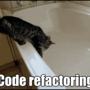

还记得以前和大家提到过的《[各种流行的编程风格](https://coolshell.cn/articles/2058.html)》吗？有一些人问我那些编程风格具体是什么样子的。下面是一个代码重构的实例，让我们看看那个流行的编程风格是实践是什么样的。下面的这个实践不是虚构，如有雷同，请对号入座。


首先，我们有一个表达式如下所示：


`s = 7;`


很明显，这个表达式的变量名太没意义了，很不利于程序的可读性，所以，我们需要取一个有意义的变量名：


`slots = 7;`


很好，不过，那个常量7是hard-code或是一个Magic number，而且，这常量没有名字也不利于代码的可读性啊。再改：


```
SEVEN = 7;
...
slots = SEVEN;
```

靠！上面，是这是哪门子的改法？（不过，我保证这是真实发生的），常量名也要有意义一点嘛，再改：


```
SLOTS_PER_WIDGET = 7;
...
slots = SLOTS_PER_WIDGET;
```

这还差不多，不过，名字可能会重名啊，最好放到一个类中：


```
import widgetConstants;
...
slots = widgetConstants.SLOTS_PER_WIDGET;
```

现在看起来好很多了，不过，即然面向对象了，我们当然要学会使用Design Pattern，比如Factory啊，或是Singleton啊什么的：


```
widgetModelFactory = WidgetModelFactory.getInstance();
widgetModel = widgetModelFactory.getWidgetModel() ;
slots = widgetModel.getSlotsPerWidget();
```

当然，要是考虑到整体的类结构，上面的那些还不够，下面是我们最终的重构代码：（欢迎来到真实的Java世界）


```
context = Context.getCurrentContext();
serviceDirectoryFactory = ServiceDirectoryFactory.getServiceDirectory(context);
serviceDirectory = serviceDirectoryFactory.getServiceDirectory(context);
serviceDescriptor = ServiceDescriptorFactory.getDescriptor("widgetModelFactory");
widgetModelFactoryServiceLocator = serviceDirectory.getServiceLocator(serviceDescriptor,context);
widgetModelFactory = (WidgetModelFactory)widgetModelFactoryServiceLocator.findService(context);
widgetModel = widgetModelFactory.getWidgetModel(context);

slots = widgetModel.getSlotsPerWidget();
```

这就是我们的面像对象的编程模式，记得N年前在面试那家著名的以鼓吹敏捷方法论的公司时，在用程序实现一个程序题的时候，他们对我的程序很不屑一顾，原因有两个，其一、我没有使用TDD写UT Case，其二、我的程序里没有设计模式。（我才知道，编程原来是为了测试和设计模式，而不是为了原来的需求），今天，仅以此文献给钟爱于[那些流行编码风格](https://coolshell.cn/articles/2058.html)的程序员们。


其实，这段代码也是如下而已罢了。


`slots = thisWidget.getSlotCount();`


(全文完)


**（转载本站文章请注明作者和出处 [酷 壳 – CoolShell](https://coolshell.cn/) ，请勿用于任何商业用途）**


### 相关文章

* [](https://coolshell.cn/articles/18024.html)[API设计原则 – Qt官网的设计实践总结](https://coolshell.cn/articles/18024.html)
* [https://coolshell.cn/wp-content/plugins/wordpress-23-related-posts-plugin/static/thumbs/14.jpg](https://coolshell.cn/articles/5444.html)[千万不要把 bool 设计成函数参数](https://coolshell.cn/articles/5444.html)
* [https://coolshell.cn/wp-content/plugins/wordpress-23-related-posts-plugin/static/thumbs/23.jpg](https://coolshell.cn/articles/5292.html)[弱爆程序员的特征值](https://coolshell.cn/articles/5292.html)
* [](https://coolshell.cn/articles/5201.html)[重构代码的7个阶段](https://coolshell.cn/articles/5201.html)
* [](https://coolshell.cn/articles/4875.html)[一个空格引发的惨剧](https://coolshell.cn/articles/4875.html)
* [https://coolshell.cn/wp-content/plugins/wordpress-23-related-posts-plugin/static/thumbs/30.jpg](https://coolshell.cn/articles/4758.html)[如何写出无法维护的代码](https://coolshell.cn/articles/4758.html)
The post [代码重构的一个示例](https://coolshell.cn/articles/3005.html) first appeared on [酷 壳 - CoolShell](https://coolshell.cn).