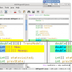

**感谢[@weidagang](http://weibo.com/n/weidagang) （Todd）向酷壳投递本文。**


程序设计语言的抽象机制包含了两个最基本的方面：一是语言关注的基本元素/语义；另一个是从基本元素/语义到复合元素/语义的构造规则。在C、C++、Java、C#、Python等通用语言中，语言的基本元素/语义往往离问题域较远，通过API库的形式进行层层抽象是降低问题难度最常用的方法。比如，在C语言中最常见的方式是提供函数库来封装复杂逻辑，方便外部调用。


不过普通的API设计方法存在一种天然的陷阱，那就是不管怎样封装，大过程虽然比小过程抽象层次更高，但本质上还是过程，受到过程语义的制约。也就是说，通过基本元素/语义构造更高级抽象元素/语义的时候，语言的构造规则很大程度上限制了抽象的维度，我们很难跳出这个维度去，甚至可能根本意识不到这个限制。而SQL、HTML、CSS、make等DSL（领域特定语言）的抽象维度是为特定领域量身定做的，从这些抽象角度看问题往往最为简单，所以DSL在解决其特定领域的问题时比通用程序设计语言更加方便。通常，SQL等非通用语言被称为外部DSL（External DSL）；在通用语言中，我们其实也可以在一定程度上突破语言构造规则的抽象维度限制，定义内部DSL（Internal DSL）。


本文将介绍一种被称为流畅接口（Fluent Interface）的内部DSL设计方法。Wikipedia上[Fluent Interface](http://en.wikipedia.org/wiki/Fluent_interface "Fluent Interface")的定义是：


> A fluent interface (as first coined by Eric Evans and Martin Fowler) is an implementation of an object oriented API that aims to provide for more readable code. A fluent interface is normally implemented by using method chaining to relay the instruction context of a subsequent call (but a fluent interface entails more than just method chaining).
> 
> 


下面将分4个部分来逐步说明流畅接口在构造内部DSL中的典型应用。


#### **1. 基本语义抽象**


如果要输出0..4这5个数，我们一般会首先想到类似这样的代码：


```

//Java
for (int i = 0; i < 5; ++i) {
    system.out.println(i);
}
```


而Ruby虽然也支持类似的for循环，但最简单的是下面这样的实现：


```

//Ruby
5.times {|i| puts i}
```

Ruby中一切皆对象，5是Fixnum类的实例，times是Fixnum的一个方法，它接受一个block参数。相比for循环实现，Ruby的times方式更简洁，可读性更强，但熟悉OOP的朋友可能会有疑问，times是否应该作为整型类的方法呢？在OOP中，方法调用通常代表了向对象发送消息，改变或查询对象的状态，times方法显然不是对整型对象状态的查询和修改。如果你是Ruby的设计者，你会把times方法放入Fixnum类吗？如果答案是否定的，那么Ruby的这种设计本质上代表了什么呢？实际上，这里的times虽然只是一个普通的类方法，但它的目的却与普通意义上的类方法不同，它的语义实际上类似于for循环这样的语言基本语义，可以被视为一种自定义的基本语义。times的语义从一定程度上跳出了类方法的框框，向问题域迈进了一步！


另一个例子来自Eric Evans的“用两个时间点构造一个时间段对象”，普通设计：


```

//Java
TimePoint fiveOClock, sixOClock;
TimeInterval meetingTime = new TimeInterval(fiveOClock, sixOClock);
```

另一种Evans的设计是这样：


```

//Java
TimeInterval meetingTime = fiveOClock.until(sixOClock);
```

按传统OO设计，until方法本不应出现在TimePoint类中，这里TimePoint类的until方法同样代表了一种自定义的基本语义，使得表达时间域的问题更加自然。


虽然上面的两个简单例子和普通设计相比看不出太大的优势，但它却为我们理解流畅接口打下了基础。重要的是应该体会到它们从一定程度上跳出了语言基本抽象机制的束缚，我们不应该再用类职责划分、迪米特法则（Law of Demeter）等OO设计原则来看待它们。


#### **2. 管道抽象**


在Shell中，我们可以通过管道将一系列的小命令组合在一起实现复杂的功能。管道中流动的是单一类型的文本流，计算过程就是从输入流到输出流的变换过程，每个命令是对文本流的一次变换作用，通过管道将作用叠加起来。在Shell中，很多时候我们只需要一句话就能完成log统计这样的中小规模问题。和其他抽象机制相比，管道的优美在于无嵌套。比如下面这段C程序，由于嵌套层次较深，不容易一下子理解清楚：


```

//C
min(max(min(max(a,b),c),d),e)

```

而用管道来表达同样的功能则清晰得多：


```

#!/bin/bash
max a b | min c | max d | min e

```

我们很容易理解这段程序表达的意思是：先求a, b的最大值；再把结果和c取最小值；再把结果和d求最大值；再把结果和e求最小值。


jQuery的链式调用设计也具有管道的风格，方法链上流动的是同一类型的jQuery对象，每一步方法调用是对对象的一次作用，整个方法链将各个方法的作用叠加起来。


```

//Javascript
$('li').filter(':event').css('background-color', 'red');

```

#### 3. 层次结构抽象


除了管道这种“线性”结构外，流畅接口还可用于构造层次结构抽象。比如，用Javascript动态创建创建下面的HTML片段：


```

<div id="’product_123’" class="’product’">

<ul>
	<li>Name: iPad2 32G</li>
	<li>Price: 3600</li>
</ul>
</div>


```

若采用Javascript的DOM API：


```

//Javascript
var div = document.createElement('div');
div.setAttribute(‘id’, ‘product_123’);
div.setAttribute(‘class’, ‘product’);

var img = document.createElement('img');
img.setAttribute(‘src’, ‘preview_123.jpg’);
div.appendChild(img);

var ul = document.createElement('ul');
var li1 = document.createElement('li');
var txt1 = document.createTextNode("Name: iPad2 32G");
li1.appendChild(txt1);
…
div.appendChild(ul);
```

而下面流畅接口API则要有表现力得多：


```

//Javascript
var obj =
$.div({id:’product_123’, class:’product’})
    .img({src:’preview_123.jpg’})
    .ul()
        .li().text(‘Name: iPad2 32G’)._li()
        .li().text(‘Price: 3600’)._li()
    ._ul()
 ._div();
```

和Javascript的标准DOM API相比，上面的API设计不再局限于孤立地看待某一个方法，而是考虑了它们在解决问题时的组合使用，所以代码的表现形式特别贴近问题的本质。这样的代码是自解释的（self-explanatory）在可读性方面要明显胜于DOM API，这相当于定义了一种类似于HTML的内部DSL，它拥有自己的语义和语法。需要特别注意的是，上面的层次结构抽象和管道抽象有着本质的不同，管道抽象的方法链上通常是同一对象的连续传递，而层次抽象中方法链上的对象却在随着层次的变化而变化。此为，我们可以把业务规则也表达在流畅接口中，比如上面的例子中，body()不能包含在div()返回的对象中，div().body()将抛出”body方法不存在”异常。
#### **4. 异步抽象**


流畅接口不仅可以构造复杂的层次抽象，还可以用于构造异步抽象。在基于回调机制的异步模式中，多个异步调用的同步和嵌套问题是使用异步的难点所在。有时一个稍复杂的调用和同步关系会导致代码充满了复杂的同步检查和层层回调，难以理解和维护。这个问题从本质上讲和上面HTML的例子一样，是由于多数通用语言并未把异步作为基本元素/语义，许多异步实现模式是向语言的妥协。针对这个问题，我用Javascript编写了一个基于流畅接口的异步DSL，示例代码如下：
[javascript]  

//Javascript  

$.begin()  

 .async(newTask(‘task1’), ‘task1’)  

 .async(newTask(‘task2’), ‘task2’)  

 .async(newTask(‘task3’), ‘task3’)  

.when()  

 .each\_done(function(name, result) {  

 console.log(name + ‘: ‘ + result);})  

 .all\_done(function(){ console.log(‘good, all completed’); })  

 .timeout(function(){  

 console.log(‘timeout!!’);  

 $.begin()  

 .async(newTask(‘task4’), ‘task4’)  

 .when()  

 .each\_done(function(name, result) {  

 console.log(name + ‘: ‘ + result); })  

 .end();}  

 , 3000)  

.end();[/javascript]

上面的代码只是一句Javascript调用，但从另一个角度看它却像一段描述异步调用的DSL程序。它通过流畅接口定义了begin when end的语法结构，begin后面跟的是启动异步调用的代码；when后面是异步结果处理，可以选择each\_done, all\_done, timeout中的一种或多种。而begin when end结构本身是可以嵌套的，比如上面的代码在timeout处理分支中就包含了另一个begin when end结构。通过这个DSL，我们可以比基于回调的方式更好地表达异步调用的同步和嵌套关系。
上面介绍了用流畅接口构造的4种典型抽象，出此之外还有很多其他的抽象和应用场合，比如：不少单元测试框架就通过流畅接口定义了单元测试的DSL。虽然上面的例子以Javascript等动态语言居多，但其实流畅接口所依赖的语法基础并不苛刻，即使在Java这样的静态语言中，同样可以轻松地使用。流畅接口不同于传统的API设计，理解和使用流畅接口关键是要突破语言抽象机制带来的定势思维，根据问题域选取适当的抽象维度，利用语言的基本语法构造领域特定的语义和语法。


**参考**


* [Wikipedia: Fluent Interface](http://en.wikipedia.org/wiki/Fluent_interface "Wikipedia: Fluent Interface")
* [Martin Fowler: Fluent Interface](http://www.martinfowler.com/bliki/FluentInterface.html "Martin Fowler: Fluent Interface")
* [jQuery is DSL](http://www.cnblogs.com/cathsfz/archive/2009/08/10/1543266.html "jQuery is DSL")
* [An Approach to Internal Domain-Specific Languages in Java](http://www.infoq.com/articles/internal-dsls-java "An Approach to Internal Domain-Specific Languages in Java")


**（转载本站文章请注明作者和出处 [酷 壳 – CoolShell](https://coolshell.cn/) ，请勿用于任何商业用途）**


### 相关文章

* [](https://coolshell.cn/articles/18360.html)[程序员练级攻略（2018) 与我的专栏](https://coolshell.cn/articles/18360.html)
* [https://coolshell.cn/wp-content/plugins/wordpress-23-related-posts-plugin/static/thumbs/24.jpg](https://coolshell.cn/articles/10337.html)[数据即代码：元驱动编程](https://coolshell.cn/articles/10337.html)
* [https://coolshell.cn/wp-content/plugins/wordpress-23-related-posts-plugin/static/thumbs/14.jpg](https://coolshell.cn/articles/5202.html)[对象的消息模型](https://coolshell.cn/articles/5202.html)
* [](https://coolshell.cn/articles/3437.html)[一些杂项资源](https://coolshell.cn/articles/3437.html)
* [https://coolshell.cn/wp-content/plugins/wordpress-23-related-posts-plugin/static/thumbs/20.jpg](https://coolshell.cn/articles/2053.html)[最为奇怪的程序语言的特性](https://coolshell.cn/articles/2053.html)
* [](https://coolshell.cn/articles/1992.html)[程序员眼中的编程语言](https://coolshell.cn/articles/1992.html)
The post [API设计：用流畅接口构造内部DSL](https://coolshell.cn/articles/5709.html) first appeared on [酷 壳 - CoolShell](https://coolshell.cn).