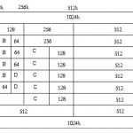

排序算法好像是程序员学习编程最多的算法，也可能是算法研究者们最喜欢研究的算法了。排序有很多很多的算法，比如，冒泡，插入，选择，堆，快速，归并等等（你可以看看本站以前的那些文章：[可视化的排序](https://coolshell.cn/articles/3933.html "可视化的排序过程")，[排序算法比较](https://coolshell.cn/articles/399.html "一个排序算法比较的网站")，[显示排序过程的python](https://coolshell.cn/articles/536.html "一个显示排序过程的Python脚本")）这里向大家介绍一个“巨NB”的排序算法——Sleep Sort。


闲言少说，请看下面的代码（用Shell脚本写的）


```
#!/bin/bash
function f() {
    sleep "$1"
    echo "$1"
}
while [ -n "$1" ]
do
    f "$1" &
    shift
done
wait
```

用法如下：


./sleepsort.bash 5 3 6 3 6 3 1 4 7


相信你可以会去试一下这个脚本，也相你你试完后你一定会说——“**我擦，真TMD排序了！**”，我还是不要解释这段代码了，过多的解释会不如代码那么直接，而且解释会影响你对这个排序算法的NB性。只想说——**这是正二八经的多线程、多进程排序啊**。我们的[Bogo排序](https://coolshell.cn/articles/3933.html "可视化的排序过程")也黯然失色啊。


下面我们需要对这个算法做一些分析——


1）让我们来分析一个这这个程序的算法复杂度，太简单了，不就是O(最大数的秒数)，呵呵。所以，如果出现这样的数列将是恶梦的——2 1 4 3 2 1 99999999


2）这个排序好是好，但对于负数或浮点数就有bug了。负数的解决方案是，我们可以这样来：x/2+MaxInt/2（时间可能相当长，不过依然工作）。对于浮点数，看看下面的代码.


```
#!/bin/bash
function f() {
  sleep $(echo "($2 - 1) + $1 / 10 ^ $2" | bc -l)
  echo "$1"
}
while [ -n "$1" ]
do
  f "$1" $(echo -n "$1" | wc -c) &
  shift
done
wait
```

3）我们来看看各种语言版本的实现吧。  

**Java**


```
public class SleepSort {
    public static void main(String[] args) {
        int[] ints = {1,4,7,3,8,9,2,6,5};
        SortThread[] sortThreads = new SortThread[ints.length];
        for (int i = 0; i < sortThreads.length; i++) {
            sortThreads[i] = new SortThread(ints[i]);
        }
        for (int i = 0; i < sortThreads.length; i++) {
            sortThreads[i].start();
        }
    }
}
class SortThread extends Thread{
    int ms = 0;
    public SortThread(int ms){
        this.ms = ms;
    }
    public void run(){
        try {
            sleep(ms*10+10);
        } catch (InterruptedException e) {
            // TODO Auto-generated catch block
            e.printStackTrace();
        }
        System.out.println(ms);
    }
}
```

**Javascript**


[javascript]function sleepsort() {  

 for (var i = 0, il = arguments.length; i < il; i++) {  

 (function(args, index) {  

 setTimeout(function() {  

 document.body.innerHTML += args[index] + ‘, ‘;  

 }, args[index]);  

 }(arguments, i));  

 }  

};  

[/javascript]


**Brainfuck** (关于这门语言，请[参看这篇文章](https://coolshell.cn/articles/4458.html "BT雷人的程序语言（大全）"))


`,>,>++++++++[<------<------>>-]  

<<[>[>+>+<<-]>>[<<+,>,>++++++++[<------<------>>-]  

<<[ ----------[++++++++++>----------]++++++++++  

>[>+>+<<-]>>[<<+>>-]<<<-] >>>++++++[<++++++++>-]<.>.>>-]<<<-]  

,----------[----------------------.,----------]  

,---<<<+>>>-------[----------------------.,----------]  

>> ----------[++++++++++>----------]++++++++++  

>++++++[<++++++++>-]< ----------[++++++++++>----------]++++++++++  

.>. ----------[++++++++++>----------]++++++++++  

>++>+<<-]>>[<<+>>-]<<<-] >>[>[>+>+<<-]>>[<<----------[++++++++++>----------]++++++++++  

>++,>,>++++++++[<------<------>>-]  

<<`


（全文完）


**（转载本站文章请注明作者和出处 [酷 壳 – CoolShell](https://coolshell.cn/) ，请勿用于任何商业用途）**


### 相关文章

* [](https://coolshell.cn/articles/17225.html)[Cuckoo Filter：设计与实现](https://coolshell.cn/articles/17225.html)
* [https://coolshell.cn/wp-content/plugins/wordpress-23-related-posts-plugin/static/thumbs/29.jpg](https://coolshell.cn/articles/12052.html)[Leetcode 编程训练](https://coolshell.cn/articles/12052.html)
* [](https://coolshell.cn/articles/11847.html)[谜题的答案和活动的心得体会](https://coolshell.cn/articles/11847.html)
* [](https://coolshell.cn/articles/11832.html)[【活动】解迷题送礼物](https://coolshell.cn/articles/11832.html)
* [](https://coolshell.cn/articles/10590.html)[二维码的生成细节和原理](https://coolshell.cn/articles/10590.html)
* [](https://coolshell.cn/articles/10427.html)[伙伴分配器的一个极简实现](https://coolshell.cn/articles/10427.html)
The post [排序算法 Sleep Sort](https://coolshell.cn/articles/4883.html) first appeared on [酷 壳 - CoolShell](https://coolshell.cn).