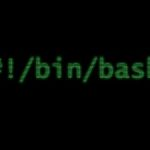

还记得以前那个用[算素数的正则表达式](https://coolshell.cn/articles/2704.html "检查素数的正则表达式")吗？编程这个世界太有趣了，总是能看到一些即别出心裁的东西。你有没有想过在写Shell脚本的时候可以把你的变量和函数放到一个类中？不要以为这不可能，这不，我在[网上](http://lab.madscience.nl/oo.sh.txt)又看到了一个把Shell脚本整成面向对象的东西。Shell本来是不支持的，需要自己做点东西，能搞出这个事事的人真的是hacker啊。


当然，这里并不是真正的面向对象，因为其只是封装罢了，还没有支持继承和多态。最变态的是他居然还支持typeid，靠！


下面让我们看看他是怎么来做的。下面的脚本可能会有点费解。本想解释一下，后来想想，还是大家自己专研一下吧，其实看懂也不难，给大家提几个点吧。


1. 我们可以看到，下面的这个脚本定义了class,  func, var, new 等函数，其实这些就是所谓的关键字。
2. class是一个函数，主要是记录类名。
3. func和var实际上是把成员函数名和成员变量记成有相同前缀的各种变量。
4. new方法主要是记录实例。大家重点看看new函数里的那个for循环，最核心的就在那里了。


脚本如下所示：


```
#!/bin/bash

# -------------------------------------------------------------------
# OO support functions
# Kludged by Pim van Riezen <pi@madscience.nl>
# -------------------------------------------------------------------
DEFCLASS=""
CLASS=""
THIS=0

class() {
  DEFCLASS="$1"
  eval CLASS_${DEFCLASS}_VARS=""
  eval CLASS_${DEFCLASS}_FUNCTIONS=""
}

static() {
  return 0
}

func() {
  local varname="CLASS_${DEFCLASS}_FUNCTIONS"
  eval "$varname=\"\${$varname}$1 \""
}

var() {
  local varname="CLASS_${DEFCLASS}_VARS"
  eval $varname="\"\${$varname}$1 \""
}

loadvar() {
  eval "varlist=\"\$CLASS_${CLASS}_VARS\""
  for var in $varlist; do
    eval "$var=\"\$INSTANCE_${THIS}_$var\""
  done
}

loadfunc() {
  eval "funclist=\"\$CLASS_${CLASS}_FUNCTIONS\""
  for func in $funclist; do
    eval "${func}() { ${CLASS}::${func} \"\$*\"; return \$?; }"
  done
}

savevar() {
  eval "varlist=\"\$CLASS_${CLASS}_VARS\""
  for var in $varlist; do
    eval "INSTANCE_${THIS}_$var=\"\$$var\""
  done
}

typeof() {
  eval echo \$TYPEOF_$1
}

new() {
  local
  local cvar="$2"
  shift
  shift
  local id=$(uuidgen | tr A-F a-f | sed -e "s/-//g")
  eval TYPEOF_${id}=$class
  eval $cvar=$id
  local funclist
  eval "funclist=\"\$CLASS_${class}_FUNCTIONS\""
  for func in $funclist; do
    eval "${cvar}.${func}() {
      local t=\$THIS; THIS=$id; local c=\$CLASS; CLASS=$class; loadvar;
      loadfunc; ${class}::${func} \"\$*\"; rt=\$?; savevar; CLASS=\$c;
      THIS=\$t; return $rt;
    }"

  done
  eval "${cvar}.${class} \"\$*\" || true"
}
```

下面，让我们来看看例程吧。


```
# -------------------------------------------------------------------
# Example code
# -------------------------------------------------------------------

# class definition
class Storpel
  func Storpel
  func setName
  func setQuality
  func print
  var name
  var quality

# class implementation
Storpel::Storpel() {
  setName "$1"
  setQuality "$2"
  if [ -z "$name" ]; then setName "Generic"; fi
  if [ -z "$quality" ]; then setQuality "Normal"; fi
}

Storpel::setName() { name="$1"; }
Storpel::setQuality() { quality="$1"; }
Storpel::print() { echo "$name ($quality)"; }

# usage
new Storpel one "Storpilator 1000" Medium
new Storpel two
new Storpel three

two.setName "Storpilator 2000"
two.setQuality "Strong"

one.print
two.print
three.print

echo ""

echo "one: $one ($(typeof $one))"
echo "two: $two ($(typeof $two))"
echo "three: $three ($(typeof $two))"
```

 


（全文完）


**（转载本站文章请注明作者和出处 [酷 壳 – CoolShell](https://coolshell.cn/) ，请勿用于任何商业用途）**


### 相关文章

* [](https://coolshell.cn/articles/19219.html)[打造高效的工作环境 – Shell 篇](https://coolshell.cn/articles/19219.html)
* [](https://coolshell.cn/articles/9410.html)[Unix考古记：一个“遗失”的shell](https://coolshell.cn/articles/9410.html)
* [](https://coolshell.cn/articles/9070.html)[AWK 简明教程](https://coolshell.cn/articles/9070.html)
* [](https://coolshell.cn/articles/8883.html)[应该知道的Linux技巧](https://coolshell.cn/articles/8883.html)
* [https://coolshell.cn/wp-content/plugins/wordpress-23-related-posts-plugin/static/thumbs/8.jpg](https://coolshell.cn/articles/8745.html)[如此理解面向对象编程](https://coolshell.cn/articles/8745.html)
* [](https://coolshell.cn/articles/8619.html)[你可能不知道的Shell](https://coolshell.cn/articles/8619.html)
The post [面向对象的Shell脚本](https://coolshell.cn/articles/5035.html) first appeared on [酷 壳 - CoolShell](https://coolshell.cn).