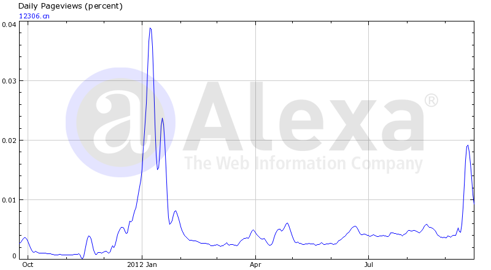

12306.cn网站挂了，被全国人民骂了。我这两天也在思考这个事，我想以这个事来粗略地和大家讨论一下网站性能的问题。因为仓促，而且完全基于本人有限的经验和了解，所以，如果有什么问题还请大家一起讨论和指正。（这又是一篇长文，只讨论性能问题，不讨论那些UI，用户体验，或是是否把支付和购票下单环节分开的功能性的东西）

#### 业务

任何技术都离不开业务需求，所以，要说明性能问题，首先还是想先说说业务问题。

* **其一**，**有人可能把这个东西和QQ或是网游相比**。但我觉得这两者是不一样的，网游和QQ在线或是登录时访问的更多的是用户自己的数据，而订票系统访问的是中心的票量数据，这是不一样的。不要觉得网游或是QQ能行你就以为这是一样的。网游和QQ 的后端负载相对于电子商务的系统还是简单。

* **其二**，**有人说春节期间订火车的这个事好像网站的秒杀活动**。的确很相似，但是如果你的思考不在表面的话，你会发现这也有些不一样。火车票这个事，一方面会伴随着大量的查询操作，更BT的是下单的时候需要对数据库很多的一致性的操作，一方面是从起点到终点各个分段票的一致性，另一方面，买的人路线、车次、时间选择有很多，会不停地改变下单方式。而秒杀，直接杀就好了，没有那么多查询和一致性的问题。另外，关于秒杀，完全可以做成只接受前N个用户的请求（完全不操作后端的任何数据， 仅仅只是对用户的下单操作log），这种业务，只需要在内存cache中放好可秒杀的数量，还可以把数据分布开来放，100商品，10台服务器一台放10个，无需在当时操作任何数据库。可以订单数够后，停止秒杀，然后批量写数据库。而且秒杀的商品不多。火车票这个不是像秒杀那么简单的，春运时间，几乎所有的票都是热门票，而且几乎是全国人民都来了，而且还有转车业务，多条线的库存都要做事务操作，你想想吧，这有多难。（淘宝的双十一也就3百万用户，而火车票瞬时有千万级别甚至是亿级别的）（**更新：2014年1月11日**：来了淘宝后，对淘宝的系统有了解，淘宝的秒杀活动，本质上是用输验证码并在CDN上把用户直接过滤掉了，比如：1千万个用户过滤了只剩2万个用户，这样数据库就顶得住了）

* **其三**，**有人拿这个系统和奥运会的票务系统比较**。我觉得还是不一样。虽然奥运会的票务系统当年也一上线就废了。但是奥运会用的是抽奖的方式，也就是说不存在先来先得的抢的方式，而且，是事后抽奖，事前只需要收信息，事前不需要保证数据一致性，没有锁，很容易水平扩展。

* **其四**，**订票系统应该和电子商务的订单系统很相似**，都是需要对库存进行：1）占住库存，2）支付（可选），3）扣除库存的操作。这个是需要有一致性的检查的，也就是在并发时需要对数据加锁的。B2C的电商基本上都会把这个事干成异步的，也就是说，你下的订单并不是马上处理的，而是延时处理的，只有成功处理了，系统才会给你一封确认邮件说是订单成功。我相信有很多朋友都收到认单不成功的邮件。**这就是说，数据一致性在并发下是一个瓶颈**。

* **其五**，**铁路的票务业务很变态**，其采用的是突然放票，而有的票又远远不够大家分，所以，大家才会有抢票这种有中国特色的业务的做法。于是当票放出来的时候，就会有几百万人甚至上千万人杀上去，查询，下单。几十分钟内，一个网站能接受几千万的访问量，这个是很恐怖的事情。[据说12306的高峰访问是10亿PV](http://www.linuxso.com/architecture/17006.html)，集中在早8点到10点，每秒PV在高峰时上千万。

多说几句：

* **库存是B2C的恶梦，库存管理相当的复杂**。不信，你可以问问所有传统和电务零售业的企业，看看他们管理库存是多么难的一件事。不然，就不会有那么多人在问凡客的库存问题了。（你还可以看看《乔布斯传》，你就知道为什么Tim会接任Apple的CEO了，最主要的原因是他搞定了苹果的库存周期问题）

* **对于一个网站来说，浏览网页的高负载很容易搞定，查询的负载有一定的难度去处理，不过还是可以通过缓存查询结果来搞定，最难的就是下单的负载**。因为要访问库存啊，对于下单，基本上是用异步来搞定的。去年双11节，淘宝的每小时的订单数大约在60万左右，京东一天也才能支持40万（居然比12306还差），亚马逊5年前一小时可支持70万订单量。可见，下订单的操作并没有我们相像的那么性能高。

* **淘宝要比B2C的网站要简单得多，因为没有仓库**，所以，不存在像B2C这样有N个仓库对同一商品库存更新和查询的操作。下单的时候，B2C的 网站要去找一个仓库，又要离用户近，又要有库存，这需要很多计算。试想，你在北京买了一本书，北京的仓库没货了，就要从周边的仓库调，那就要去看看沈阳或 是西安的仓库有没有货，如果没有，又得看看江苏的仓库，等等。淘宝的就没有那么多事了，每个商户有自己的库存，库存就是一个数字，并且库存分到商户头上了，反而有利于性能扩展。

* **数据一致性才是真正的性能瓶颈**。有 人说nginx可以搞定每秒10万的静态请求，我不怀疑。但这只是静态请求，理论值，只要带宽、I/O够强，服务器计算能力够，并支持的并发连接数顶得住10万TCP链接的建立 的话，那没有问题。但在数据一致性面前，这10万就完完全全成了一个可望不可及的理论值了。

我说那么多，我只是想从业务上告诉大家，我们需要从业务上真正了解春运铁路订票这样业务的变态之处。

#### 前端性能优化技术

要解决性能的问题，有很多种常用的方法，我在下面列举一下，我相信12306这个网站使用下面的这些技术会让其性能有质的飞跃。

##### 一、前端负载均衡

通过DNS的负载均衡器（一般在路由器上根据路由的负载重定向）可以把用户的访问均匀地分散在多个Web服务器上。这样可以减少Web服务器的请求负载。因为http的请求都是短作业，所以，可以通过很简单的负载均衡器来完成这一功能。最好是有CDN网络让用户连接与其最近的服务器（CDN通常伴随着分布式存储）。（关于负载均衡更为详细的说明见“后端的负载均衡”）

##### 二、减少前端链接数

我看了一下12306.cn，打开主页需要建60多个HTTP连接，车票预订页面则有70多个HTTP请求，现在的浏览器都是并发请求的（当然，浏览器的一个页面的并发数是有限的，但是你挡不住用户开多个页面，而且，后端服务器TCP链接在前端断开始，还不会马上释放或重要）。所以，只要有100万个用户，就有可能会有6000万个链接（访问第一次后有了浏览器端的cache，这个数会下来，就算只有20%也是百万级的链接数），太多了。一个登录查询页面就好了。把js打成一个文件，把css也打成一个文件，把图标也打成一个文件，用css分块展示。把链接数减到最低。

##### 三、减少网页大小增加带宽

这个世界不是哪个公司都敢做图片服务的，因为图片太耗带宽了。现在宽带时代很难有人能体会到当拨号时代做个图页都不敢用图片的情形（现在在手机端浏览也是这个情形）。我查看了一下12306首页的需要下载的总文件大小大约在900KB左右，如果你访问过了，浏览器会帮你缓存很多，只需下载10K左右的文件。但是我们可以想像一个极端一点的案例，1百万用户同时访问，且都是第一次访问，每人下载量需要1M，如果需要在120秒内返回，那么就需要，1M \* 1M /120 \* 8 = 66Gbps的带宽。很惊人吧。所以，我估计在当天，12306的阻塞基本上应该是网络带宽，所以，你可能看到的是没有响应。后面随着浏览器的缓存帮助12306减少很多带宽占用，于是负载一下就到了后端，后端的数据处理瓶颈一下就出来。于是你会看到很多http 500之类的错误。这说明后端服务器垮了。

##### 四、前端页面静态化

静态化一些不常变的页面和数据，并gzip一下。~~还有一个变态的方法是把这些静态页面放在/dev/shm下，这个目录就是内存，直接从内存中把文件读出来返回，这样可以减少昂贵的磁盘I/O~~。使用nginx的sendfile功能可以让这些静态文件直接在内核心态交换，可以极大增加性能。

##### 五、优化查询

很多人查询都是在查一样的，完全可以用反向代理合并这些并发的相同的查询。这样的技术主要用查询结果缓存来实现，第一次查询走数据库获得数据，并把数据放到缓存，后面的查询统统直接访问高速缓存。为每个查询做Hash，使用NoSQL的技术可以完成这个优化。（这个技术也可以用做静态页面）

对于火车票量的查询，个人觉得不要显示数字，就显示一个“有”或“无”就好了，这样可以大大简化系统复杂度，并提升性能。把查询对数据库的负载分出去，从而让数据库可以更好地为下单的人服务。

##### 六、缓存的问题

缓存可以用来缓存动态页面，也可以用来缓存查询的数据。缓存通常有那么几个问题：

1）缓存的更新。也叫缓存和数据库的同步。有这么几种方法，一是缓存time out，让缓存失效，重查，二是，由后端通知更新，一量后端发生变化，通知前端更新。前者实现起来比较简单，但实时性不高，后者实现起来比较复杂 ，但实时性高。

2）缓存的换页。内存可能不够，所以，需要把一些不活跃的数据换出内存，这个和操作系统的内存换页和交换内存很相似。FIFO、LRU、LFU都是比较经典的换页算法。相关内容参看[Wikipeida的缓存算法](http://en.wikipedia.org/wiki/Cache_algorithms)。

3）缓存的重建和持久化。缓存在内存，系统总要维护，所以，缓存就会丢失，如果缓存没了，就需要重建，如果数据量很大，缓存重建的过程会很慢，这会影响生产环境，所以，缓存的持久化也是需要考虑的。

诸多强大的NoSQL都很好支持了上述三大缓存的问题。

#### 后端性能优化技术

前面讨论了前端性能的优化技术，于是前端可能就不是瓶颈问题了。那么性能问题就会到后端数据上来了。下面说几个后端常见的性能优化技术。

##### 一、数据冗余

关于数据冗余，也就是说，把我们的数据库的数据冗余处理，也就是减少表连接这样的开销比较大的操作，但这样会牺牲数据的一致性。风险比较大。很多人把NoSQL用做数据，快是快了，因为数据冗余了，但这对数据一致性有大的风险。这需要根据不同的业务进行分析和处理。（注意：用关系型数据库很容易移植到NoSQL上，但是反过来从NoSQL到关系型就难了）

##### 二、数据镜像

几乎所有主流的数据库都支持镜像，也就是replication。数据库的镜像带来的好处就是可以做负载均衡。把一台数据库的负载均分到多台上，同时又保证了数据一致性（Oracle的SCN）。最重要的是，这样还可以有高可用性，一台废了，还有另一台在服务。

数据镜像的数据一致性可能是个复杂的问题，所以我们要在单条数据上进行数据分区，也就是说，把一个畅销商品的库存均分到不同的服务器上，如，一个畅销商品有1万的库存，我们可以设置10台服务器，每台服务器上有1000个库存，这就好像B2C的仓库一样。

##### 三、数据分区

数据镜像不能解决的一个问题就是数据表里的记录太多，导致数据库操作太慢。所以，把数据分区。数据分区有很多种做法，一般来说有下面这几种：

1）把数据把某种逻辑来分类。比如火车票的订票系统可以按各铁路局来分，可按各种车型分，可以按始发站分，可以按目的地分……，反正就是把一张表拆成多张有一样的字段但是不同种类的表，这样，这些表就可以存在不同的机器上以达到分担负载的目的。

2）把数据按字段分，也就是竖着分表。比如把一些不经常改的数据放在一个表里，经常改的数据放在另外多个表里。把一张表变成1对1的关系，这样，你可以减少表的字段个数，同样可以提升一定的性能。另外，字段多会造成一条记录的存储会被放到不同的页表里，这对于读写性能都有问题。但这样一来会有很多复杂的控制。

3）平均分表。因为第一种方法是并不一定平均分均，可能某个种类的数据还是很多。所以，也有采用平均分配的方式，通过主键ID的范围来分表。

4）同一数据分区。这个在上面数据镜像提过。也就是把同一商品的库存值分到不同的服务器上，比如有10000个库存，可以分到10台服务器上，一台上有1000个库存。然后负载均衡。

这三种分区都有好有坏。最常用的还是第一种。数据一旦分区，你就需要有一个或是多个调度来让你的前端程序知道去哪里找数据。**把火车票的数据分区，并放在各个省市，会对12306这个系统有非常有意义的质的性能的提高**。

##### 四、后端系统负载均衡

前面说了数据分区，数据分区可以在一定程度上减轻负载，但是无法减轻热销商品的负载，对于火车票来说，可以认为是大城市的某些主干线上的车票。这就需要使用数据镜像来减轻负载。使用数据镜像，你必然要使用负载均衡，在后端，我们可能很难使用像路由器上的负载均衡器，因为那是均衡流量的，因为流量并不代表服务器的繁忙程度。因此，我们需要一个任务分配系统，其还能监控各个服务器的负载情况。

任务分配服务器有一些难点：

* 负载情况比较复杂。什么叫忙？是CPU高？还是磁盘I/O高？还是内存使用高？还是并发高？还是内存换页率高？你可能需要全部都要考虑。这些信息要发送给那个任务分配器上，由任务分配器挑选一台负载最轻的服务器来处理。

* 任务分配服务器上需要对任务队列，不能丢任务啊，所以还需要持久化。并且可以以批量的方式把任务分配给计算服务器。

* 任务分配服务器死了怎么办？这里需要一些如Live-Standby或是failover等高可用性的技术。我们还需要注意那些持久化了的任务的队列如何转移到别的服务器上的问题。

我看到有很多系统都用静态的方式来分配，有的用hash，有的就简单地轮流分析。这些都不够好，一个是不能完美地负载均衡，另一个静态的方法的致命缺陷是，如果有一台计算服务器死机了，或是我们需要加入新的服务器，对于我们的分配器来说，都需要知道的。另外，还要重算哈希（一致性hash可以部分解决这个问题）。

还有一种方法是使用抢占式的方式进行负载均衡，由下游的计算服务器去任务服务器上拿任务。让这些计算服务器自己决定自己是否要任务。这样的好处是可以简化系统的复杂度，而且还可以任意实时地减少或增加计算服务器。但是唯一不好的就是，如果有一些任务只能在某种服务器上处理，这可能会引入一些复杂度。不过总体来说，这种方法可能是比较好的负载均衡。

##### 五、异步、 throttle 和 批量处理

异步、throttle（节流阀） 和批量处理都需要对并发请求数做队列处理的。

* 异步在业务上一般来说就是收集请求，然后延时处理。在技术上就是可以把各个处理程序做成并行的，也就可以水平扩展了。但是异步的技术问题大概有这些，a）被调用方的结果返回，会涉及进程线程间通信的问题。b）如果程序需要回滚，回滚会有点复杂。c）异步通常都会伴随多线程多进程，并发的控制也相对麻烦一些。d）很多异步系统都用消息机制，消息的丢失和乱序也会是比较复杂的问题。

* throttle 技术其实并不提升性能，这个技术主要是防止系统被超过自己不能处理的流量给搞垮了，这其实是个保护机制。使用throttle技术一般来说是对于一些自己无法控制的系统，比如，和你网站对接的银行系统。

* 批量处理的技术，是把一堆基本相同的请求批量处理。比如，大家同时购买同一个商品，没有必要你买一个我就写一次数据库，完全可以收集到一定数量的请求，一次操作。这个技术可以用作很多方面。比如节省网络带宽，我们都知道网络上的MTU（最大传输单元），以态网是1500字节，光纤可以达到4000多个字节，如果你的一个网络包没有放满这个MTU，那就是在浪费网络带宽，因为网卡的驱动程序只有一块一块地读效率才会高。因此，网络发包时，我们需要收集到足够多的信息后再做网络I/O，这也是一种批量处理的方式。批量处理的敌人是流量低，所以，批量处理的系统一般都会设置上两个阀值，一个是作业量，另一个是timeout，只要有一个条件满足，就会开始提交处理。

所以，**只要是异步，一般都会有throttle机制，一般都会有队列来排队，有队列，就会有持久化，而系统一般都会使用批量的方式来处理**。

[云风同学设计的“排队系统”](http://blog.codingnow.com/2012/01/ticket_queue.html) 就是这个技术。这和电子商务的订单系统很相似，就是说，我的系统收到了你的购票下单请求，但是我还没有真正处理，我的系统会跟据我自己的处理能力来throttle住这些大量的请求，并一点一点地处理。一旦处理完成，我就可以发邮件或短信告诉用户你来可以真正购票了。

在这里，我想通过业务和用户需求方面讨论一下云风同学的这个排队系统，因为其从技术上看似解决了这个问题，但是从业务和用户需求上来说可能还是有一些值得我们去深入思考的地方：

1）**队列的DoS攻击**。首先，我们思考一下，这个队是个单纯地排队的吗？这样做还不够好，因为这样我们不能杜绝黄牛，而且单纯的ticket\_id很容易发生DoS攻击，比如，我发起N个 ticket\_id，进入购票流程后，我不买，我就耗你半个小时，很容易我就可以让想买票的人几天都买不到票。有人说，用户应该要用身份证来排队， 这样在购买里就必需要用这个身份证来买，但这也还不能杜绝黄牛排队或是号贩子。因为他们可以注册N个帐号来排队，但就是不买。黄牛这些人这个时候只需要干一个事，把网站搞得正常人不能访问，让用户只能通过他们来买。

2）**对列的一致性**？对这个队列的操作是不是需要锁？只要有锁，性能一定上不去。试想，100万个人同时要求你来分配位置号，这个队列将会成为性能瓶颈。你一定没有数据库实现得性能好，所以，可能比现在还差。**抢数据库和抢队列本质上是一样的**。

3）**队列的等待时间**。购票时间半小时够不够？多不多？要是那时用户正好不能上网呢？如果时间短了，用户不够时间操作也会抱怨，如果时间长了，后面在排队的那些人也会抱怨。这个方法可能在实际操作上会有很多问题。另外，半个小时太长了，这完全不现实，我们用15分钟来举例：有1千万用户，每一个时刻只能放进去1万个，这1万个用户需要15分钟完成所有操作，那么，这1千万用户全部处理完，需要1000\*15m = 250小时，10天半，火车早开了。（我并非信口开河，[根据铁道部专家的说明](http://t.cn/z0g7dGJ)：这几天，平均一天下单100万，所以，处理1000万的用户需要十天。这个计算可能有点简单了，我只是想说，**在这样低负载的系统下用排队可能都不能解决业务问题**）

4）**队列的分布式**。这个排队系统只有一个队列好吗？还不足够好。因为，如果你放进去的可以购票的人如果在买同一个车次的同样的类型的票（比如某动车卧铺），还是等于在抢票，也就是说系统的负载还是会有可能集中到其中某台服务器上。因此，最好的方法是根据用户的需求——提供出发地和目的地，来对用户进行排队。而这样一来，队列也就可以是多个，只要是多个队列，就可以水平扩展了。这样可以解决性能问题，但是没有解决用户长时间排队的问题。

我觉得完全可以向网上购物学习。**在排队（下单）的时候，收集好用户的信息和想要买的票，并允许用户设置购票的优先级，比如，A车次卧铺买 不到就买 B车次的卧铺，如果还买不到就买硬座等等，然后用户把所需的钱先充值好，接下来就是系统完全自动地异步处理订单**。成功不成功都发短信或邮件通知用户。这样，系统不仅可以省去那半个小时的用户交互时间，自动化加快处理，还可以合并相同购票请求的人，进行批处理（减少数据库的操作次数）。**这种方法最妙的事是可以知道这些排队用户的需求，不但可以优化用户的队列，把用户分布到不同的队列，还可以像亚马逊的心愿单一样，通过一些计算就可以让铁道部做车次统筹安排和调整**（最后，排队系统（下单系统）还是要保存在数据库里的或做持久化，不能只放在内存中，不然机器一down，就等着被骂吧）。

#### 小结

写了那么多，我小结一下：

0）**无论你怎么设计，你的系统一定要能容易地水平扩展**。也就是说，你的整个数据流中，所有的环节都要能够水平扩展。这样，当你的系统有性能问题时，“加30倍的服务器”才不会被人讥笑。

1）**上述的技术不是一朝一夕能搞定的，没有长期的积累，基本无望**。我们可以看到，无论你用哪种都会引发一些复杂性，设计总是在做一种权衡。

2）集中式的卖票很难搞定，使用上述的技术可以让订票系统能有几佰倍的性能提升。而在**各个省市建分站，分开卖票，是能让现有系统性能有质的提升的最好方法**。

3）**春运前夕抢票且票量供远小于求这种业务模式是相当变态的**，让几千万甚至上亿的人在某个早晨的8点钟同时登录同时抢票的这种业务模式是变态中的变态。业务形态的变态决定了无论他们怎么办干一定会被骂。

4）**为了那么一两个星期而搞那么大的系统**，而其它时间都在闲着，有些可惜了，这也就是铁路才干得出来这样的事了。

***更新2012年9月27日***

**Alexa 统计的12306的PV** （注：Alexa的PV定义是：一个用户在一天内对一个页面的多次点击只算一次）

（**本文转载时请注明作者和出处，请勿于记商业目的**）

**（转载本站文章请注明作者和出处 [酷 壳 – CoolShell](https://coolshell.cn/) ，请勿用于任何商业用途）**

### 相关文章

* [分布式系统的事务处理](https://coolshell.cn/articles/10910.html)
* [多版本并发控制(MVCC)在分布式系统中的应用](https://coolshell.cn/articles/6790.html)
* [ETCD的内存问题](https://coolshell.cn/articles/22242.html)
* [我做系统架构的一些原则](https://coolshell.cn/articles/21672.html)
* [API设计原则 – Qt官网的设计实践总结](https://coolshell.cn/articles/18024.html)
* [AWS 的 S3 故障回顾和思考](https://coolshell.cn/articles/17737.html)
The post [由12306.cn谈谈网站性能技术](https://coolshell.cn/articles/6470.html) first appeared on [酷 壳 - CoolShell](https://coolshell.cn).