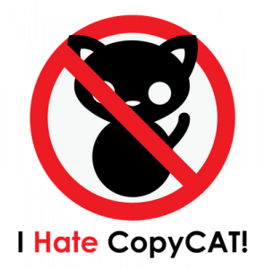
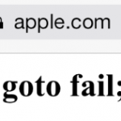

很早就想写这篇文章了，只是想法比较零碎，所以一直没有成文，这两天觉得思考得比较成熟了一些，所以把我的这些想法整理下来，欢迎大家一起和我讨论。

#### 鄙视抄袭和山寨

首先，先表达我的立场，我对抄袭的立场持BS和痛恨的态度，尤其是[那些C2C的网站](https://coolshell.cn/articles/3820.html "中国的C2C模式")，痛恨这些国外有什么就山寨什么的做法，尤其是那些连界面都不改，像素级的抄袭，连CSS和img都是一样的，更甚者，连图片都链接到抄袭源的网站去了，连源代码都抄的行为，比如：[腾讯抄新浪的代码](http://weibo.com/1661751144/yjLfJqMZ6)，[新浪抄twitter的源码](http://yuanxing.iteye.com/blog/638129)。无法不BS之。

有很多网友邀请我去那个抄袭Quora的网站上去回答问题，借此，再次声明我不会去的。因此，有一些网友说，我不一样也在Twitter的抄袭网站新浪微博上吗？说我装逼了。我想说，新浪和Twitter基本上是同一种产品的思路，但是其实现不一样，新浪微博上一些twitter上没有功能，我个人觉得这并不算抄袭，我甚至认为新浪微博和Twitter各有长处，在一些功能上新浪微博比twitter做得更好。你可以理解为，新浪微博总体上来说并没有突破我心中的那个条抄袭的底线。

我个人对抄袭的理解如下：

1）你可以复制别人的想法和功能，但是如果你连界面设计，代码，图片，风格，布局，等等所有的一切都照抄，那我就一定要鄙视你。

2）你可以仿照别人的产品，但是你的出发点应该是他没做好，我来把它把做好，如果你的出发点是为了复制抄袭和山寨，我一样鄙视。

所以，你可以理解我为什么不去Quora，Stackoverflow，Facebook，Google的山寨网站了，因为上述两点，1）完全复制，2）山寨地太次。

#### 理性对待抄袭

因为很多朋友极端地理解了我对抄袭的立场，所以我有必要要说说我对“抄袭”或是“模仿”的其它一些观点：

**1）“抄袭想法”**。想法这个东西我不觉是有什么专有的东西，也不存在什么抄袭，好的想法，就不应该被垄断，好的想法是应该放出来让大家一起来实现的。所以，我并不觉得一个想法有什么不能被抄袭的。你做Web Server，我也做Web Server，你做论坛，我也做论坛，你做手机，我也做手机，你做便携电脑，我也做便携电脑，你做通讯软件，我也可以做通讯软件…… 等等，越是优秀的产品和思路，就越不可能不被别人学习和模仿的。

**2）“抄袭界面”**。根据法律来说，界面上的某些元件，如菜单，按钮，甚至布局，配色之类的单一的东西是没有版权的，但是这些东西组成的界面是存在版权的，你不能让你的产品界面和别人的界面长得雷同。而且，对于一些有艺术特征的设计和版式是受法律保护的。所以，对于界面来说，我们需要做一些区别，比如，很多电视机长得很相似，连摇控器都很相似，但是电视其中的菜单和功能会有不同；很多的家用小汽车形状都很相似，但是线条和外形并不相似；Unix和Linux的用户接口几乎一样，但是Unix和Linux的内部实现和功能上有很大的不同（比如文件系统，内核管理等），MacOS/Windows/X-Win/Gnome/KDE 这些桌面系统大同，但是实现和细节上又不一样。

看我这样一说，你会说，嗯，你说的就是所谓的“微创新”！是的，这是个仁者见仁，智者见智的问题了。再说一遍，无所谓什么微创新不微创新，我对此的价值观很简单  —— **只要你这个复制品在不违反法律的层面上，能在品质上超过原来那个产品，我是会认可的，而且还是会对复制品买帐的**。

总之，我想说的是——

1）好的东西总是会让人去学习和仿制的，而学习和仿制好的一面是会引入竞争，竞争会让这个东西更好的。

2）不要害怕被人仿制，被人仿制说明你做得好，如果你的仿冒者超过了你，那你应该反思自己，而不要赖别人。

#### 如何不被腾讯抄袭

说起抄袭这个事来，就不得不说腾讯，现在互联网上一堆人都在思考，腾讯太变态，无论我做什么，都逃不出他的魔掌。很多风投都在问创业团队一个问题——“如果腾讯抄你，你怎么办？”。

在我往下阐述如何不被腾讯抄的话题下，请让我先重申一下我在“[腾讯，竞争力 和 用户体验](https://coolshell.cn/articles/5901.html "腾讯，竞争力 和 用户体验")”一文中说的那个观点：“*腾讯这样大规模的抄袭和山寨，对整个社会的价值就是——会让很多很多的创业团队放弃Copy，甚至让他们要放弃那些容易被复制的“业务型的项目”，而逼着他们去努力思考，如何才不能被腾讯复制，如何才能有自己的核心价值*”，我把这个观点再进一步阐述，“**有腾讯在，会让你更清楚地认识什么叫创业的残酷，会让你更清楚认识到什么是真正产品的价值，什么是核心竞争力，你但凡有一点急功近利的想法你都要想一想那个有钱有人有势也很急功近利的企鹅！**”

我不知道，我写了那篇文章这段时间来，大家有没有思考过前边文章里我说的问题？其实我在“[腾讯，竞争力 和 用户体验](https://coolshell.cn/articles/5901.html "腾讯，竞争力 和 用户体验")”一文中已经说到过一些了，不知道大家有没有去思考？

老实说，其实腾讯并不可怕，先让我们来分析一下腾讯的特征和短板：

* **特征**。腾讯的很多产品线完全雷同，比如：QQ，微信，空间，群，微博，朋友，等等，几乎完全一样，所以，这是不是说明了下面几个问题：

1）他们人太多，没事干了，所以什么都干。  

2）各产品线为了规避风险都想伴QQ这个大款，所以不知道怎么创新。  

3）内部竞争激烈，技术团队加班赶工，所以只能无目的地广撒网了。

* **短板**。你看看腾讯的这些产品线和他的用户群，我觉得就目前阶段，腾讯至少有三种产品复制不出来。

1）有烦杂的线下业务的产品。比如：电子商务需要供应商，仓库，物流，等这样物理流程的业务很难复制。  

2）有质量，有价值，有权威的社区。比如，豆瓣，Stackoverflow，Quora这样的有价值的社区。  

3）有技术含量的产品，比如： Nginx，MySQL，Android/iOS 之流技术大于业务的产品。

通过这样的分析，我想告诉大家，**腾讯并不可怕，可怕的是你自己不会思考和观察，可怕的是你急功近利而没有去找有价值的东西来做**。推而广之，如果你想做的东西是很快就能做出来的，那么你就不要指望不被人抄，也就是说，**如果你着眼短期，你无疑会面对众多的抄袭和模仿者让你万劫不复，但是，如果你着眼长期，做一个3-5年需要花费大量精力才会成熟的产品，那么，那些急功近利的抄袭者会知难而退的**。因为，“需要3-5年的时间”这一条完全不符合抄袭者的价值观，所以，你面对的竞争对手也会少了9成。

#### 什么是真正的产品

说到这里，我必需要说一下什么是真正的产品！我看到现在很多创业团队把功能当产品来做，这就为模仿者们留下了很多很多机会，比如苹果商店里的很多照片分享的Apps，或是一些云存读，云分享之类的东西，如：Dropbox和Evernote，或是一些旅游类的Apps。这些东西在我眼里还不能算得上是真正的产品，所以，我们可以看到他们的模仿者有很多很多。当然，我并不是说不能把功能当成产品来做，只是我觉得这样的产品并不长久，并不具强大的可持续性，而且很容易被取代。那怕是现在风头正劲的Instgram, Dropbox, Evernote，大家试想一下，如果哪天Apple或是Canon把Instgram这样的功能集成到他的照相功能中，哪天操作系统把Dropbox/Evernote集成到他的操作系统中。（当然，我只是说有这种可能，我只是想让大家思考一下以功能为产品的弱势是什么样的）

好，让我来说说什么是真正的产品：

* **真正的产品应该是有一个端到端的一个解决方案**。比如说：电子阅读中的从购书，到阅读，再到阅读心得分享，再到推荐，这一整套的解决方案。看看苹果的产品的端到端的解决方案，就知道什么是产品的样子了。

* **真正的产品应该是有价值的**。这种价值表现在——你可以从中获得有价值的内容，并且你也可以通过他创造对你有价值的东西。比如，像豆瓣，像Stackoverflow，甚至像Twitter和微博这样让信息平等让信息传递更快的社区，或是像AWS或是Apple的开发平台，等等。可见，我们无法通过QQ获得有价值的东西，我们也无法通过QQ创造有价值的东西。

* ****真正的产品应该是和社会有交互并能自我进化的**。**真正的产品应该是用户会来贡献有价值的内容，真正的产品应该是有开放的接口让其它系统容易集成的。也就是说，真正的产品应该是有一个生态圈的，在这个生态圈内，不但能自给自足，自我循环，还能自我管理，自我进化。可见，腾讯的用户群完全没有为这个平台贡献什么有价值的东西，更不谈他们会帮腾讯来进化了。

* **真正的产品应该是体现品质的**。所谓有品质的意思是，你能从使用这个产品中获得一种感觉，一种档次的提升的感觉。你可以认为使用品牌而非山寨的智能手机，使用一些如Thinkpad或MacBook的笔记本电脑或iPad，因为那是一种品质的体现。但是我们都知道，使用QQ完全没有任何品质的感觉，你不会在你的简历中放上QQ号，你也不会在一些商务场合使用QQ的，不是吗？这就好像请客吃饭一样，你总是会请你的朋友去一些有品质的饭馆而不是拉面馆。

当你把你的产品目标放在这样高的位置上，你不难发现，一来，仿冒者们无法跟上你的跟步，二来，仿冒者们几乎没有办法来复制。因为，他们只能复制到外表，但永远无法复制到产品的精髓。

还是那句话，**因为仿冒者们急功近利的基因就决定了他们做不到抄袭。因为QQ用户群的基因也决定了腾讯无法复制豆瓣或Stackoverflow**。

（全文完）

**（转载本站文章请注明作者和出处 [酷 壳 – CoolShell](https://coolshell.cn/) ，请勿用于任何商业用途）**

### 相关文章

* [https://coolshell.cn/wp-content/plugins/wordpress-23-related-posts-plugin/static/thumbs/30.jpg](https://coolshell.cn/articles/5901.html)[腾讯，竞争力 和 用户体验](https://coolshell.cn/articles/5901.html)
* [https://coolshell.cn/wp-content/plugins/wordpress-23-related-posts-plugin/static/thumbs/12.jpg](https://coolshell.cn/articles/5987.html)[如何设计“找回用户帐号”功能](https://coolshell.cn/articles/5987.html)
* [https://coolshell.cn/wp-content/plugins/wordpress-23-related-posts-plugin/static/thumbs/16.jpg](https://coolshell.cn/articles/5966.html)[腾讯帐号申诉的用户体验](https://coolshell.cn/articles/5966.html)
* [由苹果的低级Bug想到的](https://coolshell.cn/articles/11112.html)
* [做个环保主义的程序员](https://coolshell.cn/articles/7186.html)
* [https://coolshell.cn/wp-content/plugins/wordpress-23-related-posts-plugin/static/thumbs/24.jpg](https://coolshell.cn/articles/6775.html)[Bret Victor – Inventing on Principle](https://coolshell.cn/articles/6775.html)
The post [抄袭，腾讯 和 产品](https://coolshell.cn/articles/7617.html) first appeared on [酷 壳 - CoolShell](https://coolshell.cn).