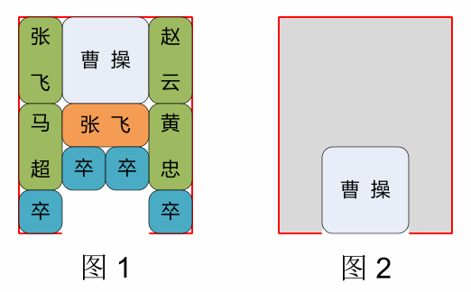

**（感谢网友 [http://tp2.sinaimg.cn/1701018393/50/1297990315/1](http://weibo.com/u/1701018393?source=webim) [@bnu\_chenshuo](http://weibo.com/u/1701018393?source=webim "bnu_chenshuo") 投稿）**





华容道是一个有益的智力游戏，游戏规则不再赘述。用计算机求解华容道也是一道不错的编程练习题，为了寻求最少步数，求解程序一般用广度优先搜索算法。华容道的一种常见开局如图 1 所示。


广度优先搜索算法求解华容道的基本步骤：


1. 准备两个“全局变量”，队列 Q 和和集合 S，S 代表“已知局面”。初时 Q 和 S 皆为空。
2. 将初始局面加入队列 Q 的末尾，并将初始局面设为已知。
3. 当队列不为空时，从 Q 的队首取出当前局面 `curr`。如果队列为空则结束搜索，表明无解。
4. 如果 `curr` 是最终局面（曹操位于门口，图 2），则结束搜索，否则继续到第 5 步。
5. 考虑 `curr` 中每个可以移动的棋子，试着上下左右移动一步，得到新局面 `next`，如果新局面未知（`next` ∉ S），则把它加入队列 Q，并设为已知。这一步可能产生多个新局面。
6. 回到第2步。


其中“局面已知”并不要求每个棋子的位置相同，而是指棋子的投影的形状相同（代码中用 mask 表示），例如交换图 1 中的张飞和赵云并不产生新局面，这一规定可以大大缩小搜索空间。


以上步骤很容易转换为 C++ 代码，这篇文章重点关注的是第 5 步的实现。


```
// 第 1 步
std::unordered_set<Mask> seen;
std::deque<State> queue;

// 第 2 步
State initial;
// 填入 initial，略。
queue.push_back(initial);
seen.insert(initial.toMask());

// 第 3 步
while (!queue.empty())
{
  const State curr = queue.front();
  queue.pop_front();

  // 第 4 步
  if (curr.isSolved())
    break;

  // 第 5 步
  for (const State& next : curr.moves())
  {
    auto result = seen.insert(next.toMask());
    if (result.second)
      queue.push_back(next);
  }
}
```

在以上原始实现中，`curr.move()` 将返回一个 `std::vector<State>` 临时对象。一种节省开销的办法是准备一个 `std::vector<State>` “涂改变量”，让 `curr.move()` 反复修改它，比如改成：


```
// 第 1 步新增一个 scratch 变量
std::vector<State> nextMoves;

// 第 3 步
while (!queue.empty())
{
  // ...
  // 第 5 步
  curr.fillMoves(&nextMoves);
  for (const State& next : nextMoves)
  { /* 略 */ }
}
```

还有一种彻底不用这个 `std::vector<State>` 的办法，把一部分逻辑以 lambda 的形式传给 `curr.move()`，代码的结构基本不变：


```
// 第 3 步
while (!queue.empty())
{
  // ...
  // 第 5 步
  curr.move([&seen, &queue](const State& next) {
    auto result = seen.insert(next.toMask());
    if (result.second)
      queue.push_back(next);
  });
}
```

这样一来，主程序的逻辑依然清晰，不必要的开销也降到了最小。


在我最早的实现中，`curr.move()` 的参数是 `const std::function<void(const State&)> &`，但是我发现这里每次构造 `std::function<void(const State&)>` 对象都会分配一次内存，似乎有些不值。因此在现在的实现中 `curr.move()` 是个函数模板，这样就能自动匹配lambda参数（通常是个 struct 对象），省去了 `std::function`的内存分配。


本文完整的代码见 [https://github.com/chenshuo/recipes/…/puzzle/huarong.cc](https://github.com/chenshuo/recipes/blob/master/puzzle/huarong.cc)，需用 GCC 4.7 编译，求解图 1 的题目的耗时约几十毫秒。


**练习：**修改程序，打印每一步移动棋子的情况。


**（转载本站文章请注明作者和出处 [酷 壳 – CoolShell](https://coolshell.cn/) ，请勿用于任何商业用途）**


### 相关文章

* [](https://coolshell.cn/articles/22422.html)[是微服务架构不香还是云不香？](https://coolshell.cn/articles/22422.html)
* [](https://coolshell.cn/articles/20845.html)[Rust语言的编程范式](https://coolshell.cn/articles/20845.html)
* [](https://coolshell.cn/articles/18360.html)[程序员练级攻略（2018) 与我的专栏](https://coolshell.cn/articles/18360.html)
* [](https://coolshell.cn/articles/18024.html)[API设计原则 – Qt官网的设计实践总结](https://coolshell.cn/articles/18024.html)
* [https://coolshell.cn/wp-content/plugins/wordpress-23-related-posts-plugin/static/thumbs/29.jpg](https://coolshell.cn/articles/12052.html)[Leetcode 编程训练](https://coolshell.cn/articles/12052.html)
* [](https://coolshell.cn/articles/12012.html)[State Threads 回调终结者](https://coolshell.cn/articles/12012.html)
The post [C++11的Lambda使用一例：华容道求解](https://coolshell.cn/articles/10476.html) first appeared on [酷 壳 - CoolShell](https://coolshell.cn).