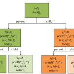

**（感谢网友 [http://tp2.sinaimg.cn/1701018393/50/1297990315/1](http://weibo.com/u/1701018393?source=webim) [@bnu\_chenshuo](http://weibo.com/u/1701018393?source=webim "bnu_chenshuo") 投稿）**


C++ 的一个常见面试题是让你实现一个 String 类，限于时间，不可能要求具备 std::string 的功能，但至少要求能正确管理资源。具体来说：


1. 能像 int 类型那样定义变量，并且支持赋值、复制。
2. 能用作函数的参数类型及返回类型。
3. 能用作标准库容器的元素类型，即 vector/list/deque 的 value\_type。（用作 std::map 的 key\_type 是更进一步的要求，本文从略）。


换言之，你的 String 能让以下代码编译运行通过，并且没有内存方面的错误。


```
void foo(String x)
{
}

void bar(const String& x)
{
}

String baz()
{
  String ret("world");
  return ret;
}

int main()
{
  String s0;
  String s1("hello");
  String s2(s0);
  String s3 = s1;
  s2 = s1;

  foo(s1);
  bar(s1);
  foo("temporary");
  bar("temporary");
  String s4 = baz();

  std::vector<String> svec;
  svec.push_back(s0);
  svec.push_back(s1);
  svec.push_back(baz());
  svec.push_back("good job");
}
```

本文给出我认为适合面试的答案，强调正确性及易实现（白板上写也不会错），不强调效率。某种意义上可以说是以时间（运行快慢）换空间（代码简洁）。


首先选择数据成员，最简单的 String 只有一个 char\* 成员变量。好处是容易实现，坏处是某些操作的复杂度较高（例如 size() 会是线性时间）。为了面试时写代码不出错，本文设计的 String 只有一个 char\* data\_成员。而且规定 invariant 如下：一个 valid 的 string 对象的 data\_ 保证不为 NULL，data\_ 以 `'\0'` 结尾，以方便配合 C 语言的 str\*() 系列函数。


其次决定支持哪些操作，构造、析构、拷贝构造、赋值这几样是肯定要有的（以前合称 big three，现在叫 copy control）。如果钻得深一点，C++11的移动构造和移动赋值也可以有。为了突出重点，本文就不考虑 operator[] 之类的重载了。


这样代码基本上就定型了：


```
#include <utility>
#include <string.h>

class String
{
 public:
  String()
    : data_(new char[1])
  {
    *data_ = '\0';
  }

  String(const char* str)
    : data_(new char[strlen(str) + 1])
  {
    strcpy(data_, str);
  }

  String(const String& rhs)
    : data_(new char[rhs.size() + 1])
  {
    strcpy(data_, rhs.c_str());
  }
  /* Delegate constructor in C++11
  String(const String& rhs)
    : String(rhs.data_)
  {
  }
  */

  ~String()
  {
    delete[] data_;
  }

  /* Traditional:
  String& operator=(const String& rhs)
  {
    String tmp(rhs);
    swap(tmp);
    return *this;
  }
  */
  String& operator=(String rhs) // yes, pass-by-value
  {
    swap(rhs);
    return *this;
  }

  // C++ 11
  String(String&& rhs)
    : data_(rhs.data_)
  {
    rhs.data_ = nullptr;
  }

  String& operator=(String&& rhs)
  {
    swap(rhs);
    return *this;
  }

  // Accessors

  size_t size() const
  {
    return strlen(data_);
  }

  const char* c_str() const
  {
    return data_;
  }

  void swap(String& rhs)
  {
    std::swap(data_, rhs.data_);
  }

 private:
  char* data_;
};
```

注意代码的几个要点：


1. 只在构造函数里调用 new char[]，只在析构函数里调用 delete[]。
2. 赋值操作符采用了《C++编程规范》推荐的现代写法。
3. 每个函数都只有一两行代码，没有条件判断。
4. 析构函数不必检查 data\_ 是否为 NULL。
5. 构造函数 `String(const char* str)` 没有检查 str 的合法性，这是一个永无止境的争论话题。这里在初始化列表里就用到了 str，因此在函数体内用 assert() 是无意义的。


这恐怕是最简洁的 String 实现了。


**练习1**：增加 operator==、operator<、operator[] 等操作符重载。


**练习2**：实现一个带 int size\_; 成员的版本，以空间换时间。


**练习3**：受益于右值引用及移动语意，在 C++11 中对 String 实施直接插入排序的性能比C++98/03要高，试编程验证之。（g++的标准库也用到了此技术。）


陈皓注：同时，大家可以移步看看我的一篇老文《[STL中String类的问题](http://blog.csdn.net/haoel/article/details/1491219)》


**（转载本站文章请注明作者和出处 [酷 壳 – CoolShell](https://coolshell.cn/) ，请勿用于任何商业用途）**


### 相关文章

* [https://coolshell.cn/wp-content/plugins/wordpress-23-related-posts-plugin/static/thumbs/29.jpg](https://coolshell.cn/articles/12052.html)[Leetcode 编程训练](https://coolshell.cn/articles/12052.html)
* [](https://coolshell.cn/articles/7965.html)[一个fork的面试题](https://coolshell.cn/articles/7965.html)
* [https://coolshell.cn/wp-content/plugins/wordpress-23-related-posts-plugin/static/thumbs/0.jpg](https://coolshell.cn/articles/4162.html)[又一个有趣的面试题](https://coolshell.cn/articles/4162.html)
* [https://coolshell.cn/wp-content/plugins/wordpress-23-related-posts-plugin/static/thumbs/21.jpg](https://coolshell.cn/articles/3961.html)[“火柴棍式”程序员面试题](https://coolshell.cn/articles/3961.html)
* [https://coolshell.cn/wp-content/plugins/wordpress-23-related-posts-plugin/static/thumbs/26.jpg](https://coolshell.cn/articles/3738.html)[打印质数的各种算法](https://coolshell.cn/articles/3738.html)
* [https://coolshell.cn/wp-content/plugins/wordpress-23-related-posts-plugin/static/thumbs/14.jpg](https://coolshell.cn/articles/3445.html)[输出从1到1000的数](https://coolshell.cn/articles/3445.html)
The post [C++面试中string类的一种正确写法](https://coolshell.cn/articles/10478.html) first appeared on [酷 壳 - CoolShell](https://coolshell.cn).