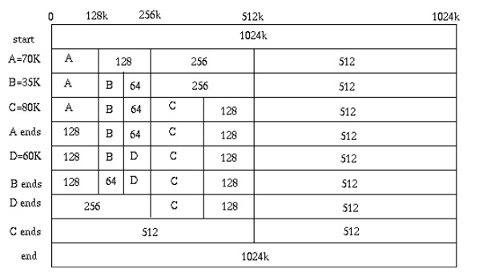
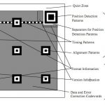

**（感谢网友** [**@我的上铺叫路遥**](http://weibo.com/fullofbull) **投稿）**


提起buddy system相信很多人不会陌生，它是一种经典的内存分配算法，大名鼎鼎的Linux底层的内存管理用的就是它。这里不探讨内核这么复杂实现，而仅仅是将该算法抽象提取出来，同时给出一份及其简洁的源码实现，以便定制扩展。


伙伴分配的实质就是一种特殊的**“分离适配”**，即将内存按2的幂进行划分，相当于分离出若干个块大小一致的空闲链表，搜索该链表并给出同需求最佳匹配的大小。其优点是快速搜索合并（O(logN)时间复杂度）以及低外部碎片（最佳适配best-fit）；其缺点是内部碎片，因为按2的幂划分块，如果碰上66单位大小，那么必须划分128单位大小的块。但若需求本身就按2的幂分配，比如可以先分配若干个内存池，在其基础上进一步细分就很有吸引力了。


可以在[维基百科](http://en.wikipedia.org/wiki/Buddy_memory_allocation)上找到该算法的描述，大体如是：


**分配内存：**


1.寻找大小合适的内存块（大于等于所需大小并且最接近2的幂，比如需要27，实际分配32）


1.如果找到了，分配给应用程序。  

2.如果没找到，分出合适的内存块。


1.对半分离出高于所需大小的空闲内存块  

2.如果分到最低限度，分配这个大小。  

3.回溯到步骤1（寻找合适大小的块）  

4.重复该步骤直到一个合适的块


**释放内存：**


1.释放该内存块


1.寻找相邻的块，看其是否释放了。  

2.如果相邻块也释放了，合并这两个块，重复上述步骤直到遇上未释放的相邻块，或者达到最高上限（即所有内存都释放了）。


上面这段文字对你来说可能看起来很费劲，没事，我们看个内存分配和释放的示意图你就知道了：





上图中，首先我们假设我们一个内存块有1024K，当我们需要给A分配70K内存的时候，


1. 我们发现1024K的一半大于70K，然后我们就把1024K的内存分成两半，一半512K。
2. 然后我们发现512K的一半仍然大于70K，于是我们再把512K的内存再分成两半，一半是128K。
3. 此时，我们发现128K的一半小于70K，于是我们就分配为A分配128K的内存。


后面的，B，C，D都这样，而释放内存时，则会把相邻的块一步一步地合并起来（合并也必需按分裂的逆操作进行合并）。


我们可以看见，这样的算法，用二叉树这个数据结构来实现再合适不过了。


我在网上分别找到[cloudwu](https://github.com/cloudwu/buddy)和[wuwenbin](https://github.com/wuwenbin/buddy2)写的两份开源实现和测试用例。实际上后一份是对前一份的精简和优化，本文打算从后一份入手讲解，**因为这份实现真正体现了“极简”二字，追求突破常规的，极致简单的设计。**网友对其评价甚高，甚至可用作教科书标准实现，看完之后回过头来看cloudwu的代码就容易理解了。


分配器的整体思想是，通过一个数组形式的完全二叉树来监控管理内存，二叉树的节点用于标记相应内存块的使用状态，高层节点对应大的块，低层节点对应小的块，在分配和释放中我们就通过这些节点的标记属性来进行块的分离合并。如图所示，假设总大小为16单位的内存，我们就建立一个深度为5的满二叉树，根节点从数组下标[0]开始，监控大小16的块；它的左右孩子节点下标[1~2]，监控大小8的块；第三层节点下标[3~6]监控大小4的块……依此类推。


在分配阶段，首先要搜索大小适配的块，假设第一次分配3，转换成2的幂是4，我们先要对整个内存进行对半切割，从16切割到4需要两步，那么从下标[0]节点开始深度搜索到下标[3]的节点并将其标记为已分配。第二次再分配3那么就标记下标[4]的节点。第三次分配6，即大小为8，那么搜索下标[2]的节点，因为下标[1]所对应的块被下标[3~4]占用了。


在释放阶段，我们依次释放上述第一次和第二次分配的块，即先释放[3]再释放[4]，当释放下标[4]节点后，我们发现之前释放的[3]是相邻的，于是我们立马将这两个节点进行合并，这样一来下次分配大小8的时候，我们就可以搜索到下标[1]适配了。若进一步释放下标[2]，同[1]合并后整个内存就回归到初始状态。


还是看一下源码实现吧，首先是伙伴分配器的数据结构：


```
struct buddy2 {
  unsigned size;
  unsigned longest[1];
};
```

这里的成员size表明管理内存的总单元数目（测试用例中是32），成员longest就是二叉树的节点标记，表明所对应的内存块的空闲单位，**在下文中会分析这是整个算法中最精妙的设计。**此处数组大小为1表明这是可以向后扩展的（注：在GCC环境下你可以写成longest[0]，不占用空间，这里是出于可移植性考虑），我们在分配器初始化的buddy2\_new可以看到这种用法。


```
struct buddy2* buddy2_new( int size ) {
  struct buddy2* self;
  unsigned node_size;
  int i;

  if (size < 1 || !IS_POWER_OF_2(size))
    return NULL;

  self = (struct buddy2*)ALLOC( 2 * size * sizeof(unsigned));
  self->size = size;
  node_size = size * 2;

  for (i = 0; i < 2 * size - 1; ++i) {
    if (IS_POWER_OF_2(i+1))
      node_size /= 2;
    self->longest[i] = node_size;
  }
  return self;
}
```

整个分配器的大小就是满二叉树节点数目，即所需管理内存单元数目的2倍。一个节点对应4个字节，longest记录了节点所对应的的内存块大小。


内存分配的alloc中，入参是分配器指针和需要分配的大小，返回值是内存块索引。alloc函数首先将size调整到2的幂大小，并检查是否超过最大限度。然后进行适配搜索，深度优先遍历，当找到对应节点后，**将其longest标记为0，即分离适配的块出来，**并转换为内存块索引offset返回，依据二叉树排列序号，比如内存总体大小32，我们找到节点下标[8]，内存块对应大小是4，则offset = (8+1)\*4-32 = 4，那么分配内存块就从索引4开始往后4个单位。


```
int buddy2_alloc(struct buddy2* self, int size) {
  unsigned index = 0;
  unsigned node_size;
  unsigned offset = 0;

  if (self==NULL)
    return -1;

  if (size <= 0)
    size = 1;
  else if (!IS_POWER_OF_2(size))
    size = fixsize(size);

  if (self->longest[index] < size)
    return -1;

  for(node_size = self->size; node_size != size; node_size /= 2 ) {
    if (self->longest[LEFT_LEAF(index)] >= size)
      index = LEFT_LEAF(index);
    else
      index = RIGHT_LEAF(index);
  }

  self->longest[index] = 0;
  offset = (index + 1) * node_size - self->size;

  while (index) {
    index = PARENT(index);
    self->longest[index] =
      MAX(self->longest[LEFT_LEAF(index)], self->longest[RIGHT_LEAF(index)]);
  }

  return offset;
}
```

在函数返回之前需要回溯，因为小块内存被占用，大块就不能分配了，比如下标[8]标记为0分离出来，那么其父节点下标[0]、[1]、[3]也需要相应大小的分离。**将它们的longest进行折扣计算，取左右子树较大值，**下标[3]取4，下标[1]取8，下标[0]取16，表明其对应的最大空闲值。


在内存释放的free接口，我们只要传入之前分配的内存地址索引，并确保它是有效值。之后就跟alloc做反向回溯，从最后的节点开始一直往上找到longest为0的节点，即当初分配块所适配的大小和位置。**我们将longest恢复到原来满状态的值。继续向上回溯，检查是否存在合并的块，依据就是左右子树longest的值相加是否等于原空闲块满状态的大小，如果能够合并，就将父节点longest标记为相加的和**（多么简单！）。


```
void buddy2_free(struct buddy2* self, int offset) {
  unsigned node_size, index = 0;
  unsigned left_longest, right_longest;

  assert(self && offset >= 0 && offset < size);

  node_size = 1;
  index = offset + self->size - 1;

  for (; self->longest[index] ; index = PARENT(index)) {
    node_size *= 2;
    if (index == 0)
      return;
  }

  self->longest[index] = node_size;

  while (index) {
    index = PARENT(index);
    node_size *= 2;

    left_longest = self->longest[LEFT_LEAF(index)];
    right_longest = self->longest[RIGHT_LEAF(index)];

    if (left_longest + right_longest == node_size)
      self->longest[index] = node_size;
    else
      self->longest[index] = MAX(left_longest, right_longest);
  }
}
```

上面两个成对alloc/free接口的时间复杂度都是O(logN)，保证了程序运行性能。然而这段程序设计的独特之处就在于**使用加权来标记内存空闲状态，而不是一般的有限状态机，实际上longest既可以表示权重又可以表示状态，状态机就毫无必要了，所谓“少即是多”嘛！**反观cloudwu的实现，将节点标记为UNUSED/USED/SPLIT/FULL四个状态机，反而会带来额外的条件判断和管理实现，而且还不如数值那样精确。从逻辑流程上看，wuwenbin的实现简洁明了如同教科书一般，特别是左右子树的走向，内存块的分离合并，块索引到节点下标的转换都是一步到位，不像cloudwu充斥了大量二叉树的深度和长度的间接计算，让代码变得晦涩难读，这些都是longest的功劳。**一个“极简”的设计往往在于你想不到的突破常规思维的地方。**


这份代码唯一的缺陷就是longest的大小是4字节，内存消耗大。但[cloudwu的博客](http://blog.codingnow.com/2011/12/buddy_memory_allocation.html)上有人提议用logN来保存值，这样就能实现uint8\_t大小了，**看，又是一个“极简”的设计！**


说实话，很难在网上找到比这更简约更优雅的buddy system实现了——至少在Google上如此。


**（转载本站文章请注明作者和出处 [酷 壳 – CoolShell](https://coolshell.cn/) ，请勿用于任何商业用途）**


### 相关文章

* [](https://coolshell.cn/articles/17225.html)[Cuckoo Filter：设计与实现](https://coolshell.cn/articles/17225.html)
* [https://coolshell.cn/wp-content/plugins/wordpress-23-related-posts-plugin/static/thumbs/29.jpg](https://coolshell.cn/articles/12052.html)[Leetcode 编程训练](https://coolshell.cn/articles/12052.html)
* [](https://coolshell.cn/articles/11847.html)[谜题的答案和活动的心得体会](https://coolshell.cn/articles/11847.html)
* [](https://coolshell.cn/articles/11832.html)[【活动】解迷题送礼物](https://coolshell.cn/articles/11832.html)
* [](https://coolshell.cn/articles/10590.html)[二维码的生成细节和原理](https://coolshell.cn/articles/10590.html)
* [https://coolshell.cn/wp-content/plugins/wordpress-23-related-posts-plugin/static/thumbs/8.jpg](https://coolshell.cn/articles/9886.html)[二叉树迭代器算法](https://coolshell.cn/articles/9886.html)
The post [伙伴分配器的一个极简实现](https://coolshell.cn/articles/10427.html) first appeared on [酷 壳 - CoolShell](https://coolshell.cn).