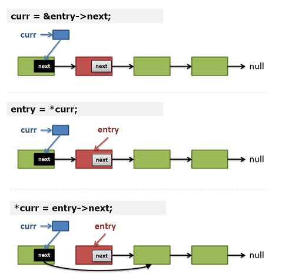

**感谢网友full\_of\_bull投递此文**（注：此文最初发表在这个[这里](http://www.oldlinux.org/oldlinux/viewthread.php?tid=14575&extra=page%3D1)，我对原文后半段修改了许多，并加入了插图）


Linus大婶在[slashdot](http://meta.slashdot.org/story/12/10/11/0030249/linus-torvalds-answers-your-questions)上回答一些编程爱好者的提问，其中一个人问他什么样的代码是他所喜好的，大婶表述了自己一些观点之后，举了一个指针的例子，解释了什么才是**core low-level coding**。


下面是Linus的教学原文及翻译——


“At the opposite end of the spectrum, I actually wish more people understood the really core low-level kind of coding. Not big, complex stuff like the lockless name lookup, but simply good use of pointers-to-pointers etc. For example, I’ve seen too many people who delete a singly-linked list entry by keeping track of the “prev” entry, and then to delete the entry, doing something like。（在这段话的最后，我实际上希望更多的人了解什么是真正的核心底层代码。这并不像无锁文件名查询（注：可能是git源码里的设计）那样庞大、复杂，只是仅仅像诸如使用二级指针那样简单的技术。例如，我见过很多人在删除一个单项链表的时候，维护了一个”prev”表项指针，然后删除当前表项，就像这样）”


```
if (prev)
    prev->next = entry->next;
else
    list_head = entry->next;
```

and whenever I see code like that, I just go “This person doesn’t understand pointers”. And it’s sadly quite common.（当我看到这样的代码时，我就会想“这个人不了解指针”。令人难过的是这太常见了。）


People who understand pointers just use a “pointer to the entry pointer”, and initialize that with the address of the list\_head. And then as they traverse the list, they can remove the entry without using any conditionals, by just doing a “\*pp = entry->next”. （了解指针的人会使用链表头的地址来初始化一个“指向节点指针的指针”。当遍历链表的时候，可以不用任何条件判断（注：指prev是否为链表头）就能移除某个节点，只要写)


`*pp = entry->next`


So there’s lots of pride in doing the small details right. It may not be big and important code, but I do like seeing code where people really thought about the details, and clearly also were thinking about the compiler being able to generate efficient code (rather than hoping that the compiler is so smart that it can make efficient code \*despite\* the state of the original source code). （纠正细节是令人自豪的事。也许这段代码并非庞大和重要，**但我喜欢看那些注重代码细节的人写的代码，也就是清楚地了解如何才能编译出有效代码**（而不是寄望于聪明的编译器来产生有效代码，即使是那些原始的汇编代码））。


Linus举了一个单向链表的例子，但给出的代码太短了，一般的人很难搞明白这两个代码后面的含义。正好，有个编程爱好者阅读了这段话，并给出了一个[比较完整的代码](http://wordaligned.org/articles/two-star-programming)。他的话我就不翻译了，下面给出代码说明。


如果我们需要写一个remove\_if(link\*, rm\_cond\_func\*)的函数，也就是传入一个单向链表，和一个自定义的是否删除的函数，然后返回处理后的链接。


这个代码不难，基本上所有的教科书都会提供下面的代码示例，而这种写法也是大公司的面试题**标准**模板：


```
typedef struct node
{
    struct node * next;
    ....
} node;

typedef bool (* remove_fn)(node const * v);

// Remove all nodes from the supplied list for which the
// supplied remove function returns true.
// Returns the new head of the list.
node * remove_if(node * head, remove_fn rm)
{
    for (node * prev = NULL, * curr = head; curr != NULL; )
    {
        node * const next = curr->next;
        if (rm(curr))
        {
            if (prev)
                prev->next = next;
            else
                head = next;
            free(curr);
        }
        else
            prev = curr;
        curr = next;
    }
    return head;
}
```

这里remove\_fn由调用查提供的一个是否删除当前实体结点的函数指针，其会判断删除条件是否成立。这段代码维护了两个节点指针prev和curr，**标准的教科书写法——删除当前结点时，需要一个previous的指针，并且还要这里还需要做一个边界条件的判断——curr是否为链表头**。于是，要删除一个节点（不是表头），只要将前一个节点的next指向当前节点的next指向的对象，即下一个节点（即：prev->next = curr->next），然后释放当前节点。


但在Linus看来，这是不懂指针的人的做法。那么，什么是core low-level coding呢？那就是**有效地利用二级指针，将其作为管理和操作链表的首要选项。**代码如下：


```
void remove_if(node ** head, remove_fn rm)
{
    for (node** curr = head; *curr; )
    {
        node * entry = *curr;
        if (rm(entry))
        {
            *curr = entry->next;
            free(entry);
        }
        else
            curr = &entry->next;
    }
}
```

同上一段代码有何改进呢？我们看到：**不需要prev指针了，也不需要再去判断是否为链表头了，但是，curr变成了一个指向指针的指针**。这正是这段程序的精妙之处。（注意，我所highlight的那三行代码）


让我们来人肉跑一下这个代码，对于——


* **删除节点是表头**的情况，输入参数中传入head的二级指针，在for循环里将其初始化curr，然后entry就是\*head(\*curr)，我们马上删除它，那么第8行就等效于\*head = (\*head)->next，就是删除表头的实现。


* **删除节点不是表头**的情况，对于上面的代码，我们可以看到——


**1）**（第12行）**如果不删除当前结点 —— curr保存的是当前结点next指针的地址**。


**2）（第5行） entry 保存了 \*curr **——**这意味着在下一次循环：entry就是prev->next指针所指向的内存。**


**3）（第8行）删除结点：\*curr = entry->next; —— 于是：prev->next 指向了 entry -> next;**


是不是很巧妙？我们可以只用一个二级指针来操作链表，对所有节点都一样。


如果你对上面的代码和描述理解上有困难的话，你可以看看下图的示意：





（全文完）


**（转载本站文章请注明作者和出处 [酷 壳 – CoolShell](https://coolshell.cn/) ，请勿用于任何商业用途）**


### 相关文章

* [](https://coolshell.cn/articles/9859.html)[Alan Cox：单向链表中prev指针的妙用](https://coolshell.cn/articles/9859.html)
* [](https://coolshell.cn/articles/18360.html)[程序员练级攻略（2018) 与我的专栏](https://coolshell.cn/articles/18360.html)
* [](https://coolshell.cn/articles/18024.html)[API设计原则 – Qt官网的设计实践总结](https://coolshell.cn/articles/18024.html)
* [https://coolshell.cn/wp-content/plugins/wordpress-23-related-posts-plugin/static/thumbs/10.jpg](https://coolshell.cn/articles/9917.html)[Alan Cox：大教堂、市集与市议会](https://coolshell.cn/articles/9917.html)
* [https://coolshell.cn/wp-content/plugins/wordpress-23-related-posts-plugin/static/thumbs/7.jpg](https://coolshell.cn/articles/8088.html)[对技术的态度](https://coolshell.cn/articles/8088.html)
* [](https://coolshell.cn/articles/7886.html)[代码执行的效率](https://coolshell.cn/articles/7886.html)
The post [Linus：利用二级指针删除单向链表](https://coolshell.cn/articles/8990.html) first appeared on [酷 壳 - CoolShell](https://coolshell.cn).