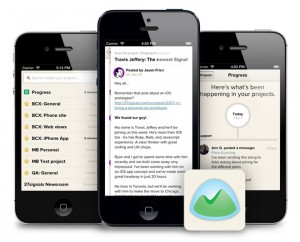

 

David，Ruby on Rails 作者，37signals 合伙人

畅销书作家、演说家、赛车手、业余摄影师、顾家好男人

 

[37signals](http://37signals.com/) 在2013年2月发布了 Basecamp 的 iPhone app，在此之前我们就使用原生开发（native）还是混合开发（hybrid）做了许多尝试。在2012年项目启动的时候，大多数人都倾向于原生开发。

Facebook 在2012年发布了他们新的 iOS app，为了获得更好的用户体验，他们放弃了原来的 HTML5 混合开发方式。考虑到2010～2011年的时候，HTML 在移动端的性能确实不尽如人意，这个决定在当时看来也在情理之中。2010年的时候我们觉得 iPhone 3G/3GS 够眩够快，但按照现在的标准来看它们就太慢了。因此在为移动应用开发做架构设计时，我们需要考虑新的移动设备的计算能力，而不是那些老的过时的设备。

#### 移动开发架构设计不需要过多考虑设备的性能

我们从一些测试中得出的一个结论是：现在的移动设备计算能力都很强，运行原生应用和 HTML 应用的效果差别不大，而 HTML 开发的成本则要比原生开发小得多。

当然这个结论在某些领域并不太适用。如果你要开发一个 3D 游戏，原生开发方式能够带来更好的游戏体验。但如果你的移动应用象 Basecamp 一样侧重信息处理，为了降低开发成本，你就可以考虑混合开发方式。我们就是如此，下面是我们三代移动产品的发展轨迹：

#### 第一代产品：原生外壳(native shell)＋嵌套WebView

这个版本就是一个简单的原生外壳负责界面导航，嵌套一个 WebView 来显示 Basecamp Rail application，显示的基本上都是我们移动网站页面，再加上一些特殊的样式。

在移动网站的页面上嵌套一个原生的壳，听起来还是 Web 页面，但实际带给用户的体验确是非常不同。用户可以在 Apple App Store 找到我们的 app，他们一旦登录 app 后可以再也不用重新登录（移动版本的 Safari 似乎会经常清空 cookie，让你不得不重新登录）。我们的 app 大受欢迎，用户评分在4和5之间。

整个 app 由一名程序员和一名设计师开发，成本不高，因为我们可以在已有的移动网站的基础上开发。

如果我们当初开发完全原生的 app，用10个人的团队1年半的时间也未必能完成。

 

#### 第二代产品：原生外壳＋原生导航界面

几个月前发布的 Basecamp Android app 是我们的第二代产品，我们在其中做了大量的改进。

从第一代 iPhone app 中我们感受到了原生导航界面的威力，所以在 Android 版本中，我们由 HTML 页面导航转向了原生导航界面。我们从 HTML 页面生成原生导航界面，用户体验更加流畅，原生界面和 HTML 页面的体验差别越来越小，甚至很难区分哪些是原生部分，哪些是 HTML 。

Android 版本是由一两个程序员和一个设计师开发（50%投入）完成的。我们重用了移动站点和 iPhone app 中使用的所有 webview，大大提高了开发效率，同时用户也很买账，超过1000名用户打了4.5~5的高分。

很多公司在抱怨他们的 iOS 移动项目进展缓慢，Android 项目似乎更是如此。或许他们已经习惯了 iOS 项目的开发流程，也许是因为 Android 的屏幕碎片化问题，但是这些对我们来说那都不是事。我们推出的 Android app 表现良好，重用了95%的代码，开发团队也一直保持在小规模。

 

#### 因地制宜地运用原生开发方式

目前我们正在开发第三代产品，发布的平台暂时保密，不过你应该也不难猜到。在前两代产品中，我们增加了原生导航界面的使用，同时进一步确定了以 webview 为核心的整体架构。在第三代产品中，我们将因地制宜地选择需要使用原生开发的功能，好钢要用在刀刃上。

从之前的100% HTML，到现在的90% HTML +10%原生，我们会选择最值得做原生开发的那10%的部分，最终目的是让 app 原生部分和 HTML 部分的体验没有太大区别。

 

#### 混合开发模式使用的技术

混合开发模式在技术很简单，主要是处理 webview 的集成、Web 页面的加载，以及原生内容和 HTML 内容之间的交叉链接，其实可能比你想像的还要简单得多。

HTML 方面，我们的 Rails Web 应用支持 Web 和移动两大平台，其中 [Rails 4.1 feature of variants](http://edgeguides.rubyonrails.org/4_1_release_notes.html#action-pack-variants) 起了很大的作用。

这也很大程度上有助于我们发布新功能。设想一下如果我们每次需要更新这么多平台：Rails desktop app, a Rails API app, a client-side MVC app, a mobile web wrapper app, an Android app, and an iPhone app，像我们这样只有10个程序员和7个设计师的公司根本无力承担如此巨大的工作量。

除了工作量的减轻，bug 修复效率也提高了，因为大部分的代码逻辑是在 Web 服务器端，我们可以随时修改代码并发布，不用通过 Apple App Store 的审批流程。所以我们的移动 app 和 Web 应用一样，也是持续部署。

就如我之前提到的，混合模式开发并不适用于所有情况。在2010年以前，那时手机的处理能力都不强，所以 HTML/JS 的体验并不好，用户也不喜欢。但是时过境迁，现在手机的处理能力大大提高了，HTML/JS 的性能也不再是一个问题。

 

#### 混合开发模式对原生开发模式的挑战

混合开发模式在降低开发复杂度方面有它的优势，如果你的产品是以显示和处理信息为主，我认为都可以不同程度地采用这个模式。

对于小型团队和公司而言，并不一定需要采用 iOS 原生 app 先行的模式。使用混合模式，不需要你重头开发一个 app，这样可以降低维护成本，将来扩展到其他平台也更为方便。

当然我知道会有很多人质疑这个模式，或许因为他们的 app 中有很多地方需要原生开发（也许仅仅是他们自己这样认为罢了）。又或许他们已经花了很多时间让 app 里的 UITableView 看起来非常漂亮，以致如果其他地方不这样的话显得不是太完美。再或许大公司就是喜欢耗时耗力的原生开发，有钱就是这么任性。

无论怎样，混合开发当下应该能够成为我们移动开发策略的一个选择。如果你认为这是一个好的选择，那么恭喜你，尽情愉快地玩耍吧！

 

*原文链接：[Hybrid sweet spot: Native navigation, web content](https://signalvnoise.com/posts/3743?utm_campaign=iOS_Dev_Weekly_Issue_175&utm_medium=email&utm_source=iOS%2BDev%2BWeekly)*

 

下面补充一些 David 答读者问：

 

Mike Waite @ 2014-05-08：我很好奇你是如何决定哪些功能要用原生开发？  

David @ 2014-05-08：主要靠感觉，这毕竟不是一门科学。如果你感觉你app的某一部分如果用原生开发会更好些，可以尝试做快速原型（spike）。很多时候我们通过这种方式证明我们的想法其实是错的。当然如果你需要使用到手机上的功能如：摄像和其他设备时，HTML目前还不太适用，不过永远也不要把话说死。

 

Mike Parsons @ 2014-05-08：好文。很好奇你们是否使用 PhoneGap 或者 Cordova 这样的框架，或者你们自己开发了一个？  

David @ 2014-05-08：我们没有使用任何框架。（此处省去xxx字）

 

Derick @ 2014-05-08：你怎样解决 Android 浏览器渲染速度慢的问题？这也是 Android 平台上更多人倾向开发原生app得原因。  

David @ 2014-05-08：不知道你这个结论是近期的还是以前的？Basecamp 的 Android app 在我的 Nexus 5 和 HTC One 上面运行得非常流畅。  

Derick @ 2014-05-08：就是最近。我猜测可能和你使用JavaScript的多少有关系。因为以我个人的经验，Android 上 JavaScript 的运行速度非常慢。如果你感兴趣可以看看下面的文章：<https://www.timroes.de/2013/11/23/old-webview-vs-chromium-webview/>  

David @ 2014-05-08：我们使用了很多JavaScript，当然没有 Web MVC 客户端用得那样多。另外我们使用了 Turbolinks ：）

 

**（转载本站文章请注明作者和出处 [酷 壳 – CoolShell](https://coolshell.cn/) ，请勿用于任何商业用途）**

### 相关文章

* [Google Inbox如何跨平台重用代码？](https://coolshell.cn/articles/12136.html)
* [关于移动端的钓鱼式攻击](https://coolshell.cn/articles/17066.html)
* [程序员练级攻略（2018) 与我的专栏](https://coolshell.cn/articles/18360.html)
* [如何免费的让网站启用HTTPS](https://coolshell.cn/articles/18094.html)
* [HTML6 展望](https://coolshell.cn/articles/12206.html)
* [State Threads 回调终结者](https://coolshell.cn/articles/12012.html)
The post [DHH 谈混合移动应用开发](https://coolshell.cn/articles/12225.html) first appeared on [酷 壳 - CoolShell](https://coolshell.cn).