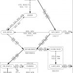

TCP是一个巨复杂的协议，因为他要解决很多问题，而这些问题又带出了很多子问题和阴暗面。所以学习TCP本身是个比较痛苦的过程，但对于学习的过程却能让人有很多收获。关于TCP这个协议的细节，我还是推荐你去看[W.Richard Stevens](http://www.kohala.com/start/)的《[TCP/IP 详解 卷1：协议](http://book.douban.com/subject/1088054/)》（当然，你也可以去读一下[RFC793](http://tools.ietf.org/html/rfc793)以及后面N多的RFC）。另外，本文我会使用英文术语，这样方便你通过这些英文关键词来查找相关的技术文档。


之所以想写这篇文章，目的有三个，


* 一个是想锻炼一下自己是否可以用简单的篇幅把这么复杂的TCP协议描清楚的能力。
* 另一个是觉得现在的好多程序员基本上不会认认真真地读本书，喜欢快餐文化，所以，希望这篇快餐文章可以让你对TCP这个古典技术有所了解，并能体会到软件设计中的种种难处。并且你可以从中有一些软件设计上的收获。
* 最重要的希望这些基础知识可以让你搞清很多以前一些似是而非的东西，并且你能意识到基础的重要。


所以，本文不会面面俱到，只是对TCP协议、算法和原理的科普。


我本来只想写一个篇幅的文章的，但是TCP真TMD的复杂，比C++复杂多了，这30多年来，各种优化变种争论和修改。所以，写着写着就发现只有砍成两篇。


* 上篇中，主要向你介绍TCP协议的定义和丢包时的重传机制。
* 下篇中，重点介绍TCP的流迭、拥塞处理。


废话少说，首先，我们需要知道TCP在网络OSI的七层模型中的第四层——Transport层，IP在第三层——Network层，ARP在第二层——Data Link层，在第二层上的数据，我们叫Frame，在第三层上的数据叫Packet，第四层的数据叫Segment。


首先，我们需要知道，我们程序的数据首先会打到TCP的Segment中，然后TCP的Segment会打到IP的Packet中，然后再打到以太网Ethernet的Frame中，传到对端后，各个层解析自己的协议，然后把数据交给更高层的协议处理。


#### TCP头格式


接下来，我们来看一下TCP头的格式


TCP头格式（[图片来源](http://nmap.org/book/tcpip-ref.html)）


你需要注意这么几点：


* TCP的包是没有IP地址的，那是IP层上的事。但是有源端口和目标端口。
* 一个TCP连接需要四个元组来表示是同一个连接（src\_ip, src\_port, dst\_ip, dst\_port）准确说是五元组，还有一个是协议。但因为这里只是说TCP协议，所以，这里我只说四元组。
* 注意上图中的四个非常重要的东西：
	+ **Sequence Number**是包的序号，**用来解决网络包乱序（reordering）问题。**
	+ **Acknowledgement Number**就是ACK——用于确认收到，**用来解决不丢包的问题**。
	+ **Window又叫Advertised-Window**，也就是著名的滑动窗口（Sliding Window），**用于解决流控的**。
	+ **TCP Flag** ，也就是包的类型，**主要是用于操控TCP的状态机的**。


关于其它的东西，可以参看下面的图示


（[图片来源](http://nmap.org/book/tcpip-ref.html)）


#### TCP的状态机


其实，**网络上的传输是没有连接的，包括TCP也是一样的**。而TCP所谓的“连接”，其实只不过是在通讯的双方维护一个“连接状态”，让它看上去好像有连接一样。所以，TCP的状态变换是非常重要的。


下面是：“**TCP协议的状态机**”（[图片来源](http://www.tcpipguide.com/free/t_TCPOperationalOverviewandtheTCPFiniteStateMachineF-2.htm)） 和 “**TCP建链接**”、“**TCP断链接**”、“**传数据**” 的对照图，我把两个图并排放在一起，这样方便在你对照着看。另外，下面这两个图非常非常的重要，你一定要记牢。（吐个槽：看到这样复杂的状态机，就知道这个协议有多复杂，复杂的东西总是有很多坑爹的事情，所以TCP协议其实也挺坑爹的）


 


很多人会问，为什么建链接要3次握手，断链接需要4次挥手？


* **对于建链接的3次握手，**主要是要初始化Sequence Number 的初始值。通信的双方要互相通知对方自己的初始化的Sequence Number（缩写为ISN：Inital Sequence Number）——所以叫SYN，全称Synchronize Sequence Numbers。也就上图中的 x 和 y。这个号要作为以后的数据通信的序号，以保证应用层接收到的数据不会因为网络上的传输的问题而乱序（TCP会用这个序号来拼接数据）。


* **对于4次挥手，**其实你仔细看是2次，因为TCP是全双工的，所以，发送方和接收方都需要Fin和Ack。只不过，有一方是被动的，所以看上去就成了所谓的4次挥手。如果两边同时断连接，那就会就进入到CLOSING状态，然后到达TIME\_WAIT状态。下图是双方同时断连接的示意图（你同样可以对照着TCP状态机看）：


  

两端同时断连接（[图片来源](http://www.tcpipguide.com/free/t_TCPConnectionTermination-4.htm)）


 


另外，有几个事情需要注意一下：


* **关于建连接时SYN超时**。试想一下，如果server端接到了clien发的SYN后回了SYN-ACK后client掉线了，server端没有收到client回来的ACK，那么，这个连接处于一个中间状态，即没成功，也没失败。于是，server端如果在一定时间内没有收到的TCP会重发SYN-ACK。在Linux下，默认重试次数为5次，重试的间隔时间从1s开始每次都翻售，5次的重试时间间隔为1s, 2s, 4s, 8s, 16s，总共31s，第5次发出后还要等32s都知道第5次也超时了，所以，总共需要 1s + 2s + 4s+ 8s+ 16s + 32s = 2^6 -1 = 63s，TCP才会把断开这个连接。


* **关于SYN Flood攻击**。一些恶意的人就为此制造了SYN Flood攻击——给服务器发了一个SYN后，就下线了，于是服务器需要默认等63s才会断开连接，这样，攻击者就可以把服务器的syn连接的队列耗尽，让正常的连接请求不能处理。于是，Linux下给了一个叫**tcp\_syncookies**的参数来应对这个事——当SYN队列满了后，TCP会通过源地址端口、目标地址端口和时间戳打造出一个特别的Sequence Number发回去（又叫cookie），如果是攻击者则不会有响应，如果是正常连接，则会把这个 SYN Cookie发回来，然后服务端可以通过cookie建连接（即使你不在SYN队列中）。请注意，**请先千万别用tcp\_syncookies来处理正常的大负载的连接的情况**。因为，synccookies是妥协版的TCP协议，并不严谨。对于正常的请求，你应该调整三个TCP参数可供你选择，第一个是：tcp\_synack\_retries 可以用他来减少重试次数；第二个是：tcp\_max\_syn\_backlog，可以增大SYN连接数；第三个是：tcp\_abort\_on\_overflow 处理不过来干脆就直接拒绝连接了。


* **关于ISN的初始化**。ISN是不能hard code的，不然会出问题的——比如：如果连接建好后始终用1来做ISN，如果client发了30个segment过去，但是网络断了，于是 client重连，又用了1做ISN，但是之前连接的那些包到了，于是就被当成了新连接的包，此时，client的Sequence Number 可能是3，而Server端认为client端的这个号是30了。全乱了。[RFC793](http://tools.ietf.org/html/rfc793)中说，ISN会和一个假的时钟绑在一起，这个时钟会在每4微秒对ISN做加一操作，直到超过2^32，又从0开始。这样，一个ISN的周期大约是4.55个小时。因为，我们假设我们的TCP Segment在网络上的存活时间不会超过Maximum Segment Lifetime（缩写为MSL – [Wikipedia语条](http://en.wikipedia.org/wiki/Maximum_Segment_Lifetime)），所以，只要MSL的值小于4.55小时，那么，我们就不会重用到ISN。


* **关于 MSL 和 TIME\_WAIT**。通过上面的ISN的描述，相信你也知道MSL是怎么来的了。我们注意到，在TCP的状态图中，从TIME\_WAIT状态到CLOSED状态，有一个超时设置，这个超时设置是 2\*MSL（[RFC793](http://tools.ietf.org/html/rfc793)定义了MSL为2分钟，Linux设置成了30s）为什么要这有TIME\_WAIT？为什么不直接给转成CLOSED状态呢？主要有两个原因：1）TIME\_WAIT确保有足够的时间让对端收到了ACK，如果被动关闭的那方没有收到Ack，就会触发被动端重发Fin，一来一去正好2个MSL，2）有足够的时间让这个连接不会跟后面的连接混在一起（你要知道，有些自做主张的路由器会缓存IP数据包，如果连接被重用了，那么这些延迟收到的包就有可能会跟新连接混在一起）。你可以看看这篇文章《[TIME\_WAIT and its design implications for protocols and scalable client server systems](http://www.serverframework.com/asynchronousevents/2011/01/time-wait-and-its-design-implications-for-protocols-and-scalable-servers.html)》


* **关于TIME\_WAIT数量太多**。从上面的描述我们可以知道，TIME\_WAIT是个很重要的状态，但是如果在大并发的短链接下，TIME\_WAIT 就会太多，这也会消耗很多系统资源。只要搜一下，你就会发现，十有八九的处理方式都是教你设置两个参数，一个叫**tcp\_tw\_reuse**，另一个叫**tcp\_tw\_recycle**的参数，这两个参数默认值都是被关闭的，后者recyle比前者resue更为激进，resue要温柔一些。另外，如果使用tcp\_tw\_reuse，必需设置tcp\_timestamps=1，否则无效。这里，你一定要注意，**打开这两个参数会有比较大的坑——可能会让TCP连接出一些诡异的问题**（因为如上述一样，如果不等待超时重用连接的话，新的连接可能会建不上。正如[官方文档](https://www.kernel.org/doc/Documentation/networking/ip-sysctl.txt)上说的一样“**It should not be changed without advice/request of technical experts**”）。


+ **关于tcp\_tw\_reuse**。官方文档上说tcp\_tw\_reuse 加上tcp\_timestamps（又叫PAWS, for Protection Against Wrapped Sequence Numbers）可以保证协议的角度上的安全，但是你需要tcp\_timestamps在两边都被打开（你可以读一下[tcp\_twsk\_unique](http://lxr.free-electrons.com/ident?i=tcp_twsk_unique)的源码 ）。我个人估计还是有一些场景会有问题。


+ **关于tcp\_tw\_recycle**。如果是tcp\_tw\_recycle被打开了话，会假设对端开启了tcp\_timestamps，然后会去比较时间戳，如果时间戳变大了，就可以重用。但是，如果对端是一个NAT网络的话（如：一个公司只用一个IP出公网）或是对端的IP被另一台重用了，这个事就复杂了。建链接的SYN可能就被直接丢掉了（你可能会看到connection time out的错误）（如果你想观摩一下Linux的内核代码，请参看源码[tcp\_timewait\_state\_process](http://lxr.free-electrons.com/ident?i=tcp_timewait_state_process)）。


+ **关于tcp\_max\_tw\_buckets**。这个是控制并发的TIME\_WAIT的数量，默认值是180000，如果超限，那么，系统会把多的给destory掉，然后在日志里打一个警告（如：time wait bucket table overflow），官网文档说这个参数是用来对抗DDoS攻击的。也说的默认值180000并不小。这个还是需要根据实际情况考虑。


**Again，使用tcp\_tw\_reuse和tcp\_tw\_recycle来解决TIME\_WAIT的问题是非常非常危险的，因为这两个参数违反了TCP协议（[RFC 1122](http://tools.ietf.org/html/rfc1122)）**


其实，TIME\_WAIT表示的是你主动断连接，所以，这就是所谓的“不作死不会死”。试想，如果让对端断连接，那么这个破问题就是对方的了，呵呵。另外，如果你的服务器是于HTTP服务器，那么设置一个[HTTP的KeepAlive](http://en.wikipedia.org/wiki/HTTP_persistent_connection)有多重要（浏览器会重用一个TCP连接来处理多个HTTP请求），然后让客户端去断链接（你要小心，浏览器可能会非常贪婪，他们不到万不得已不会主动断连接）。


#### 数据传输中的Sequence Number


下图是我从Wireshark中截了个我在访问coolshell.cn时的有数据传输的图给你看一下，SeqNum是怎么变的。（使用Wireshark菜单中的Statistics ->Flow Graph… ）


你可以看到，**SeqNum的增加是和传输的字节数相关的**。上图中，三次握手后，来了两个Len:1440的包，而第二个包的SeqNum就成了1441。然后第一个ACK回的是1441，表示第一个1440收到了。


**注意**：如果你用Wireshark抓包程序看3次握手，你会发现SeqNum总是为0，不是这样的，Wireshark为了显示更友好，使用了Relative SeqNum——相对序号，你只要在右键菜单中的protocol preference 中取消掉就可以看到“Absolute SeqNum”了


#### TCP重传机制


TCP要保证所有的数据包都可以到达，所以，必需要有重传机制。


注意，接收端给发送端的Ack确认只会确认最后一个连续的包，比如，发送端发了1,2,3,4,5一共五份数据，接收端收到了1，2，于是回ack 3，然后收到了4（注意此时3没收到），此时的TCP会怎么办？我们要知道，因为正如前面所说的，**SeqNum和Ack是以字节数为单位，所以ack的时候，不能跳着确认，只能确认最大的连续收到的包**，不然，发送端就以为之前的都收到了。


##### 超时重传机制


一种是不回ack，死等3，当发送方发现收不到3的ack超时后，会重传3。一旦接收方收到3后，会ack 回 4——意味着3和4都收到了。


但是，这种方式会有比较严重的问题，那就是因为要死等3，所以会导致4和5即便已经收到了，而发送方也完全不知道发生了什么事，因为没有收到Ack，所以，发送方可能会悲观地认为也丢了，所以有可能也会导致4和5的重传。


对此有两种选择：


* 一种是仅重传timeout的包。也就是第3份数据。
* 另一种是重传timeout后所有的数据，也就是第3，4，5这三份数据。


这两种方式有好也有不好。第一种会节省带宽，但是慢，第二种会快一点，但是会浪费带宽，也可能会有无用功。但总体来说都不好。因为都在等timeout，timeout可能会很长（在下篇会说TCP是怎么动态地计算出timeout的）


##### 快速重传机制


于是，TCP引入了一种叫**Fast Retransmit** 的算法，**不以时间驱动，而以数据驱动重传**。也就是说，如果，包没有连续到达，就ack最后那个可能被丢了的包，如果发送方连续收到3次相同的ack，就重传。Fast Retransmit的好处是不用等timeout了再重传。


比如：如果发送方发出了1，2，3，4，5份数据，第一份先到送了，于是就ack回2，结果2因为某些原因没收到，3到达了，于是还是ack回2，后面的4和5都到了，但是还是ack回2，因为2还是没有收到，于是发送端收到了三个ack=2的确认，知道了2还没有到，于是就马上重转2。然后，接收端收到了2，此时因为3，4，5都收到了，于是ack回6。示意图如下：


Fast Retransmit只解决了一个问题，就是timeout的问题，它依然面临一个艰难的选择，就是，是重传之前的一个还是重传所有的问题。对于上面的示例来说，是重传#2呢还是重传#2，#3，#4，#5呢？因为发送端并不清楚这连续的3个ack(2)是谁传回来的？也许发送端发了20份数据，是#6，#10，#20传来的呢。这样，发送端很有可能要重传从2到20的这堆数据（这就是某些TCP的实际的实现）。可见，这是一把双刃剑。


##### SACK 方法


另外一种更好的方式叫：**Selective Acknowledgment (SACK)**（参看[RFC 2018](http://tools.ietf.org/html/rfc2018)），这种方式需要在TCP头里加一个SACK的东西，ACK还是Fast Retransmit的ACK，SACK则是汇报收到的数据碎版。参看下图：


这样，在发送端就可以根据回传的SACK来知道哪些数据到了，哪些没有到。于是就优化了Fast Retransmit的算法。当然，这个协议需要两边都支持。在 Linux下，可以通过**tcp\_sack**参数打开这个功能（Linux 2.4后默认打开）。


这里还需要注意一个问题——**接收方Reneging，所谓Reneging的意思就是接收方有权把已经报给发送端SACK里的数据给丢了**。这样干是不被鼓励的，因为这个事会把问题复杂化了，但是，接收方这么做可能会有些极端情况，比如要把内存给别的更重要的东西。**所以，发送方也不能完全依赖SACK，还是要依赖ACK，并维护Time-Out，如果后续的ACK没有增长，那么还是要把SACK的东西重传，另外，接收端这边永远不能把SACK的包标记为Ack。**


注意：SACK会消费发送方的资源，试想，如果一个攻击者给数据发送方发一堆SACK的选项，这会导致发送方开始要重传甚至遍历已经发出的数据，这会消耗很多发送端的资源。详细的东西请参看《[TCP SACK的性能权衡](http://www.ibm.com/developerworks/cn/linux/l-tcp-sack/)》


##### Duplicate SACK – 重复收到数据的问题


Duplicate SACK又称D-SACK，**其主要使用了SACK来告诉发送方有哪些数据被重复接收了**。[RFC-2883](http://www.ietf.org/rfc/rfc2883.txt) 里有详细描述和示例。下面举几个例子（来源于[RFC-2883](http://www.ietf.org/rfc/rfc2883.txt)）


D-SACK使用了SACK的第一个段来做标志，


* 如果SACK的第一个段的范围被ACK所覆盖，那么就是D-SACK


* 如果SACK的第一个段的范围被SACK的第二个段覆盖，那么就是D-SACK


**示例一：ACK丢包**


下面的示例中，丢了两个ACK，所以，发送端重传了第一个数据包（3000-3499），于是接收端发现重复收到，于是回了一个SACK=3000-3500，因为ACK都到了4000意味着收到了4000之前的所有数据，所以这个SACK就是D-SACK——旨在告诉发送端我收到了重复的数据，而且我们的发送端还知道，数据包没有丢，丢的是ACK包。


```

	Transmitted  Received    ACK Sent
	Segment      Segment     (Including SACK Blocks)

	3000-3499    3000-3499   3500 (ACK dropped)
	3500-3999    3500-3999   4000 (ACK dropped)
	3000-3499    3000-3499   4000, SACK=3000-3500
                                        ---------
```

**示例二，网络延误**


下面的示例中，网络包（1000-1499）被网络给延误了，导致发送方没有收到ACK，而后面到达的三个包触发了“Fast Retransmit算法”，所以重传，但重传时，被延误的包又到了，所以，回了一个SACK=1000-1500，因为ACK已到了3000，所以，这个SACK是D-SACK——标识收到了重复的包。


这个案例下，发送端知道之前因为“Fast Retransmit算法”触发的重传不是因为发出去的包丢了，也不是因为回应的ACK包丢了，而是因为网络延时了。


```

    Transmitted    Received    ACK Sent
    Segment        Segment     (Including SACK Blocks)

    500-999        500-999     1000
    1000-1499      (delayed)
    1500-1999      1500-1999   1000, SACK=1500-2000
    2000-2499      2000-2499   1000, SACK=1500-2500
    2500-2999      2500-2999   1000, SACK=1500-3000
    1000-1499      1000-1499   3000
                   1000-1499   3000, SACK=1000-1500
                                          ---------
```

 


可见，引入了D-SACK，有这么几个好处：


1）可以让发送方知道，是发出去的包丢了，还是回来的ACK包丢了。


2）是不是自己的timeout太小了，导致重传。


3）网络上出现了先发的包后到的情况（又称reordering）


4）网络上是不是把我的数据包给复制了。


 **知道这些东西可以很好得帮助TCP了解网络情况，从而可以更好的做网络上的流控**。


Linux下的tcp\_dsack参数用于开启这个功能（Linux 2.4后默认打开）


好了，上篇就到这里结束了。如果你觉得我写得还比较浅显易懂，那么，欢迎移步看下篇《[TCP的那些事（下）](https://coolshell.cn/articles/11609.html)》


**[TCP的那些事儿（下）>>>](https://coolshell.cn/articles/11609.html)**


（上篇完）


**（转载本站文章请注明作者和出处 [酷 壳 – CoolShell](https://coolshell.cn/) ，请勿用于任何商业用途）**


### 相关文章

* [](https://coolshell.cn/articles/22263.html)[从一次经历谈 TIME\_WAIT 的那些事](https://coolshell.cn/articles/22263.html)
* [](https://coolshell.cn/articles/19840.html)[HTTP的前世今生](https://coolshell.cn/articles/19840.html)
* [](https://coolshell.cn/articles/11609.html)[TCP 的那些事儿（下）](https://coolshell.cn/articles/11609.html)
* [](https://coolshell.cn/articles/9859.html)[Alan Cox：单向链表中prev指针的妙用](https://coolshell.cn/articles/9859.html)
* [](https://coolshell.cn/articles/7490.html)[性能调优攻略](https://coolshell.cn/articles/7490.html)
* [](https://coolshell.cn/articles/1484.html)[TCP网络关闭的状态变换时序图](https://coolshell.cn/articles/1484.html)
The post [TCP 的那些事儿（上）](https://coolshell.cn/articles/11564.html) first appeared on [酷 壳 - CoolShell](https://coolshell.cn).