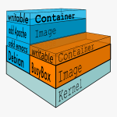

前面，我们介绍了[Linux Namespace](https://coolshell.cn/articles/17010.html "Docker基础技术：Linux Namespace")，但是Namespace解决的问题主要是环境隔离的问题，这只是虚拟化中最最基础的一步，我们还需要解决对计算机资源使用上的隔离。也就是说，虽然你通过Namespace把我Jail到一个特定的环境中去了，但是我在其中的进程使用用CPU、内存、磁盘等这些计算资源其实还是可以随心所欲的。所以，我们希望对进程进行资源利用上的限制或控制。这就是Linux CGroup出来了的原因。


Linux CGroup全称Linux Control Group， 是Linux内核的一个功能，用来限制，控制与分离一个进程组群的资源（如CPU、内存、磁盘输入输出等）。这个项目最早是由Google的工程师在2006年发起（主要是Paul Menage和Rohit Seth），最早的名称为进程容器（process containers）。在2007年时，因为在Linux内核中，容器（container）这个名词太过广泛，为避免混乱，被重命名为cgroup，并且被合并到2.6.24版的内核中去。然后，其它开始了他的发展。


Linux CGroupCgroup 可​​​让​​​您​​​为​​​系​​​统​​​中​​​所​​​运​​​行​​​任​​​务​​​（进​​​程​​​）的​​​用​​​户​​​定​​​义​​​组​​​群​​​分​​​配​​​资​​​源​​​ — 比​​​如​​​ CPU 时​​​间​​​、​​​系​​​统​​​内​​​存​​​、​​​网​​​络​​​带​​​宽​​​或​​​者​​​这​​​些​​​资​​​源​​​的​​​组​​​合​​​。​​​您​​​可​​​以​​​监​​​控​​​您​​​配​​​置​​​的​​​ cgroup，拒​​​绝​​​ cgroup 访​​​问​​​某​​​些​​​资​​​源​​​，甚​​​至​​​在​​​运​​​行​​​的​​​系​​​统​​​中​​​动​​​态​​​配​​​置​​​您​​​的​​​ cgroup。


主要提供了如下功能：


* **Resource limitation**: 限制资源使用，比如内存使用上限以及文件系统的缓存限制。
* **Prioritization**: 优先级控制，比如：CPU利用和磁盘IO吞吐。
* **Accounting**: 一些审计或一些统计，主要目的是为了计费。
* **Control**: 挂起进程，恢复执行进程。


使​​​用​​​ cgroup，系​​​统​​​管​​​理​​​员​​​可​​​更​​​具​​​体​​​地​​​控​​​制​​​对​​​系​​​统​​​资​​​源​​​的​​​分​​​配​​​、​​​优​​​先​​​顺​​​序​​​、​​​拒​​​绝​​​、​​​管​​​理​​​和​​​监​​​控​​​。​​​可​​​更​​​好​​​地​​​根​​​据​​​任​​​务​​​和​​​用​​​户​​​分​​​配​​​硬​​​件​​​资​​​源​​​，提​​​高​​​总​​​体​​​效​​​率​​​。


在实践中，系统管理员一般会利用CGroup做下面这些事（有点像为某个虚拟机分配资源似的）：


* 隔离一个进程集合（比如：nginx的所有进程），并限制他们所消费的资源，比如绑定CPU的核。
* 为这组进程 分配其足够使用的内存
* 为这组进程分配相应的网络带宽和磁盘存储限制
* 限制访问某些设备（通过设置设备的白名单）


那么CGroup是怎么干的呢？我们先来点感性认识吧。


首先，Linux把CGroup这个事实现成了一个file system，你可以mount。在我的Ubuntu 14.04下，你输入以下命令你就可以看到cgroup已为你mount好了。


```
hchen@ubuntu:~$ mount -t cgroup
cgroup on /sys/fs/cgroup/cpuset type cgroup (rw,relatime,cpuset)
cgroup on /sys/fs/cgroup/cpu type cgroup (rw,relatime,cpu)
cgroup on /sys/fs/cgroup/cpuacct type cgroup (rw,relatime,cpuacct)
cgroup on /sys/fs/cgroup/memory type cgroup (rw,relatime,memory)
cgroup on /sys/fs/cgroup/devices type cgroup (rw,relatime,devices)
cgroup on /sys/fs/cgroup/freezer type cgroup (rw,relatime,freezer)
cgroup on /sys/fs/cgroup/blkio type cgroup (rw,relatime,blkio)
cgroup on /sys/fs/cgroup/net_prio type cgroup (rw,net_prio)
cgroup on /sys/fs/cgroup/net_cls type cgroup (rw,net_cls)
cgroup on /sys/fs/cgroup/perf_event type cgroup (rw,relatime,perf_event)
cgroup on /sys/fs/cgroup/hugetlb type cgroup (rw,relatime,hugetlb)
```

或者使用lssubsys命令：


```
$ lssubsys  -m
cpuset /sys/fs/cgroup/cpuset
cpu /sys/fs/cgroup/cpu
cpuacct /sys/fs/cgroup/cpuacct
memory /sys/fs/cgroup/memory
devices /sys/fs/cgroup/devices
freezer /sys/fs/cgroup/freezer
blkio /sys/fs/cgroup/blkio
net_cls /sys/fs/cgroup/net_cls
net_prio /sys/fs/cgroup/net_prio
perf_event /sys/fs/cgroup/perf_event
hugetlb /sys/fs/cgroup/hugetlb
```

我们可以看到，在/sys/fs下有一个cgroup的目录，这个目录下还有很多子目录，比如： cpu，cpuset，memory，blkio……这些，这些都是cgroup的子系统。分别用于干不同的事的。


如果你没有看到上述的目录，你可以自己mount，下面给了一个示例：


```
mkdir cgroup
mount -t tmpfs cgroup_root ./cgroup
mkdir cgroup/cpuset
mount -t cgroup -ocpuset cpuset ./cgroup/cpuset/
mkdir cgroup/cpu
mount -t cgroup -ocpu cpu ./cgroup/cpu/
mkdir cgroup/memory
mount -t cgroup -omemory memory ./cgroup/memory/
```

一旦mount成功，你就会看到这些目录下就有好文件了，比如，如下所示的cpu和cpuset的子系统：


```
hchen@ubuntu:~$ ls /sys/fs/cgroup/cpu /sys/fs/cgroup/cpuset/ 
/sys/fs/cgroup/cpu:
cgroup.clone_children  cgroup.sane_behavior  cpu.shares         release_agent
cgroup.event_control   cpu.cfs_period_us     cpu.stat           tasks
cgroup.procs           cpu.cfs_quota_us      notify_on_release  user

/sys/fs/cgroup/cpuset/:
cgroup.clone_children  cpuset.mem_hardwall             cpuset.sched_load_balance
cgroup.event_control   cpuset.memory_migrate           cpuset.sched_relax_domain_level
cgroup.procs           cpuset.memory_pressure          notify_on_release
cgroup.sane_behavior   cpuset.memory_pressure_enabled  release_agent
cpuset.cpu_exclusive   cpuset.memory_spread_page       tasks
cpuset.cpus            cpuset.memory_spread_slab       user
cpuset.mem_exclusive   cpuset.mems
```

你可以到/sys/fs/cgroup的各个子目录下去make个dir，你会发现，一旦你创建了一个子目录，这个子目录里又有很多文件了。


```
hchen@ubuntu:/sys/fs/cgroup/cpu$ sudo mkdir haoel
[sudo] password for hchen: 
hchen@ubuntu:/sys/fs/cgroup/cpu$ ls ./haoel
cgroup.clone_children  cgroup.procs       cpu.cfs_quota_us  cpu.stat           tasks
cgroup.event_control   cpu.cfs_period_us  cpu.shares        notify_on_release
```

好了，我们来看几个示例。


#### CPU 限制


假设，我们有一个非常吃CPU的程序，叫deadloop，其源码如下：


```
int main(void)
{
    int i = 0;
    for(;;) i++;
    return 0;
}
```

用sudo执行起来后，毫无疑问，CPU被干到了100%（下面是top命令的输出）


```
  PID USER      PR  NI    VIRT    RES    SHR S %CPU %MEM     TIME+ COMMAND     
 3529 root      20   0    4196    736    656 R 99.6  0.1   0:23.13 deadloop   
```

然后，我们这前不是在/sys/fs/cgroup/cpu下创建了一个haoel的group。我们先设置一下这个group的cpu利用的限制：


```
hchen@ubuntu:~# cat /sys/fs/cgroup/cpu/haoel/cpu.cfs_quota_us 
-1
root@ubuntu:~# echo 20000 > /sys/fs/cgroup/cpu/haoel/cpu.cfs_quota_us
```

我们看到，这个进程的PID是3529，我们把这个进程加到这个cgroup中：


`# echo 3529 >> /sys/fs/cgroup/cpu/haoel/tasks`


然后，就会在top中看到CPU的利用立马下降成20%了。（前面我们设置的20000就是20%的意思）


```
  PID USER      PR  NI    VIRT    RES    SHR S %CPU %MEM     TIME+ COMMAND     
 3529 root      20   0    4196    736    656 R 19.9  0.1   8:06.11 deadloop    
```

下面的代码是一个线程的示例：


```
#define _GNU_SOURCE         /* See feature_test_macros(7) */

#include <pthread.h>
#include <stdio.h>
#include <stdlib.h>
#include <sys/stat.h>
#include <sys/types.h>
#include <unistd.h>
#include <sys/syscall.h>


const int NUM_THREADS = 5;

void *thread_main(void *threadid)
{
    /* 把自己加入cgroup中（syscall(SYS_gettid)为得到线程的系统tid） */
    char cmd[128];
    sprintf(cmd, "echo %ld >> /sys/fs/cgroup/cpu/haoel/tasks", syscall(SYS_gettid));
    system(cmd); 
    sprintf(cmd, "echo %ld >> /sys/fs/cgroup/cpuset/haoel/tasks", syscall(SYS_gettid));
    system(cmd);

    long tid;
    tid = (long)threadid;
    printf("Hello World! It's me, thread #%ld, pid #%ld!\n", tid, syscall(SYS_gettid));
    
    int a=0; 
    while(1) {
        a++;
    }
    pthread_exit(NULL);
}
int main (int argc, char *argv[])
{
    int num_threads;
    if (argc > 1){
        num_threads = atoi(argv[1]);
    }
    if (num_threads<=0 || num_threads>=100){
        num_threads = NUM_THREADS;
    }

    /* 设置CPU利用率为50% */
    mkdir("/sys/fs/cgroup/cpu/haoel", 755);
    system("echo 50000 > /sys/fs/cgroup/cpu/haoel/cpu.cfs_quota_us");

    mkdir("/sys/fs/cgroup/cpuset/haoel", 755);
    /* 限制CPU只能使用#2核和#3核 */
    system("echo \"2,3\" > /sys/fs/cgroup/cpuset/haoel/cpuset.cpus");

    pthread_t* threads = (pthread_t*) malloc (sizeof(pthread_t)*num_threads);
    int rc;
    long t;
    for(t=0; t<num_threads; t++){
        printf("In main: creating thread %ld\n", t);
        rc = pthread_create(&threads[t], NULL, thread_main, (void *)t);
        if (rc){
            printf("ERROR; return code from pthread_create() is %d\n", rc);
            exit(-1);
        }
    }

    /* Last thing that main() should do */
    pthread_exit(NULL);
    free(threads);
}

```

#### 内存使用限制


我们再来看一个限制内存的例子（下面的代码是个死循环，其它不断的分配内存，每次512个字节，每次休息一秒）：


```
#include <stdio.h>
#include <stdlib.h>
#include <string.h>
#include <sys/types.h>
#include <unistd.h>

int main(void)
{
    int size = 0;
    int chunk_size = 512;
    void *p = NULL;

    while(1) {

        if ((p = malloc(p, chunk_size)) == NULL) {
            printf("out of memory!!\n");
            break;
        }
        memset(p, 1, chunk_size);
        size += chunk_size;
        printf("[%d] - memory is allocated [%8d] bytes \n", getpid(), size);
        sleep(1);
    }
    return 0;
}
```

然后，在我们另外一边：


```
# 创建memory cgroup
$ mkdir /sys/fs/cgroup/memory/haoel
$ echo 64k > /sys/fs/cgroup/memory/haoel/memory.limit_in_bytes

# 把上面的进程的pid加入这个cgroup
$ echo [pid] > /sys/fs/cgroup/memory/haoel/tasks 
```

你会看到，一会上面的进程就会因为内存问题被kill掉了。


#### 磁盘I/O限制


我们先看一下我们的硬盘IO，我们的模拟命令如下：（从/dev/sda1上读入数据，输出到/dev/null上）


`sudo dd if=/dev/sda1 of=/dev/null`


我们通过iotop命令我们可以看到相关的IO速度是55MB/s（虚拟机内）：


```
  TID  PRIO  USER     DISK READ  DISK WRITE  SWAPIN     IO>    COMMAND          
 8128 be/4 root       55.74 M/s    0.00 B/s  0.00 % 85.65 % dd if=/de~=/dev/null...
```

然后，我们先创建一个blkio（块设备IO）的cgroup


`mkdir /sys/fs/cgroup/blkio/haoel`


并把读IO限制到1MB/s，并把前面那个dd命令的pid放进去（注：8:0 是设备号，你可以通过ls -l /dev/sda1获得）：


```
root@ubuntu:~# echo '8:0 1048576'  > /sys/fs/cgroup/blkio/haoel/blkio.throttle.read_bps_device 
root@ubuntu:~# echo 8128 > /sys/fs/cgroup/blkio/haoel/tasks
```

再用iotop命令，你马上就能看到读速度被限制到了1MB/s左右。


```
  TID  PRIO  USER     DISK READ  DISK WRITE  SWAPIN     IO>    COMMAND          
 8128 be/4 root      973.20 K/s    0.00 B/s  0.00 % 94.41 % dd if=/de~=/dev/null...
```

#### CGroup的子系统


好了，有了以上的感性认识我们来，我们来看看control group有哪些子系统：


* blkio — 这​​​个​​​子​​​系​​​统​​​为​​​块​​​设​​​备​​​设​​​定​​​输​​​入​​​/输​​​出​​​限​​​制​​​，比​​​如​​​物​​​理​​​设​​​备​​​（磁​​​盘​​​，固​​​态​​​硬​​​盘​​​，USB 等​​​等​​​）。
* cpu — 这​​​个​​​子​​​系​​​统​​​使​​​用​​​调​​​度​​​程​​​序​​​提​​​供​​​对​​​ CPU 的​​​ cgroup 任​​​务​​​访​​​问​​​。​​​
* cpuacct — 这​​​个​​​子​​​系​​​统​​​自​​​动​​​生​​​成​​​ cgroup 中​​​任​​​务​​​所​​​使​​​用​​​的​​​ CPU 报​​​告​​​。​​​
* cpuset — 这​​​个​​​子​​​系​​​统​​​为​​​ cgroup 中​​​的​​​任​​​务​​​分​​​配​​​独​​​立​​​ CPU（在​​​多​​​核​​​系​​​统​​​）和​​​内​​​存​​​节​​​点​​​。​​​
* devices — 这​​​个​​​子​​​系​​​统​​​可​​​允​​​许​​​或​​​者​​​拒​​​绝​​​ cgroup 中​​​的​​​任​​​务​​​访​​​问​​​设​​​备​​​。​​​
* freezer — 这​​​个​​​子​​​系​​​统​​​挂​​​起​​​或​​​者​​​恢​​​复​​​ cgroup 中​​​的​​​任​​​务​​​。​​​
* memory — 这​​​个​​​子​​​系​​​统​​​设​​​定​​​ cgroup 中​​​任​​​务​​​使​​​用​​​的​​​内​​​存​​​限​​​制​​​，并​​​自​​​动​​​生​​​成​​​​​内​​​存​​​资​​​源使用​​​报​​​告​​​。​​​
* net\_cls — 这​​​个​​​子​​​系​​​统​​​使​​​用​​​等​​​级​​​识​​​别​​​符​​​（classid）标​​​记​​​网​​​络​​​数​​​据​​​包​​​，可​​​允​​​许​​​ Linux 流​​​量​​​控​​​制​​​程​​​序​​​（tc）识​​​别​​​从​​​具​​​体​​​ cgroup 中​​​生​​​成​​​的​​​数​​​据​​​包​​​。​​​
* net\_prio — 这个子系统用来设计网络流量的优先级
* hugetlb — 这个子系统主要针对于HugeTLB系统进行限制，这是一个大页文件系统。
​​​


注意，你可能在Ubuntu 14.04下看不到net\_cls和net\_prio这两个cgroup，你需要手动mount一下：


```
$ sudo modprobe cls_cgroup
$ sudo mkdir /sys/fs/cgroup/net_cls
$ sudo mount -t cgroup -o net_cls none /sys/fs/cgroup/net_cls

$ sudo modprobe netprio_cgroup
$ sudo mkdir /sys/fs/cgroup/net_prio
$ sudo mount -t cgroup -o net_prio none /sys/fs/cgroup/net_prio
```

关于各个子系统的参数细节，以及更多的Linux CGroup的文档，你可以看看下面的文档：


* [Linux Kernel的官方文档](https://www.kernel.org/doc/Documentation/cgroups/)
* [Redhat的官方文档](https://access.redhat.com/documentation/zh-CN/Red_Hat_Enterprise_Linux/6/html-single/Resource_Management_Guide/index.html#ch-Subsystems_and_Tunable_Parameters)


#### CGroup的术语


CGroup有下述术语：


* **任务（Tasks）**：就是系统的一个进程。
* **控制组（Control Group）**：一组按照某种标准划分的进程，比如官方文档中的Professor和Student，或是WWW和System之类的，其表示了某进程组。Cgroups中的资源控制都是以控制组为单位实现。一个进程可以加入到某个控制组。而资源的限制是定义在这个组上，就像上面示例中我用的haoel一样。简单点说，cgroup的呈现就是一个目录带一系列的可配置文件。
* **层级（Hierarchy）**：控制组可以组织成hierarchical的形式，既一颗控制组的树（目录结构）。控制组树上的子节点继承父结点的属性。简单点说，hierarchy就是在一个或多个子系统上的cgroups目录树。
* **子系统（Subsystem）**：一个子系统就是一个资源控制器，比如CPU子系统就是控制CPU时间分配的一个控制器。子系统必须附加到一个层级上才能起作用，一个子系统附加到某个层级以后，这个层级上的所有控制族群都受到这个子系统的控制。Cgroup的子系统可以有很多，也在不断增加中。


#### 下一代的CGroup


上面，我们可以看到，CGroup的一些常用方法和相关的术语。一般来说，这样的设计在一般情况下还是没什么问题的，除了操作上的用户体验不是很好，但基本满足我们的一般需求了。


不过，对此，有个叫Tejun Heo的同学非常不爽，他在Linux社区里[对cgroup吐了一把槽](https://lwn.net/Articles/484254/)，还引发了内核组的各种讨论。


对于Tejun Heo同学来说，cgroup设计的相当糟糕。他给出了些例子，大意就是说，如果有多种层级关系，也就是说有多种对进程的分类方式，比如，我们可以按用户来分，分成Professor和Student，同时，也有按应用类似来分的，比如WWW和NFS等。那么，当一个进程即是Professor的，也是WWW的，那么就会出现多层级正交的情况，从而出现对进程上管理的混乱。另外，一个case是，如果有一个层级A绑定cpu，而层级B绑定memory，还有一个层级C绑定cputset，而有一些进程有的需要AB，有的需要AC，有的需要ABC，管理起来就相当不易。 


层级操作起来比较麻烦，而且如果层级变多，更不易于操作和管理，虽然那种方式很好实现，但是在使用上有很多的复杂度。你可以想像一个图书馆的图书分类问题，你可以有各种不同的分类，分类和图书就是一种多对多的关系。


所以，在Kernel 3.16后，引入了[unified hierarchy](http://lwn.net/Articles/601840/)的新的设计，这个东西引入了一个叫**\_\_DEVEL\_\_sane\_behavior**的特性（这个名字很明显意味目前还在开发试验阶段），它可以把所有子系统都挂载到根层级下，只有叶子节点可以存在tasks，非叶子节点只进行资源控制。


我们mount一下看看：


```
$ sudo mount -t cgroup -o __DEVEL__sane_behavior cgroup ./cgroup

$ ls ./cgroup
cgroup.controllers  cgroup.procs  cgroup.sane_behavior  cgroup.subtree_control 

$ cat ./cgroup/cgroup.controllers
cpuset cpu cpuacct memory devices freezer net_cls blkio perf_event net_prio hugetlb
```

我们可以看到有四个文件，然后，你在这里mkdir一个子目录，里面也会有这四个文件。**上级的cgroup.subtree\_control控制下级的cgroup.controllers。**


举个例子：假设我们有以下的目录结构，b代表blkio，m代码memory，其中，A是root，包括所有的子系统（）。


```

# A(b,m) - B(b,m) - C (b)
#               \ - D (b) - E

# 下面的命令中， +表示enable， -表示disable

# 在B上的enable blkio
# echo +blkio > A/cgroup.subtree_control

# 在C和D上enable blkio 
# echo +blkio > A/B/cgroup.subtree_control

# 在B上enable memory  
# echo +memory > A/cgroup.subtree_control
```

在上述的结构中，


* cgroup只有上线控制下级，无法传递到下下级。所以，C和D中没有memory的限制，E中没有blkio和memory的限制。而本层的cgroup.controllers文件是个只读的，其中的内容就看上级的subtree\_control里有什么了。
* **任何被配置过subtree\_control的目录都不能绑定进程，根结点除外**。所以，A,C,D,E可以绑上进程，但是B不行。


我们可以看到，**这种方式干净的区分开了两个事，一个是进程的分组，一个是对分组的资源控制**（以前这两个事完全混在一起），在目录继承上增加了些限制，这样可以避免一些模棱两可的情况。


当然，这个事还在演化中，cgroup的这些问题这个事目前由cgroup的吐槽人Tejun Heo和华为的Li Zefan同学负责解决中。总之，这是一个系统管理上的问题，而且改变会影响很多东西，但一旦方案确定，老的cgroup方式将一去不复返。


#### 参考


* [Linux Kernel Cgroup Documents](https://www.kernel.org/doc/Documentation/cgroups/)
* [Reahat Resource Management Guide](https://access.redhat.com/documentation/zh-CN/Red_Hat_Enterprise_Linux/6/html-single/Resource_Management_Guide/index.html)
* [Fixing control groups](https://lwn.net/Articles/484251/)
* [The unified control group hierarchy in 3.16](http://lwn.net/Articles/601840/)
* [Cgroup v2(PDF)](http://events.linuxfoundation.org/sites/events/files/slides/2014-KLF.pdf)


（全文完）  


**（转载本站文章请注明作者和出处 [酷 壳 – CoolShell](https://coolshell.cn/) ，请勿用于任何商业用途）**


### 相关文章

* [](https://coolshell.cn/articles/18654.html)[记一次Kubernetes/Docker网络排障](https://coolshell.cn/articles/18654.html)
* [](https://coolshell.cn/articles/17200.html)[Docker基础技术：DeviceMapper](https://coolshell.cn/articles/17200.html)
* [](https://coolshell.cn/articles/17061.html)[Docker基础技术：AUFS](https://coolshell.cn/articles/17061.html)
* [](https://coolshell.cn/articles/17010.html)[Docker基础技术：Linux Namespace（上）](https://coolshell.cn/articles/17010.html)
* [](https://coolshell.cn/articles/17029.html)[Docker基础技术：Linux Namespace（下）](https://coolshell.cn/articles/17029.html)
* [](https://coolshell.cn/articles/22320.html)[eBPF 介绍](https://coolshell.cn/articles/22320.html)
The post [Docker基础技术：Linux CGroup](https://coolshell.cn/articles/17049.html) first appeared on [酷 壳 - CoolShell](https://coolshell.cn).