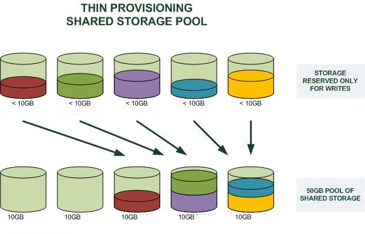
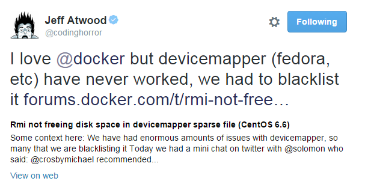
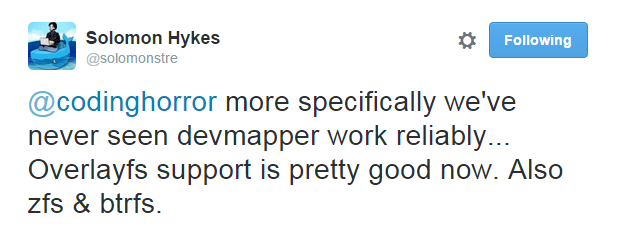

在上一篇[介绍AUFS的文章](https://coolshell.cn/articles/17061.html)中，大家可以看到，Docker的分层镜像是怎么通过UnionFS这种文件系统做到的，但是，因为Docker首选的AUFS并不在Linux的内核主干里，所以，对于非Ubuntu的Linux分发包，比如CentOS，就无法使用AUFS作为Docker的文件系统了。于是作为第二优先级的DeviceMapper就被拿出来做分层镜像的一个实现。


#### Device Mapper 简介


DeviceMapper自Linux 2.6被引入成为了Linux最重要的一个技术。它在内核中支持逻辑卷管理的通用设备映射机制，它为实现用于存储资源管理的块设备驱动提供了一个高度模块化的内核架构，它包含三个重要的对象概念，Mapped Device、Mapping Table、Target device。


Mapped Device 是一个逻辑抽象，可以理解成为内核向外提供的逻辑设备，它通过Mapping Table描述的映射关系和 Target Device 建立映射。Target device 表示的是 Mapped Device 所映射的物理空间段，对 Mapped Device 所表示的逻辑设备来说，就是该逻辑设备映射到的一个物理设备。


Mapping Table里有 Mapped Device 逻辑的起始地址、范围、和表示在 Target Device 所在物理设备的地址偏移量以及Target 类型等信息（注：这些地址和偏移量都是以磁盘的扇区为单位的，即 512 个字节大小，所以，当你看到128的时候，其实表示的是128\*512=64K）。


DeviceMapper 中的逻辑设备Mapped Device不但可以映射一个或多个物理设备Target Device，还可以映射另一个Mapped Device，于是，就是构成了一个迭代或递归的情况，就像文件系统中的目录里除了文件还可以有目录，理论上可以无限嵌套下去。


DeviceMapper在内核中通过一个一个模块化的 Target Driver 插件实现对 IO 请求的过滤或者重新定向等工作，当前已经实现的插件包括软 Raid、加密、多路径、镜像、快照等，这体现了在 Linux 内核设计中策略和机制分离的原则。如下图所示。从图中，我们可以**看到DeviceMapper只是一个框架，在这个框架上，我们可以插入各种各样的策略**（让我不自然地想到了面向对象中的策略模式），在这诸多“插件”中，**有一个东西叫Thin Provisioning Snapshot，这是Docker使用DeviceMapper中最重要的模块**。


图片来源：<http://people.redhat.com/agk/talks/FOSDEM_2005/>
#### **Thin Provisioning 简介**


Thin Provisioning要怎么翻译成中文，真是一件令人头痛的事，我就不翻译了。这个技术是虚拟化技术中的一种。它是什么意思呢？**你可以联想一下我们计算机中的内存管理中用到的——“虚拟内存技术”**——操作系统给每个进程N多N多用不完的内址地址（32位下，每个进程可以有最多2GB的内存空间），但是呢，我们知道，物理内存是没有那么多的，如果按照进程内存和物理内存一一映射来玩的话，那么，我们得要多少的物理内存啊。所以，操作系统引入了虚拟内存的设计，**意思是，我逻辑上给你无限多的内存，但是实际上是实报实销**，因为我知道你一定用不了那么多，于是，达到了内存使用率提高的效果。（今天云计算中很多所谓的虚拟化其实完全都是在用和“虚拟内存”相似的Thin Provisioning的技术，所谓的超配，或是超卖）


 


好了，话题拉回来，我们这里说的是存储。看下面两个图（[图片来源](http://www.architecting.it/2009/06/04/enterprise-computing-why-thin-provisioning-is-not-the-holy-grail-for-utilisation/)），第一个是Fat Provisioning，第二个是Thin Provisioning，其很好的说明了是个怎么一回事（和虚拟内存是一个概念）


 


那么，Docker是怎么使用Thin Provisioning这个技术做到像UnionFS那样的分层镜像的呢？答案是，Docker使用了Thin Provisioning的Snapshot的技术。下面我们来介绍一下Thin Provisioning的Snapshot。


#### Thin Provisioning Snapshot 演示


下面，我们用一系列的命令来演示一下Device Mapper的Thin Provisioning Snapshot是怎么玩的。


首先，我们需要先建两个文件，一个是data.img，一个是meta.data.img：


```
~hchen$ sudo dd if=/dev/zero of=/tmp/data.img bs=1K count=1 seek=10M
1+0 records in
1+0 records out
1024 bytes (1.0 kB) copied, 0.000621428 s, 1.6 MB/s

~hchen$ sudo dd if=/dev/zero of=/tmp/meta.data.img bs=1K count=1 seek=1G
1+0 records in
1+0 records out
1024 bytes (1.0 kB) copied, 0.000140858 s, 7.3 MB/s
```

注意命令中`seek`选项，其表示为略过`of`选项指定的输出文件的前10G个output的bloksize的空间后再写入内容。因为bs是1个字节，所以也就是10G的尺寸，但其实在硬盘上是没有占有空间的，占有空间只有1k的内容。当向其写入内容时，才会在硬盘上为其分配空间。我们可以用ls命令看一下，实际分配了12K和4K。


```
~hchen$ sudo ls -lsh /tmp/data.img
12K -rw-r--r--. 1 root root 11G Aug 25 23:01 /tmp/data.img

~hchen$ sudo ls -slh /tmp/meta.data.img
4.0K -rw-r--r--. 1 root root 101M Aug 25 23:17 /tmp/meta.data.img
```

然后，我们为这个文件创建一个loopback设备。（loop2015和loop2016是我乱取的两个名字）


```
~hchen$ sudo losetup /dev/loop2015 /tmp/data.img
~hchen$ sudo losetup /dev/loop2016 /tmp/meta.data.img

~hchen$ sudo losetup -a
/dev/loop2015: [64768]:103991768 (/tmp/data.img)
/dev/loop2016: [64768]:103991765 (/tmp/meta.data.img)
```

现在，我们为这个设备建一个Thin Provisioning的Pool，用dmsetup命令：


```
~hchen$ sudo dmsetup create hchen-thin-pool \
                  --table "0 20971522 thin-pool /dev/loop2016 /dev/loop2015 \
                           128 65536 1 skip_block_zeroing"
```

其中的参数解释如下（更多信息可参看[Thin Provisioning的man page](https://github.com/torvalds/linux/blob/master/Documentation/device-mapper/thin-provisioning.txt)）：


* dmsetup create是用来创建thin pool的命令
* hchen-thin-pool 是自定义的一个pool名，不冲突就好。
* –table是这个pool的参数设置
	+ 0代表起的sector位置
	+ 20971522代码结句的sector号，前面说过，一个sector是512字节，所以，20971522个正好是10GB
	+ /dev/loop2016是meta文件的设备（前面我们建好了）
	+ /dev/loop2015是data文件的设备（前面我们建好了）
	+ 128是最小的可分配的sector数
	+ 65536是最少可用sector的water mark，也就是一个threshold
	+ 1 代表有一个附加参数
	+ skip\_block\_zeroing是个附加参数，表示略过用0填充的块


然后，我们就可以看到一个Device Mapper的设备了：


```
~hchen$ sudo ll /dev/mapper/hchen-thin-pool
lrwxrwxrwx. 1 root root 7 Aug 25 23:24 /dev/mapper/hchen-thin-pool -> ../dm-4
```

接下来，我们的初始还没有完成，还要创建一个Thin Provisioning 的 Volume：


```
~hchen$ sudo dmsetup message /dev/mapper/hchen-thin-pool 0 "create_thin 0"
~hchen$ sudo dmsetup create hchen-thin-volumn-001 \
            --table "0 2097152 thin /dev/mapper/hchen-thin-pool 0"
```

其中：


* 第一个命令中的create\_thin是关键字，后面的0表示这个Volume的device 的 id
* 第二个命令，是真正的为这个Volumn创建一个可以mount的设备，名字叫hchen-thin-volumn-001。2097152只有1GB


好了，在mount前，我们还要格式化一下：


```
~hchen$ sudo mkfs.ext4 /dev/mapper/hchen-thin-volumn-001
mke2fs 1.42.9 (28-Dec-2013)
Discarding device blocks: done
Filesystem label=
OS type: Linux
Block size=4096 (log=2)
Fragment size=4096 (log=2)
Stride=16 blocks, Stripe width=16 blocks
65536 inodes, 262144 blocks
13107 blocks (5.00%) reserved for the super user
First data block=0
Maximum filesystem blocks=268435456
8 block groups
32768 blocks per group, 32768 fragments per group
8192 inodes per group
Superblock backups stored on blocks:
32768, 98304, 163840, 229376

Allocating group tables: done
Writing inode tables: done
Creating journal (8192 blocks): done
Writing superblocks and filesystem accounting information: done
```

好了，我们可以mount了（下面的命令中，我还创建了一个文件）


```
~hchen$ sudo mkdir -p /mnt/base
~hchen$ sudo mount /dev/mapper/hchen-thin-volumn-001 /mnt/base
~hchen$ sudo echo "hello world, I am a base" > /mnt/base/id.txt
~hchen$ sudo cat /mnt/base/id.txt
hello world, I am a base
```

好了，接下来，我们来看看snapshot怎么搞：


```
~hchen$ sudo dmsetup message /dev/mapper/hchen-thin-pool 0 "create_snap 1 0"
~hchen$ sudo dmsetup create mysnap1 \
                   --table "0 2097152 thin /dev/mapper/hchen-thin-pool 1"

~hchen$ sudo ll /dev/mapper/mysnap1
lrwxrwxrwx. 1 root root 7 Aug 25 23:49 /dev/mapper/mysnap1 -> ../dm-5
```

上面的命令中：


* 第一条命令是向hchen-thin-pool发一个create\_snap的消息，后面跟两个id，第一个是新的dev id，第二个是要从哪个已有的dev id上做snapshot（0这个dev id是我们前面就创建了了）


* 第二条命令是创建一个mysnap1的device，并可以被mount。


下面我们来看看：


```
~hchen$ sudo mkdir -p /mnt/mysnap1
~hchen$ sudo mount /dev/mapper/mysnap1 /mnt/mysnap1

~hchen$ sudo ll /mnt/mysnap1/
total 20
-rw-r--r--. 1 root root 25 Aug 25 23:46 id.txt
drwx------. 2 root root 16384 Aug 25 23:43 lost+found

~hchen$ sudo cat /mnt/mysnap1/id.txt
hello world, I am a base
```

我们来修改一下/mnt/mysnap1/id.txt，并加上一个snap1.txt的文件：


```
~hchen$ sudo echo "I am snap1" >> /mnt/mysnap1/id.txt
~hchen$ sudo echo "I am snap1" > /mnt/mysnap1/snap1.txt

~hchen$ sudo cat /mnt/mysnap1/id.txt
hello world, I am a base
I am snap1

~hchen$ sudo cat /mnt/mysnap1/snap1.txt
I am snap1
```

我们再看一下/mnt/base，你会发现没有什么变化：


```
~hchen$ sudo ls /mnt/base
id.txt      lost+found
~hchen$ sudo cat /mnt/base/id.txt
hello world, I am a base
```

你是不是已经看到了分层镜像的样子了？


你还要吧继续在刚才的snapshot上再建一个snapshot


```
~hchen$ sudo dmsetup message /dev/mapper/hchen-thin-pool 0 "create_snap 2 1"
~hchen$ sudo dmsetup create mysnap2 \
                   --table "0 2097152 thin /dev/mapper/hchen-thin-pool 2"

~hchen$ sudo ll /dev/mapper/mysnap2
lrwxrwxrwx. 1 root root 7 Aug 25 23:52 /dev/mapper/mysnap1 -> ../dm-7

~hchen$ sudo mkdir -p /mnt/mysnap2
~hchen$ sudo mount /dev/mapper/mysnap2 /mnt/mysnap2
~hchen$ sudo  ls /mnt/mysnap2
id.txt  lost+found  snap1.txt 
```

好了，我相信你看到了分层镜像的样子了。


看完演示，我们再来补点理论知识吧：


* Snapshot来自LVM（Logic Volumn Manager），它可以在不中断服务的情况下为某个device打一个快照。
* Snapshot是Copy-On-Write的，也就是说，只有发生了修改，才会对对应的内存进行拷贝。


另外，这里有篇文章[Storage thin provisioning benefits and challenges](http://searchstorage.techtarget.com/tip/Storage-thin-provisioning-benefits-and-challenges)可以前往一读。


#### Docker的DeviceMapper


上面基本上就是Docker的玩法了，我们可以看一下docker的loopback设备：


```
~hchen $ sudo losetup -a
/dev/loop0: [64768]:38050288 (/var/lib/docker/devicemapper/devicemapper/data)
/dev/loop1: [64768]:38050289 (/var/lib/docker/devicemapper/devicemapper/metadata)
```

其中data 100GB，metadata 2.0GB


```
~hchen $ sudo ls -alhs /var/lib/docker/devicemapper/devicemapper
506M -rw-------. 1 root root 100G Sep 10 20:15 data
1.1M -rw-------. 1 root root 2.0G Sep 10 20:15 metadata 
```

下面是相关的thin-pool。其中，有个当一大串hash串的device是正在启动的容器：


```
~hchen $ sudo ll /dev/mapper/dock*
lrwxrwxrwx. 1 root root 7 Aug 25 07:57 /dev/mapper/docker-253:0-104108535-pool -> ../dm-2
lrwxrwxrwx. 1 root root 7 Aug 25 11:13 /dev/mapper/docker-253:0-104108535-deefcd630a60aa5ad3e69249f58a68e717324be4258296653406ff062f605edf -> ../dm-3
```

我们可以看一下它的device id（Docker都把它们记下来了）：


```
~hchen $ sudo cat /var/lib/docker/devicemapper/metadata/deefcd630a60aa5ad3e69249f58a68e717324be4258296653406ff062f605edf
{"device_id":24,"size":10737418240,"transaction_id":26,"initialized":false}
```

device\_id是24，size是10737418240，除以512，就是20971520 个 sector，我们用这些信息来做个snapshot看看（注：我用了一个比较大的dev id – 1024）：


```
~hchen$ sudo dmsetup message "/dev/mapper/docker-253:0-104108535-pool" 0 \
                                    "create_snap 1024 24"
~hchen$ sudo dmsetup create dockersnap --table \
                    "0 20971520 thin /dev/mapper/docker-253:0-104108535-pool 1024"
~hchen$ sudo mkdir /mnt/docker
~hchen$ sudo mount /dev/mapper/dockersnap /mnt/docker/
~hchen$ sudo ls /mnt/docker/
id lost+found rootfs
~hchen$ sudo ls /mnt/docker/rootfs/
bin dev etc home lib lib64 lost+found media mnt opt proc root run sbin srv sys tmp usr var
```

我们在docker的容器里用findmnt命令也可以看到相关的mount的情况（因为太长，下面只是摘要）：


```
# findmnt
TARGET                SOURCE               
/                 /dev/mapper/docker-253:0-104108535-deefcd630a60[/rootfs]
/etc/resolv.conf  /dev/mapper/centos-root[/var/lib/docker/containers/deefcd630a60/resolv.conf]
/etc/hostname     /dev/mapper/centos-root[/var/lib/docker/containers/deefcd630a60/hostname]
/etc/hosts        /dev/mapper/centos-root[/var/lib/docker/containers/deefcd630a60/hosts]
```

#### Device Mapper 行不行？


Thin Provisioning的文档中说，这还处理实验阶段，不要上Production.


> These targets are very much still in the EXPERIMENTAL state. Please do not yet rely on them in production.
> 
> 


另外，Jeff Atwood在Twitter上发过这样的一推


[](https://twitter.com/codinghorror/status/604096348682485760)


这个推指向的[这个讨论](https://forums.docker.com/t/rmi-not-freeing-disk-space-in-devicemapper-sparse-file-centos-6-6/1640/3)中，其中指向了这个[code diff](https://github.com/discourse/discourse_docker/commit/48f22d14f39496c8df446cbc65ee04b258c5a1a0)，基本上就是说，DeviceMapper这种东西问题太多了，我们应该把其加入黑名单。Doker的Founder也这样回复到：


[](https://twitter.com/solomonstre/status/604055267303636992)


所以，如果你在使用loopback的devicemapper的话，当你的存储出现了问题后，正确的解决方案是：


rm -rf /var/lib/docker


（全文完）


**（转载本站文章请注明作者和出处 [酷 壳 – CoolShell](https://coolshell.cn/) ，请勿用于任何商业用途）**


### 相关文章

* [](https://coolshell.cn/articles/18654.html)[记一次Kubernetes/Docker网络排障](https://coolshell.cn/articles/18654.html)
* [](https://coolshell.cn/articles/17061.html)[Docker基础技术：AUFS](https://coolshell.cn/articles/17061.html)
* [](https://coolshell.cn/articles/17049.html)[Docker基础技术：Linux CGroup](https://coolshell.cn/articles/17049.html)
* [](https://coolshell.cn/articles/17010.html)[Docker基础技术：Linux Namespace（上）](https://coolshell.cn/articles/17010.html)
* [](https://coolshell.cn/articles/17029.html)[Docker基础技术：Linux Namespace（下）](https://coolshell.cn/articles/17029.html)
* [](https://coolshell.cn/articles/22320.html)[eBPF 介绍](https://coolshell.cn/articles/22320.html)
The post [Docker基础技术：DeviceMapper](https://coolshell.cn/articles/17200.html) first appeared on [酷 壳 - CoolShell](https://coolshell.cn).